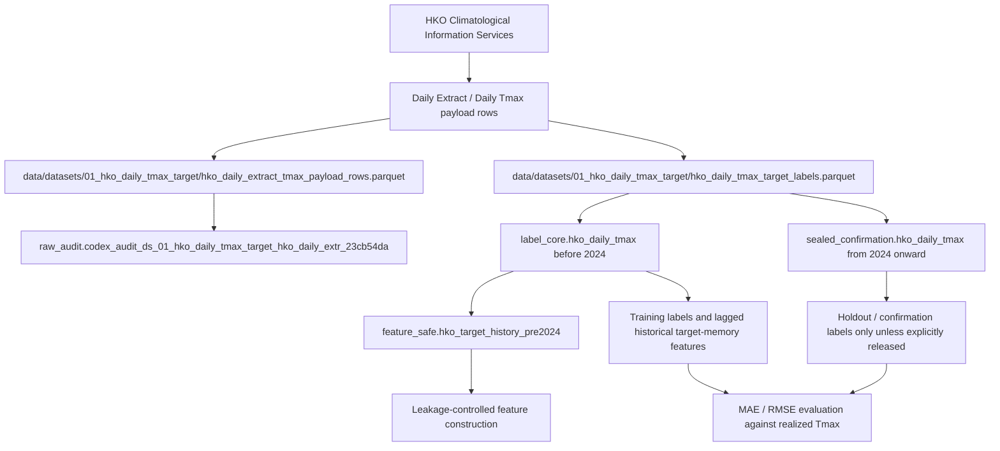

# HKG Daily Tmax Target Data Context - HKO Daily Extract 1884-2026

Created: 2026-07-05 CEST

Primary purpose: document the realized target variable used by the HKG Tmax forecasting system. This file is about the actual observed settlement-side daily maximum temperature at the Hong Kong Observatory target station. It is not a forecast-source document and it is not a trading-backtest document.

## Executive Summary

The HKG Tmax forecasting task is to predict the actual daily maximum temperature, in deg C to one decimal place, recorded by the Hong Kong Observatory for a target local day T. For Polymarket-style markets, the settlement source is the HKO Daily Extract field named `Absolute Daily Max (deg. C)` for the specified date. The model can use forecasts and as-of-safe observations before the trading cutoff, but the target label itself is only known after the day is complete and the Daily Extract has been published.

The project has a dedicated dataset for this target:

- Dataset ID: `01_hko_daily_tmax_target`.
- Local dataset folder: `data/datasets/01_hko_daily_tmax_target`.
- Canonical label file: `hko_daily_tmax_target_labels.parquet`.
- Raw/audit payload file: `hko_daily_extract_tmax_payload_rows.parquet`.
- Canonical DB tables:
  - `label_core.hko_daily_tmax` for pre-2024 labels.
  - `sealed_confirmation.hko_daily_tmax` for 2024 onward confirmation labels.
- Feature-safe pre-2024 view:
  - `feature_safe.hko_target_history_pre2024`.
- Raw audit DB table:
  - `raw_audit.codex_audit_ds_01_hko_daily_tmax_target_hko_daily_extr_23cb54da`.

The combined canonical target currently contains `49,459` usable daily Tmax rows from `1884-01-01` through `2026-05-31`. There are zero null `target_tmax_c` values in the canonical label tables. Calendar coverage over the full date span is `95.084205%`, with the entire missing block explained by the historical HKO observation break from `1940-01-01` through `1946-12-31`. Outside that 1940-1946 gap, yearly canonical label coverage is 100% through the latest canonical date in the DB.

The target station is `Hong Kong Observatory`, configured as HKO Headquarters at Tsim Sha Tsui. The local station configuration records latitude `22.301944`, longitude `114.174167`, and elevation `32 m`. The current DB target source ID is `hko_daily_climate_maximum_temperature_all` for both pre-2024 and 2024+ labels.

Modeling contract:

- Use this dataset as the supervised outcome and evaluation truth.
- Never use `target_tmax_c` for target day T as a predictor.
- Use lagged target history only when the lagged value would have been available before the forecast cutoff.
- Keep `sealed_confirmation.hko_daily_tmax` out of model fitting and model selection unless the run is explicitly a holdout or confirmation evaluation.
- Prefer `feature_safe.hko_target_history_pre2024` for historical target-memory feature generation because it excludes 2024+ sealed confirmation rows by definition.

Verification status:

- DB schema, constraints, indexes, row counts, gaps, null rates, source IDs, sample rows, seasonality, and related NOAA/IGRA support-source ranges were checked with direct read-only Postgres queries against `hkg_tmax_research`.
- Local parquet files were opened with pandas and cross-checked against the DB counts and null rates.
- Official HKO public source pages were reviewed for the Daily Extract source family and publication timing context.

## Reader Orientation and Document Map

Read this document if you are building or reviewing any HKG Tmax point-forecasting system, especially if you need to know what the actual label is, where it lives, what date coverage exists, which rows are safe for training, and where leakage can enter.

Use the sections in this order:

- `What This Data Is`: defines the target and the station.
- `What This Data Is Not`: separates labels from forecasts and intraday observations.
- `Source-of-Truth Inputs`: lists the evidence used to write this file.
- `Current DB Objects`: maps the four relevant Postgres objects.
- `Coverage Deep Dive`: gives exact date coverage, missingness, and the 1940-1946 gap.
- `Yearly Coverage Appendix`: provides a year-by-year coverage matrix.
- `Raw Daily Extract Payload`: explains why the raw payload has more rows than the canonical target.
- `Modeling Contract`: explains how to use this data without leakage.
- `Example Queries`: gives copyable SQL for canonical labels, raw audit checks, gaps, and samples.
- `Testing and Verification Evidence`: records the exact verification methods used.

## Scope Boundaries

Included in this document:

- HKO Daily Extract Tmax target labels from 1884 through the current canonical DB end date.
- The canonical DB split between `label_core` and `sealed_confirmation`.
- The feature-safe pre-2024 target-history view.
- The raw Daily Extract payload audit table and its relationship to the canonical labels.
- Yearly coverage, full-span coverage, null rates, source IDs, station identity, sample records, value distribution, and known gaps.
- How this dataset should be used in an as-of-safe point-forecasting system.

Excluded from this document:

- The Info.gov local forecast archive. That source is documented in `HKG_TMAX_INFO_GOV_LIVE_FORECAST_SOURCE_CONTEXT_20260704.md`.
- The Info.gov hourly readings table. That source is documented in `HKG_TMAX_INFO_GOV_HOURLY_READINGS_DATA_CONTEXT_20260705.md`.
- Polymarket order execution, market-making, position sizing, and liquidity logic.
- A new model implementation. This file is a data-context and target-contract document.
- A full data rescue study of missing 1940-1946 values. The DB has no canonical target labels for those days.

## Source-of-Truth Inputs

This document is evidence-backed from these concrete inputs:

- Direct read-only Postgres queries against local database `hkg_tmax_research`.
- `label_core.hko_daily_tmax`.
- `sealed_confirmation.hko_daily_tmax`.
- `feature_safe.hko_target_history_pre2024`.
- `raw_audit.codex_audit_ds_01_hko_daily_tmax_target_hko_daily_extr_23cb54da`.
- `catalog.source_file_registry`.
- `ingestion.batch`.
- Local parquet files under `data/datasets/01_hko_daily_tmax_target`.
- Dataset documentation file `documentation/datasets/01_hko_daily_tmax_target.md`.
- Dataset catalog file `documentation/DATASET_CATALOG.md`.
- Data quality register file `documentation/DATA_QUALITY_REGISTER.md`.
- Target config `config/target.yaml`.
- Station config `config/stations_hko.yaml`.
- As-of configs `config/asof.yaml` and `config/hkg_t24/asof_t24_1500.yaml`.
- Official HKO Climatological Information Services page: `https://www.hko.gov.hk/en/cis/climat.htm`.
- Official HKO Daily Extract page example for January 1884: `https://www.weather.gov.hk/en/cis/dailyExtract.htm?m=1&y=1884`.
- Official HKO climate-statistics page family confirming HKO series framing since 1884 and excluding 1940-1946: `https://www.hko.gov.hk/en/cis/statistic/vhot34day_statistic.htm`.

One important note about evidence hierarchy: row-level DB queries and parquet reads are used as the authoritative date-range evidence in this file. `catalog.source_file_registry.data_min` and `data_max` are useful lineage fields, but their timestamp rendering includes timezone coercion artifacts for date-only files. Do not use the catalog timestamp rendering to override row-level `local_date` aggregates.

## Requirements-to-Implementation Traceability

| Requirement | Implementation Location | Delivered Behavior | Verification Evidence | Caveat |
| --- | --- | --- | --- | --- |
| Document the 1884 daily Tmax target data. | This file. | Defines target, source, station, DB objects, coverage, missingness, and model contract. | Direct DB and parquet checks recorded below. | No model code changed. |
| Explain what the data is about. | `What This Data Is`, `Target Station`, `Resolution Contract`. | Explains Daily Extract `Absolute Daily Max (deg. C)` at Hong Kong Observatory. | `config/target.yaml`, DB `target_station`, HKO source pages. | Project config still requires final settlement parity verification before a production release. |
| Explain exact coverage. | `Coverage Deep Dive`, `Yearly Coverage Appendix`. | Provides row counts, date spans, coverage percent, and gap range. | Postgres calendar-series query using integer day offsets. | Coverage is current as of the local DB state on 2026-07-05. |
| Explain null and unusable values. | `Canonical Null And Unusable Rates`, `Raw Daily Extract Payload`. | Canonical labels have zero null target values; raw payload has one failed row. | Postgres aggregates and pandas parquet scan. | Raw payload is audit-side, not the canonical modeling label table. |
| Explain relation to 1945-era support data. | `Relationship To Other Long-History Data`. | Distinguishes HKO target labels from NOAA/ISD and IGRA diagnostic sources. | Direct DB table summaries for NOAA/ISD and IGRA. | The support data has separate quality issues and is not settlement truth. |
| Provide copyable queries. | `Example Queries`. | Includes canonical union, feature-safe view, gap audit, yearly coverage, raw payload audit, and sample-row queries. | Queries were executed in read-only form. | Credentials are intentionally redacted. |

## Change Inventory

| File Path | Change Type | Why It Changed | Main Objects Documented | Effect | Verification Coverage |
| --- | --- | --- | --- | --- | --- |
| `documentation/strategy_implementation_documentation/context/live_trading/HKG_TMAX_DAILY_TARGET_1884_DATA_CONTEXT_20260705.md` | Added documentation | User requested a deep dive on the 1884 Tmax target data in the live-trading context folder. | HKO Daily Extract Tmax target, canonical label tables, feature-safe view, raw audit table, source files, coverage, modeling contract. | Adds a dedicated target-label context document next to the existing forecast-source and hourly-readings docs. | Postgres queries, parquet scan, local config reads, official HKO source-page review, documentation quality gate. |

No database table, code module, migration, model artifact, or source parquet was changed for this request.

## Architecture and Control Flow

The target-data flow in this project is simple but critical:



Operational meaning:

- The label tables answer: what was the realized daily maximum temperature at the target station?
- Forecast tables answer: what did an HKO forecast bulletin say before the target day?
- Hourly-reading tables answer: what was observed intraday before or during the target day?
- Only the first category is the settlement target. The other categories are predictors if they satisfy the cutoff and availability rules.

Failure path:

- If a row has no `local_date`, it cannot be used as a label.
- If a row has no target value, it cannot be used as a supervised outcome.
- If a row belongs to `sealed_confirmation`, it must not enter ordinary model training or feature selection unless the evaluation policy explicitly allows holdout confirmation labels.
- If a target-history feature is generated from a date that was not available at the decision cutoff, it is leakage and must be rejected.

## File-by-File Deep Dive

### This Documentation File

Path:

`documentation/strategy_implementation_documentation/context/live_trading/HKG_TMAX_DAILY_TARGET_1884_DATA_CONTEXT_20260705.md`

Responsibility:

- Gives a single, live-trading-oriented explanation of the target label source.
- Records the current DB object map and coverage statistics.
- Provides copyable SQL for future checks.
- States leakage rules for using the target label and lagged target history.

Inputs:

- Postgres metadata and aggregates from `hkg_tmax_research`.
- Local parquet scans.
- Existing dataset, quality, target, station, and as-of docs.
- Official HKO source pages.

Outputs:

- A human-readable context file for future Codex/GPT-Pro/modeling work.

Side effects:

- Adds only this Markdown file.
- Does not modify data, schema, source files, or model artifacts.

Maintenance notes:

- Update this file when canonical target labels are refreshed beyond `2026-05-31`.
- Update the coverage section if the DB gains recovered 1940-1946 rows.
- Keep the target-label contract separate from forecast-source docs.
- If a production release starts using 2024+ labels for training, document the evaluation-policy change and why sealed confirmation no longer applies for that run.

## Public Interfaces and Contracts

### Settlement And Target Contract

The forecasting target is:

- Station: Hong Kong Observatory.
- HKO station code in config: `HKO`.
- Local timezone: `Asia/Hong_Kong`.
- Local date semantics: local calendar day from `00:00:00` through the end of the day.
- Field: `Absolute Daily Max (deg. C)`.
- Precision: `0.1 deg C`.
- Source family: HKO Climatological Information Services / Daily Extract.
- Market-style settlement use: the observed Daily Extract value after publication, not the prior forecast.

The target config records:

- `target_id: hko_daily_absolute_max_first_published`.
- `contract_named_publisher: Hong Kong Observatory`.
- `contract_named_product: Daily Extract`.
- `contract_named_field: Absolute Daily Max (deg. C)`.
- `source_precision_celsius: 0.1`.
- `revision_semantics: first_publication_only_per_current_contract_template`.
- `canonical_status: pending_g1_verification`.

The target station config records:

- `code: HKO`.
- `name: Hong Kong Observatory`.
- `location_description: Observatory Headquarters, Tsim Sha Tsui`.
- `latitude: 22.301944`.
- `longitude: 114.174167`.
- `elevation_m: 32`.
- `official_history_note: 1884-present, excluding 1940-1946 per HKO API documentation`.

### As-Of Contract

The active T-24 configuration says:

- Forecast question: HKO Headquarters official daily Tmax for local day T.
- Cutoff HKT: `T-1 15:00:00`.
- Cutoff UTC: `T-1 07:00:00`.
- Governing timestamp: `available_at`.
- Eligibility rule: feature `available_at_hkt <= cutoff_hkt`.

For target-history features, this means:

- `target_tmax_c[T]` is forbidden.
- `target_tmax_c[T-1]` is usually not safe at a `T-1 15:00 HKT` cutoff unless first-publication evidence proves availability before that cutoff.
- `target_tmax_c[T-2]` and older lags are normally the starting point for safe target-memory features, but the implementation must still respect weekends, holidays, and exact publication records if the system claims strict live replication.
- Any rolling target feature must be built only from values available at the cutoff. A rolling mean crossing into target day T or an unavailable T-1 label is leakage.

## Data Model, Persistence, and Migration Notes

### Canonical Label Table: `label_core.hko_daily_tmax`

Purpose:

- Stores canonical pre-2024 target labels.
- Used for supervised training and historical evaluation before the sealed period.

Columns:

```text
local_date              date, not null
target_tmax_c           numeric, not null
target_station          text, not null
target_source_id        text, not null
content_sha256          character, not null
retrieved_at_utc        timestamptz, nullable
quality_status          text, not null, default 'VALID'
source_file_id          bigint, nullable
ingestion_batch_id      text, nullable
```

Constraints and indexes:

```text
primary key: local_date
check: local_date < '2024-01-01'
check: target_tmax_c >= -20 and target_tmax_c <= 60
foreign key: source_file_id -> catalog.source_file_registry(source_file_id)
foreign key: ingestion_batch_id -> ingestion.batch(batch_id)
unique btree index: hko_daily_tmax_pkey(local_date)
```

Current summary:

```text
rows: 48,577
first local_date: 1884-01-01
last local_date: 2023-12-31
null target_tmax_c: 0
min target_tmax_c: 3.20
max target_tmax_c: 36.60
avg target_tmax_c: 25.4164
target_station values: Hong Kong Observatory only
target_source_id values: hko_daily_climate_maximum_temperature_all only
quality_status values: VALID only
```

### Sealed Confirmation Table: `sealed_confirmation.hko_daily_tmax`

Purpose:

- Stores 2024+ confirmation labels.
- Intended for holdout, locked-test, confirmation, or post-deployment validation.
- Should not be used for ordinary training or model selection unless the run's policy explicitly allows it.

Columns:

Same shape as `label_core.hko_daily_tmax`.

Constraints and indexes:

```text
primary key: local_date
check: local_date >= '2024-01-01'
check: target_tmax_c >= -20 and target_tmax_c <= 60
foreign key: source_file_id -> catalog.source_file_registry(source_file_id)
foreign key: ingestion_batch_id -> ingestion.batch(batch_id)
unique btree index: hko_daily_tmax_pkey(local_date)
```

Current summary:

```text
rows: 882
first local_date: 2024-01-01
last local_date: 2026-05-31
null target_tmax_c: 0
min target_tmax_c: 10.40
max target_tmax_c: 35.70
avg target_tmax_c: 26.8286
target_station values: Hong Kong Observatory only
target_source_id values: hko_daily_climate_maximum_temperature_all only
quality_status values: VALID only
```

Note: although the column default in `sealed_confirmation` is `SEALED_CONFIRMATION`, the current rows have `quality_status='VALID'`. Treat the schema/table boundary, not the text value alone, as the sealed-period guard.

### Feature-Safe View: `feature_safe.hko_target_history_pre2024`

Purpose:

- Provides a leakage-safe starting object for historical target-memory features.
- Explicitly excludes all 2024+ confirmation rows.

View definition:

```sql
SELECT
  local_date,
  target_tmax_c,
  target_station,
  target_source_id,
  quality_status
FROM label_core.hko_daily_tmax
WHERE local_date < DATE '2024-01-01';
```

Current summary:

```text
rows: 48,577
first local_date: 1884-01-01
last local_date: 2023-12-31
null target_tmax_c: 0
min target_tmax_c: 3.20
max target_tmax_c: 36.60
```

### Raw Audit Table

Table:

`raw_audit.codex_audit_ds_01_hko_daily_tmax_target_hko_daily_extr_23cb54da`

Purpose:

- Retains the Daily Extract payload rows for provenance and audit.
- Contains both annual-source and monthly-source payload rows.
- Should not be treated as the canonical label table because it includes overlapping monthly/yearly rows and one failed payload row.

Columns:

```text
ingest_source_file
ingest_source_file_id
ingest_source_row_number
ingested_at_utc
ingestion_batch_id
source_id
content_sha256
raw_retrieved_at_utc
local_date
year
month
day
absolute_daily_max_c
value_precision
completeness
parse_issue
availability_tier
operational_input_allowed
source_time_policy
```

Current summary:

```text
rows: 49,628
local_date min: 1884-01-01
local_date max: 2026-06-17
null local_date: 1
null absolute_daily_max_c: 1
null absolute_daily_max_c percent: 0.002015%
min absolute_daily_max_c: 3.2
max absolute_daily_max_c: 36.6
source_id count: 2
source_id rows:
  hko_daily_extract_year: 49,460
  hko_daily_extract_month: 168
rows with parse_issue: 1
parse_issue text:
  parse_failed:Daily Extract payload contained no matching daily rows
```

The failed row is:

```text
ingest_source_row_number: 20622
source_id: hko_daily_extract_year
year: 1946
local_date: null
absolute_daily_max_c: null
parse_issue: parse_failed:Daily Extract payload contained no matching daily rows
```

### Source File Registry

Registered source files:

```text
source_file_id: 1
source_file: 01_hko_daily_tmax_target/hko_daily_extract_tmax_payload_rows.parquet
file_type: parquet
physical_sha256: 5343e4e33dbbb319e09c7cf93c9407586cd4b20f16fc7096c42b08ab029139d7
byte_size: 372465
source_row_count: 49628
attribute_count: 14
ingestion_action: LOAD_PROVENANCE
target_database_layer: raw_audit
model_status: LABEL_AUDIT_ONLY
priority: HIGH
status: PASS

source_file_id: 2
source_file: 01_hko_daily_tmax_target/hko_daily_tmax_target_labels.parquet
file_type: parquet
physical_sha256: bc7b22d27a7de657ca597774d03a7bce4b70e515992e6c6b694749e4915d02f8
byte_size: 350441
source_row_count: 49459
attribute_count: 8
ingestion_action: LOAD_CANONICAL
target_database_layer: label_core
model_status: LABEL_ONLY
priority: CRITICAL
status: PASS
```

Ingestion batch:

```text
batch_id: audit-ingest-bdbc1fce90c0-primary
status: SUCCEEDED
started_at_utc: 2026-06-23 16:52:20.824969+02 as rendered by local psql
finished_at_utc: 2026-06-23 17:03:34.863712+02 as rendered by local psql
loader_version: hkg_tmax_db_psql_loader_20260623_v1
files_succeeded: 40
files_failed: 0
files_skipped: 12
```

## What This Data Is

This is the realized daily maximum temperature at the Hong Kong Observatory target station, expressed in degrees Celsius to one decimal place. In the local project and DB it is stored as `target_tmax_c` in canonical label tables.

It is the answer to:

```text
What was the highest temperature recorded by the Hong Kong Observatory on local date T?
```

It is not the answer to:

```text
What did an HKO forecast predict before local date T?
```

The data is valuable for three separate purposes:

- Supervised outcome: it is the `y` value for point-forecast model training.
- Evaluation truth: MAE and RMSE must be calculated against this value.
- Lagged historical memory: older realized values can be converted into causal features, such as lag-2 Tmax, rolling lagged Tmax means, hot-spell length ending at an available lag, and seasonal climatology.

Because HKO Headquarters is a coastal, urban, subtropical target station, long target history matters. It captures station-specific climatology, seasonal phase, urban heating, cool-season extremes, hot-season ceilings, and long-term warming. It also reveals that a naive citywide or airport forecast can be physically mismatched to the settlement station.

## What This Data Is Not

This data is not:

- The Info.gov local forecast archive.
- The HKO 9-day forecast API.
- A gridded NWP model output.
- A regional station-network observation.
- A same-day intraday observation stream.
- A tradable market price.
- A probability distribution.
- A safe predictor for target day T.

The most common mistake is to use the label as if it were a feature. For example, if the system predicts `2026-07-05`, the row for `2026-07-05` in this target table is forbidden at inference. The row for `2026-07-04` may also be forbidden at a `2026-07-04 15:00 HKT` cutoff if the final Daily Extract for `2026-07-04` had not yet been published. The implementation must gate every lag by `available_at`, not by calendar intuition alone.

## Current DB Objects

Relevant objects found in Postgres:

```text
feature_safe.hko_target_history_pre2024
  type: VIEW
  role: pre-2024 feature-safe target-history view

label_core.hko_daily_tmax
  type: BASE TABLE
  role: canonical pre-2024 label table

raw_audit.codex_audit_ds_01_hko_daily_tmax_target_hko_daily_extr_23cb54da
  type: BASE TABLE
  role: raw Daily Extract Tmax payload audit table

sealed_confirmation.hko_daily_tmax
  type: BASE TABLE
  role: 2024+ confirmation / holdout label table
```

Combined canonical target:

```sql
SELECT local_date, target_tmax_c, target_station, target_source_id, quality_status
FROM label_core.hko_daily_tmax
UNION ALL
SELECT local_date, target_tmax_c, target_station, target_source_id, quality_status
FROM sealed_confirmation.hko_daily_tmax;
```

Use this union for reporting total label availability. Use only `label_core` or `feature_safe.hko_target_history_pre2024` for ordinary pre-2024 training workflows unless the evaluation plan explicitly releases the sealed period.

## Coverage Deep Dive

### Combined Canonical Coverage

The combined canonical target is the union of:

- `label_core.hko_daily_tmax`.
- `sealed_confirmation.hko_daily_tmax`.

Current combined summary:

```text
rows: 49,459
first local_date: 1884-01-01
last local_date: 2026-05-31
expected calendar days from first to last inclusive: 52,016
missing calendar days: 2,557
calendar coverage percent: 95.084205%
usable target_tmax_c rows: 49,459
usable target_tmax_c coverage percent: 95.084205%
null target_tmax_c rows: 0
null target_tmax_c percent among present canonical rows: 0.000000%
min target_tmax_c: 3.20
max target_tmax_c: 36.60
avg target_tmax_c: 25.4416
target station count: 1
target source ID count: 1
quality status count: 1
```

Exact missing interval:

```text
gap_start: 1940-01-01
gap_end: 1946-12-31
missing_days: 2,557
```

Interpretation:

- The dataset really does start in 1884.
- The only canonical-label gap in the DB is the full 1940-1946 block.
- From 1884-1939, coverage is complete by year.
- From 1947 through the current canonical end date, coverage is complete by year.
- The latest canonical DB label is `2026-05-31`. The raw payload table extends through `2026-06-17`, but that extension is audit-side and not yet promoted into the canonical label union in this DB state.

### Canonical Null And Unusable Rates

Canonical labels:

```text
combined canonical rows: 49,459
null target_tmax_c: 0
null/unusable target_tmax_c percent among present rows: 0.000000%
missing calendar days across full span: 2,557
missing calendar percent across full span: 4.915795%
all missing calendar days are 1940-01-01 through 1946-12-31
```

Raw audit payload:

```text
raw payload rows: 49,628
null absolute_daily_max_c: 1
null absolute_daily_max_c percent: 0.002015%
row with parse_issue: 1
row with null local_date: 1
```

The correct modeling conclusion is:

- For present canonical rows, the target value is fully usable.
- For calendar continuity from 1884 through 2026-05-31, the only absent training days are the 1940-1946 gap.
- The raw payload's one failed 1946 row is not a model label and should remain audit-only.

### Yearly Coverage Appendix

The yearly table below uses the combined canonical target and an integer-offset calendar series from `1884-01-01` through `2026-05-31`. `coverage_pct` and `usable_pct` are identical because every present canonical row has a non-null `target_tmax_c`.

```text
year  expected_days  rows_present  usable_rows  coverage_pct  usable_pct  min_tmax  max_tmax
1884  366            366           366          100.000       100.000     12.20     33.90
1885  365            365           365          100.000       100.000      9.10     31.80
1886  365            365           365          100.000       100.000     10.80     32.10
1887  365            365           365          100.000       100.000     10.70     32.60
1888  366            366           366          100.000       100.000      7.40     33.80
1889  365            365           365          100.000       100.000     10.30     33.60
1890  365            365           365          100.000       100.000     11.40     34.30
1891  365            365           365          100.000       100.000     10.70     33.80
1892  366            366           366          100.000       100.000     11.40     34.40
1893  365            365           365          100.000       100.000      3.20     33.50
1894  365            365           365          100.000       100.000      8.10     33.80
1895  365            365           365          100.000       100.000      8.40     34.40
1896  366            366           366          100.000       100.000     10.70     34.40
1897  365            365           365          100.000       100.000     10.60     33.20
1898  365            365           365          100.000       100.000     12.30     33.10
1899  365            365           365          100.000       100.000     13.70     33.80
1900  365            365           365          100.000       100.000      8.20     36.10
1901  365            365           365          100.000       100.000      6.90     33.70
1902  365            365           365          100.000       100.000      9.00     33.40
1903  365            365           365          100.000       100.000     10.10     33.60
1904  366            366           366          100.000       100.000      8.90     32.80
1905  365            365           365          100.000       100.000      8.50     32.90
1906  365            365           365          100.000       100.000     11.40     34.30
1907  365            365           365          100.000       100.000     11.70     33.10
1908  366            366           366          100.000       100.000     12.10     33.70
1909  365            365           365          100.000       100.000     12.90     32.70
1910  365            365           365          100.000       100.000     11.20     32.90
1911  365            365           365          100.000       100.000     11.90     33.90
1912  366            366           366          100.000       100.000     11.30     33.60
1913  365            365           365          100.000       100.000     12.50     33.30
1914  365            365           365          100.000       100.000     13.20     34.40
1915  365            365           365          100.000       100.000     10.20     34.10
1916  366            366           366          100.000       100.000     10.70     33.60
1917  365            365           365          100.000       100.000      9.10     32.70
1918  365            365           365          100.000       100.000     12.30     32.90
1919  365            365           365          100.000       100.000      9.30     33.40
1920  366            366           366          100.000       100.000     12.20     33.90
1921  365            365           365          100.000       100.000     12.20     33.40
1922  365            365           365          100.000       100.000     10.90     33.90
1923  365            365           365          100.000       100.000     10.40     33.80
1924  366            366           366          100.000       100.000     12.00     34.00
1925  365            365           365          100.000       100.000     11.20     33.80
1926  365            365           365          100.000       100.000     11.40     33.60
1927  365            365           365          100.000       100.000     11.40     33.90
1928  366            366           366          100.000       100.000     11.90     33.70
1929  365            365           365          100.000       100.000     10.70     33.40
1930  365            365           365          100.000       100.000     10.70     33.80
1931  365            365           365          100.000       100.000     11.10     34.40
1932  366            366           366          100.000       100.000      8.80     32.70
1933  365            365           365          100.000       100.000     10.10     33.90
1934  365            365           365          100.000       100.000     10.30     33.90
1935  365            365           365          100.000       100.000     11.20     33.70
1936  366            366           366          100.000       100.000      8.30     33.60
1937  365            365           365          100.000       100.000      9.60     33.90
1938  365            365           365          100.000       100.000     11.90     34.40
1939  365            365           365          100.000       100.000     12.50     34.40
1940  366              0             0            0.000         0.000
1941  365              0             0            0.000         0.000
1942  365              0             0            0.000         0.000
1943  365              0             0            0.000         0.000
1944  366              0             0            0.000         0.000
1945  365              0             0            0.000         0.000
1946  365              0             0            0.000         0.000
1947  365            365           365          100.000       100.000     10.30     34.90
1948  366            366           366          100.000       100.000      7.30     33.40
1949  365            365           365          100.000       100.000     12.10     33.50
1950  365            365           365          100.000       100.000      9.80     33.80
1951  365            365           365          100.000       100.000      9.70     33.60
1952  366            366           366          100.000       100.000      7.50     33.30
1953  365            365           365          100.000       100.000     13.40     34.00
1954  365            365           365          100.000       100.000      9.40     34.90
1955  365            365           365          100.000       100.000     12.00     33.50
1956  366            366           366          100.000       100.000     11.20     34.30
1957  365            365           365          100.000       100.000     10.10     34.20
1958  365            365           365          100.000       100.000      9.70     34.90
1959  365            365           365          100.000       100.000     11.20     33.40
1960  366            366           366          100.000       100.000     12.90     35.40
1961  365            365           365          100.000       100.000     12.70     34.20
1962  365            365           365          100.000       100.000     12.10     35.50
1963  365            365           365          100.000       100.000     12.70     35.60
1964  366            366           366          100.000       100.000      9.60     33.90
1965  365            365           365          100.000       100.000     12.00     33.40
1966  365            365           365          100.000       100.000     11.60     34.70
1967  365            365           365          100.000       100.000      9.60     34.40
1968  366            366           366          100.000       100.000      9.70     35.70
1969  365            365           365          100.000       100.000     10.60     34.70
1970  365            365           365          100.000       100.000     13.50     33.60
1971  365            365           365          100.000       100.000      7.90     33.70
1972  366            366           366          100.000       100.000     10.50     34.70
1973  365            365           365          100.000       100.000     14.30     33.10
1974  365            365           365          100.000       100.000      8.80     34.30
1975  365            365           365          100.000       100.000      8.70     33.90
1976  366            366           366          100.000       100.000     11.20     35.20
1977  365            365           365          100.000       100.000      8.70     34.90
1978  365            365           365          100.000       100.000     10.60     34.20
1979  365            365           365          100.000       100.000     13.40     33.80
1980  366            366           366          100.000       100.000      8.60     35.00
1981  365            365           365          100.000       100.000     12.40     33.30
1982  365            365           365          100.000       100.000     13.90     34.80
1983  365            365           365          100.000       100.000     10.00     33.90
1984  366            366           366          100.000       100.000      9.60     34.40
1985  365            365           365          100.000       100.000     11.30     33.00
1986  365            365           365          100.000       100.000      7.70     34.80
1987  365            365           365          100.000       100.000     11.20     34.20
1988  366            366           366          100.000       100.000     11.90     33.80
1989  365            365           365          100.000       100.000     10.80     34.30
1990  365            365           365          100.000       100.000     11.40     36.10
1991  365            365           365          100.000       100.000      9.60     34.50
1992  366            366           366          100.000       100.000     12.50     35.00
1993  365            365           365          100.000       100.000      8.40     33.50
1994  365            365           365          100.000       100.000     11.60     34.10
1995  365            365           365          100.000       100.000     13.50     34.20
1996  366            366           366          100.000       100.000      8.40     34.30
1997  365            365           365          100.000       100.000     12.60     33.20
1998  365            365           365          100.000       100.000     10.90     34.40
1999  365            365           365          100.000       100.000     10.20     35.10
2000  366            366           366          100.000       100.000     11.90     34.20
2001  365            365           365          100.000       100.000     12.90     34.00
2002  365            365           365          100.000       100.000      9.30     33.60
2003  365            365           365          100.000       100.000     14.20     33.70
2004  366            366           366          100.000       100.000     10.30     34.60
2005  365            365           365          100.000       100.000     10.80     35.40
2006  365            365           365          100.000       100.000     12.70     34.00
2007  365            365           365          100.000       100.000     14.00     35.30
2008  366            366           366          100.000       100.000     10.70     34.60
2009  365            365           365          100.000       100.000     13.10     34.90
2010  365            365           365          100.000       100.000     10.50     34.10
2011  365            365           365          100.000       100.000     10.40     35.00
2012  366            366           366          100.000       100.000     10.20     34.50
2013  365            365           365          100.000       100.000     13.10     34.90
2014  365            365           365          100.000       100.000      9.70     34.60
2015  365            365           365          100.000       100.000     13.90     36.30
2016  366            366           366          100.000       100.000      7.10     35.60
2017  365            365           365          100.000       100.000     13.80     36.60
2018  365            365           365          100.000       100.000     10.60     35.40
2019  365            365           365          100.000       100.000     15.90     35.10
2020  366            366           366          100.000       100.000     14.20     35.30
2021  365            365           365          100.000       100.000     10.70     36.10
2022  365            365           365          100.000       100.000      9.80     36.10
2023  365            365           365          100.000       100.000     12.30     36.10
2024  366            366           366          100.000       100.000     10.40     35.70
2025  365            365           365          100.000       100.000     14.30     35.60
2026  151            151           151          100.000       100.000     16.30     34.10
```

## Value Distribution And Seasonality

Monthly canonical distribution:

```text
month  rows  avg_tmax  p05   median  p95   min    max
01     4216   18.453   13.2   18.6   23.3   3.20  26.90
02     3841   18.414   12.5   18.2   24.8   6.90  28.30
03     4216   20.889   15.0   20.8   26.8   7.70  31.50
04     4080   24.640   18.9   24.8   29.7  12.80  33.40
05     4216   28.269   23.7   28.5   32.2  19.90  36.10
06     4050   30.180   26.5   30.4   32.9  21.30  35.60
07     4185   31.129   28.0   31.3   33.6  24.90  36.10
08     4185   30.903   27.7   31.2   33.4  25.00  36.60
09     4050   30.161   26.8   30.3   33.1  21.40  35.90
10     4185   27.666   24.2   27.7   31.0  18.20  34.60
11     4050   24.057   19.7   24.1   28.0  11.20  31.80
12     4185   20.266   15.7   20.4   24.6   8.70  28.70
```

Decadal canonical distribution:

```text
decade  rows  avg_tmax  min    max
1880    2192   24.232    7.40  33.90
1890    3652   24.768    3.20  34.40
1900    3652   24.841    6.90  36.10
1910    3652   24.796    9.10  34.40
1920    3653   24.845   10.40  34.00
1930    3652   25.205    8.30  34.40
1940    1096   25.528    7.30  34.90
1950    3652   25.539    7.50  34.90
1960    3653   25.999    9.60  35.70
1970    3652   25.860    7.90  35.20
1980    3653   25.351    7.70  35.00
1990    3652   25.687    8.40  36.10
2000    3653   25.840    9.30  35.40
2010    3652   26.239    7.10  36.60
2020    2343   27.046    9.80  36.10
```

Interpretation for models:

- July and August are the highest-ceiling months, with historical maxima above 36 deg C.
- The long-history average rises in modern decades, so simple climatology features should be date-aware and should not average 1884-era climate with modern rows blindly.
- The 1940 decade row has only 1947-1949 values because 1940-1946 are absent. Do not interpret it as a complete decade.
- A useful model should include seasonal phase, modern-era climatology, target-memory lags, and residual correction against forecast anchors.

Global extremes in the canonical DB:

```text
coldest canonical Tmax:
1893-01-16  target_tmax_c = 3.20

hottest canonical Tmax:
2017-08-22  target_tmax_c = 36.60
```

Top cold examples:

```text
1893-01-16  3.20
1893-01-17  4.30
1893-01-15  5.10
1901-02-04  6.90
2016-01-24  7.10
```

Top hot examples:

```text
2017-08-22  36.60
2015-08-08  36.30
1900-08-19  36.10
1990-08-18  36.10
2021-05-23  36.10
2022-07-24  36.10
2023-07-27  36.10
```

## Example Data Output

Representative canonical rows:

```text
example_type  object_name                         local_date  target_tmax_c  target_station          target_source_id                           quality_status
earliest      label_core.hko_daily_tmax           1884-01-01  15.30          Hong Kong Observatory   hko_daily_climate_maximum_temperature_all  VALID
earliest      label_core.hko_daily_tmax           1884-01-02  17.10          Hong Kong Observatory   hko_daily_climate_maximum_temperature_all  VALID
earliest      label_core.hko_daily_tmax           1884-01-03  19.60          Hong Kong Observatory   hko_daily_climate_maximum_temperature_all  VALID
last_pre2024  label_core.hko_daily_tmax           2023-12-29  21.00          Hong Kong Observatory   hko_daily_climate_maximum_temperature_all  VALID
last_pre2024  label_core.hko_daily_tmax           2023-12-30  23.00          Hong Kong Observatory   hko_daily_climate_maximum_temperature_all  VALID
last_pre2024  label_core.hko_daily_tmax           2023-12-31  25.70          Hong Kong Observatory   hko_daily_climate_maximum_temperature_all  VALID
first_sealed  sealed_confirmation.hko_daily_tmax  2024-01-01  22.00          Hong Kong Observatory   hko_daily_climate_maximum_temperature_all  VALID
first_sealed  sealed_confirmation.hko_daily_tmax  2024-01-02  20.50          Hong Kong Observatory   hko_daily_climate_maximum_temperature_all  VALID
first_sealed  sealed_confirmation.hko_daily_tmax  2024-01-03  21.60          Hong Kong Observatory   hko_daily_climate_maximum_temperature_all  VALID
latest        sealed_confirmation.hko_daily_tmax  2026-05-29  34.10          Hong Kong Observatory   hko_daily_climate_maximum_temperature_all  VALID
latest        sealed_confirmation.hko_daily_tmax  2026-05-30  32.60          Hong Kong Observatory   hko_daily_climate_maximum_temperature_all  VALID
latest        sealed_confirmation.hko_daily_tmax  2026-05-31  30.90          Hong Kong Observatory   hko_daily_climate_maximum_temperature_all  VALID
```

Representative raw audit rows:

```text
source_id                 local_date  absolute_daily_max_c  availability_tier  operational_input_allowed  source_time_policy
hko_daily_extract_year    1884-01-01  15.3                  TARGET_ONLY        false                      Daily Extract payload is target/label side unless first-publication polling proves exact availability
hko_daily_extract_year    2023-07-05  33.0                  TARGET_ONLY        false                      Daily Extract payload is target/label side unless first-publication polling proves exact availability
hko_daily_extract_year    2024-07-05  34.6                  TARGET_ONLY        false                      Daily Extract payload is target/label side unless first-publication polling proves exact availability
hko_daily_extract_month   2026-05-31  30.9                  TARGET_ONLY        false                      Daily Extract payload is target/label side unless first-publication polling proves exact availability
hko_daily_extract_year    2026-05-31  30.9                  TARGET_ONLY        false                      Daily Extract payload is target/label side unless first-publication polling proves exact availability
hko_daily_extract_month   2026-06-17  28.4                  TARGET_ONLY        false                      Daily Extract payload is target/label side unless first-publication polling proves exact availability
```

That raw audit example shows why canonical labels and raw payload rows are not interchangeable:

- `2026-05-31` appears in both monthly and yearly payload sources.
- `2026-06-17` exists in raw monthly payload but is not in the canonical label union in this DB state.
- The raw payload explicitly marks itself as `TARGET_ONLY` with `operational_input_allowed=false`.

## Relationship To Other Long-History Data

### HKO Daily Climate All Elements

The broader dataset catalog includes `02_hko_daily_climate_all_elements`:

```text
dataset: HKO Daily Climate All Elements
row count in catalog: 556,399
data range in catalog: 1884-01-01 through 2026-05-31
recommended layer: diagnostic_physics
diagnostic value: high
operational value: zero until publication timing is proven
```

This is related but not identical:

- The Tmax target table is the canonical settlement label.
- The all-elements table may include pressure, humidity, rainfall, cloud, and other climate variables.
- Those variables can be valuable for research and lagged historical feature ideas.
- They must not be promoted into live predictors until their point-in-time publication timing is proven and their data quality issues are resolved.

### NOAA ISD Regional Surface Data From 1945

The DB also has NOAA/ISD regional surface diagnostic tables:

```text
isd_core_obs:
  rows: 4,029,291
  first HKT observation: 1945-12-01T00:00:00+08:00
  last HKT observation: 2025-08-25T05:30:00+08:00
  station count: 36
  null air_temperature_c rows: 126,590

isd_station_day_summary:
  rows: 317,489
  first local_date: 1945-12-01
  last local_date: 2025-08-25
  station count: 36
  null daily_air_temperature_max_c rows: 6,596
```

This data is not the settlement target. It is a regional station-network support source that can help learn spatial gradients, air mass state, dew point, pressure, wind, and proxy regimes. The current data quality register warns that NOAA/ISD wind direction and some station metadata need repair before direct operational promotion.

### NOAA IGRA Upper-Air Data From 1949

The DB also has NOAA IGRA upper-air diagnostic tables:

```text
igra_key_levels:
  rows: 88,407
  first HKT valid time in DB rendering: 1949-06-02T07:00:00+09:00
  last HKT valid time: 2026-06-18T02:00:00+08:00
  station count: 1
  null temperature_c_850hpa rows: 38,862

igra_full_profile:
  rows: 477,514
  first HKT valid time in DB rendering: 1949-06-02T07:00:00+09:00
  last HKT valid time: 2026-06-18T02:00:00+08:00
  station count: 1
  null temperature_c rows: 155,565
```

This is mechanism data, not settlement truth. It can be valuable for understanding boundary-layer and synoptic regimes, but it has separate sentinel, scale, and release-timing issues recorded in the quality register.

## Modeling Contract

### Correct Use

Use this target dataset for:

- `y_train` and `y_eval`.
- MAE and RMSE scoring.
- Official settlement-value reconciliation.
- Lagged target-memory features that are provably available before cutoff.
- Seasonal climatology built from historical rows available before the training prediction date.
- Error-residual learning against forecast anchors, where residual is computed only in training or evaluation after labels are known:

```text
official_residual_c = target_tmax_c - official_forecast_max_c
```

### Forbidden Use

Do not use:

- `target_tmax_c[T]` as an input feature.
- `absolute_daily_max_c[T]` from raw audit as an input feature.
- Any same-day target or finalized Daily Extract row that was not available before the decision cutoff.
- Whole-dataset climatology fit using future rows before a temporal split.
- 2024+ sealed confirmation labels for ordinary model choice.
- Raw audit duplicates as if they were independent observations.
- Recovered or external values for 1940-1946 unless they are loaded into a new documented source with quality flags.

### Recommended Target-Memory Feature Families

For a T-24 / `T-1 15:00 HKT` model, target-memory features should begin conservatively from lag 2 unless exact first-publication data proves lag 1 availability:

```text
target_lag2_tmax_c
target_lag3_tmax_c
target_lag7_tmax_c
target_lag14_tmax_c
target_lag30_tmax_c
target_lag60_tmax_c
target_lag365_tmax_c
target_roll7_mean_lag2_c
target_roll14_mean_lag2_c
target_roll30_mean_lag2_c
target_roll60_mean_lag2_c
target_roll365_mean_lag2_c
target_roll30_anomaly_lag2_c
target_same_day_of_year_climatology_past_only_c
target_hot_spell_length_lag2_days
target_cool_spell_length_lag2_days
modern_era_climatology_features_fit_only_on_past_rows
```

Every feature must be computed within each temporal training fold using only rows before that fold's prediction date and respecting the cutoff. A rolling statistic precomputed across the whole series is not acceptable unless the computation is explicitly expanding or fold-local.

### Train/Validation Split Guidance

Conservative default:

- Train and tune on pre-2024 rows only.
- Use `feature_safe.hko_target_history_pre2024` or `label_core.hko_daily_tmax` as the label source for pre-2024 research.
- Keep `sealed_confirmation.hko_daily_tmax` for locked validation, confirmation, and live-style replay.
- Do not let sealed rows influence model family choice, hyperparameters, feature selection, calibration, imputation, scaling, or threshold tuning.

Gap handling:

- Do not impute 1940-1946 target labels for supervised training.
- Use date continuity features that know the gap exists.
- Rolling target-memory features spanning the gap should require enough observed values or should emit null with a missing-history flag.

Seasonality:

- Do not use fixed whole-history monthly averages in live-like testing.
- Prefer expanding or rolling historical climatology by day-of-year, month, seasonal phase, and modern era.
- Modern-era warming means the long 1884 series is valuable, but the model must allow nonstationarity.

## Example Queries

### Canonical Combined Target Summary

```sql
WITH u AS (
  SELECT 'label_core.hko_daily_tmax' AS object_name,
         local_date, target_tmax_c, target_station, target_source_id, quality_status
  FROM label_core.hko_daily_tmax
  UNION ALL
  SELECT 'sealed_confirmation.hko_daily_tmax',
         local_date, target_tmax_c, target_station, target_source_id, quality_status
  FROM sealed_confirmation.hko_daily_tmax
)
SELECT
  count(*) AS rows,
  min(local_date) AS first_date,
  max(local_date) AS last_date,
  count(*) FILTER (WHERE target_tmax_c IS NULL) AS null_tmax,
  min(target_tmax_c) AS min_tmax_c,
  max(target_tmax_c) AS max_tmax_c,
  round(avg(target_tmax_c), 4) AS avg_tmax_c,
  count(DISTINCT target_station) AS stations,
  count(DISTINCT target_source_id) AS source_ids
FROM u;
```

Expected current output:

```text
rows: 49,459
first_date: 1884-01-01
last_date: 2026-05-31
null_tmax: 0
min_tmax_c: 3.20
max_tmax_c: 36.60
avg_tmax_c: 25.4416
stations: 1
source_ids: 1
```

### Feature-Safe Pre-2024 Query

```sql
SELECT
  count(*) AS rows,
  min(local_date) AS first_date,
  max(local_date) AS last_date,
  count(*) FILTER (WHERE target_tmax_c IS NULL) AS null_tmax,
  min(target_tmax_c) AS min_tmax_c,
  max(target_tmax_c) AS max_tmax_c
FROM feature_safe.hko_target_history_pre2024;
```

Expected current output:

```text
rows: 48,577
first_date: 1884-01-01
last_date: 2023-12-31
null_tmax: 0
min_tmax_c: 3.20
max_tmax_c: 36.60
```

### Exact Gap Query

```sql
WITH u AS (
  SELECT local_date FROM label_core.hko_daily_tmax
  UNION ALL
  SELECT local_date FROM sealed_confirmation.hko_daily_tmax
),
b AS (
  SELECT min(local_date) AS first_date, max(local_date) AS last_date FROM u
),
expected AS (
  SELECT (first_date + offs)::date AS local_date
  FROM b
  CROSS JOIN generate_series(0, (last_date - first_date)) AS offs
),
missing AS (
  SELECT e.local_date
  FROM expected e
  LEFT JOIN u USING (local_date)
  WHERE u.local_date IS NULL
),
gap_groups AS (
  SELECT
    local_date,
    local_date - (row_number() OVER (ORDER BY local_date))::int AS grp
  FROM missing
)
SELECT min(local_date) AS gap_start,
       max(local_date) AS gap_end,
       count(*) AS missing_days
FROM gap_groups
GROUP BY grp
ORDER BY gap_start;
```

Expected current output:

```text
gap_start: 1940-01-01
gap_end: 1946-12-31
missing_days: 2,557
```

### Raw Payload Audit Query

```sql
SELECT
  count(*) AS rows,
  min(local_date) AS min_local_date_text,
  max(local_date) AS max_local_date_text,
  count(*) FILTER (WHERE local_date IS NULL) AS null_local_date,
  count(*) FILTER (WHERE absolute_daily_max_c IS NULL) AS null_absolute_daily_max_c,
  round(100.0 * count(*) FILTER (WHERE absolute_daily_max_c IS NULL) / count(*), 6)
    AS null_absolute_daily_max_pct,
  min(absolute_daily_max_c) AS min_abs_max_c,
  max(absolute_daily_max_c) AS max_abs_max_c,
  count(DISTINCT source_id) AS source_ids,
  count(*) FILTER (WHERE parse_issue IS NOT NULL) AS rows_with_parse_issue
FROM raw_audit.codex_audit_ds_01_hko_daily_tmax_target_hko_daily_extr_23cb54da;
```

Expected current output:

```text
rows: 49,628
min_local_date_text: 1884-01-01
max_local_date_text: 2026-06-17
null_local_date: 1
null_absolute_daily_max_c: 1
null_absolute_daily_max_pct: 0.002015
min_abs_max_c: 3.2
max_abs_max_c: 36.6
source_ids: 2
rows_with_parse_issue: 1
```

### Sample Labels Around The Sealed Boundary

```sql
SELECT 'pre2024' AS block, *
FROM label_core.hko_daily_tmax
WHERE local_date BETWEEN DATE '2023-12-29' AND DATE '2023-12-31'
UNION ALL
SELECT 'sealed' AS block, *
FROM sealed_confirmation.hko_daily_tmax
WHERE local_date BETWEEN DATE '2024-01-01' AND DATE '2024-01-03'
ORDER BY local_date;
```

Expected current output:

```text
2023-12-29  21.00  label_core
2023-12-30  23.00  label_core
2023-12-31  25.70  label_core
2024-01-01  22.00  sealed_confirmation
2024-01-02  20.50  sealed_confirmation
2024-01-03  21.60  sealed_confirmation
```

## Error Handling, Edge Cases, and Failure Modes

Known edge cases:

- The 1940-1946 gap is real in the canonical DB. Models must not silently fill it as if labels existed.
- The raw payload table contains one failed annual source row for 1946. It has no `local_date` and no `absolute_daily_max_c`.
- The raw payload table contains both annual and monthly sources, which can overlap for recent dates.
- The raw payload extends through `2026-06-17`, while canonical labels currently stop at `2026-05-31`.
- The sealed table has `quality_status='VALID'`, so sealed-period gating must be schema/table-aware.
- Catalog date fields may render date-only source files with timezone-looking offsets. Use row-level `local_date` aggregates for true coverage.
- HKO public pages may revise historical climate data. For market settlement, current rule templates usually care about first publication, so a production settlement adapter must archive the first-published event value.
- Daily Extract update timing can be affected by weekends, holidays, operational delay, or revisions. Do not infer live availability solely from a final `local_date`.

Required handling:

- Reject labels with null date or null value.
- Reject raw audit rows as direct predictors.
- Emit explicit missing-history flags for lag/rolling windows interrupted by the 1940-1946 gap.
- Use temporal splits and fold-local preprocessing for all label-derived climatology.
- Store and use `available_at` for any feature family claiming as-of safety.

## Security, Privacy, and Safety Review

This documentation change does not add code, credentials, network calls in the repo, or new database writes.

Data sensitivity:

- The target data is public weather/climate data.
- The DB connection command used during verification was local and read-only in behavior.
- Passwords and secrets are not recorded in this document.

Operational safety:

- The document warns against target leakage.
- The document warns against using sealed confirmation labels for ordinary training.
- The document distinguishes raw audit rows from canonical labels.
- The document distinguishes target labels from forecast inputs.

## Performance, Scalability, and Concurrency

The canonical target tables are small:

```text
label_core.hko_daily_tmax: 48,577 rows
sealed_confirmation.hko_daily_tmax: 882 rows
raw audit payload: 49,628 rows
```

Performance notes:

- `local_date` primary keys make direct date joins cheap.
- A full calendar coverage scan over 52,016 dates is trivial.
- Model feature generation over lagged target history is not computationally expensive, but it is leakage-sensitive.
- If target-history rolling features are built repeatedly across folds, the implementation should use deterministic fold-local windows and avoid repeated full-table scans inside inner loops.

Concurrency notes:

- This file documents read patterns only.
- Future label refresh jobs should upsert canonical dates under an ingestion batch and validate row counts before promotion.
- A promotion from raw monthly payload to canonical label tables should be idempotent and should not duplicate existing annual rows.

## Configuration and Environment

Local DB connection shape:

```text
host: 127.0.0.1
port: 5432
database: hkg_tmax_research
user: postgres
password: redacted
```

Relevant config files:

```text
config/target.yaml
config/stations_hko.yaml
config/asof.yaml
config/hkg_t24/asof_t24_1500.yaml
```

Relevant local data files:

```text
data/datasets/01_hko_daily_tmax_target/README.md
data/datasets/01_hko_daily_tmax_target/hko_daily_tmax_target_labels.parquet
data/datasets/01_hko_daily_tmax_target/hko_daily_extract_tmax_payload_rows.parquet
```

Relevant docs:

```text
documentation/DATASET_CATALOG.md
documentation/DATA_QUALITY_REGISTER.md
documentation/DATABASE_USAGE_AND_LAYER_GUIDE.md
documentation/datasets/01_hko_daily_tmax_target.md
```

## Testing and Verification Evidence

### Verification 1: Relevant DB Objects

Command run:

```powershell
psql -h 127.0.0.1 -p 5432 -U postgres -d hkg_tmax_research -c "select table_schema, table_name, table_type from information_schema.tables where (table_name ilike '%hko%daily%tmax%' or table_name ilike '%daily%extract%tmax%' or table_name ilike '%target%history%') and table_schema not in ('pg_catalog','information_schema') order by table_schema, table_name;"
```

Result:

```text
feature_safe.hko_target_history_pre2024                                      VIEW
label_core.hko_daily_tmax                                                    BASE TABLE
raw_audit.codex_audit_ds_01_hko_daily_tmax_target_hko_daily_extr_23cb54da    BASE TABLE
sealed_confirmation.hko_daily_tmax                                           BASE TABLE
```

What it proves:

- The local DB has exactly the expected target-label, feature-safe, and raw-audit objects for this source.

What it does not prove:

- It does not prove first-publication settlement timing.

### Verification 2: DB Schema, Constraints, And Indexes

Command run:

```powershell
psql ... -c "select ... from information_schema.columns ...; select ... from pg_constraint ...; select ... from pg_indexes ...;"
```

Result summary:

```text
label_core.hko_daily_tmax:
  primary key on local_date
  local_date < 2024-01-01
  target_tmax_c between -20 and 60

sealed_confirmation.hko_daily_tmax:
  primary key on local_date
  local_date >= 2024-01-01
  target_tmax_c between -20 and 60

raw_audit table:
  provenance foreign keys to source_file_registry and ingestion.batch
  btree index on ingest_source_file_id and ingest_source_row_number
```

What it proves:

- The DB enforces a clean pre-2024 versus 2024+ split and one canonical row per date within each canonical table.

### Verification 3: Combined Canonical Counts

Command run:

```powershell
psql ... -c "with u as (...) select object_name, count(*), min(local_date), max(local_date), count(*) filter (...), min(target_tmax_c), max(target_tmax_c), round(avg(target_tmax_c),4) from u ..."
```

Result summary:

```text
combined canonical target:
  rows 49,459
  date range 1884-01-01 through 2026-05-31
  null target_tmax_c 0
  min 3.20
  max 36.60
  avg 25.4416

label_core:
  rows 48,577
  date range 1884-01-01 through 2023-12-31

sealed_confirmation:
  rows 882
  date range 2024-01-01 through 2026-05-31
```

What it proves:

- The canonical target is fully non-null for present rows and spans 1884 through the current canonical end date.

### Verification 4: Calendar Coverage And Gap

Command run:

```powershell
psql ... -c "with u as (...), expected as (select (first_date + offs)::date ... generate_series(0, (last_date - first_date)) ...) select ..."
```

Result summary:

```text
expected calendar days: 52,016
rows present: 49,459
missing days: 2,557
coverage: 95.084205%
gap: 1940-01-01 through 1946-12-31
```

What it proves:

- The only canonical DB gap is 1940-1946.

Why the query uses integer offsets:

- A timestamp-based `generate_series(first_date, last_date, interval '1 day')` produced a misleading partial-year boundary under local timezone rendering. Integer date offsets avoid that artifact.

### Verification 5: Raw Payload Audit

Command run:

```powershell
psql ... -c "select count(*), min(local_date), max(local_date), null counts, source_id counts, parse_issue counts from raw_audit..."
```

Result summary:

```text
raw rows: 49,628
raw local_date range: 1884-01-01 through 2026-06-17
null absolute_daily_max_c: 1
source IDs:
  hko_daily_extract_year: 49,460
  hko_daily_extract_month: 168
parse_issue rows: 1
```

What it proves:

- Raw payload is broader and noisier than canonical labels.

### Verification 6: Local Parquet Scan

Command run:

```powershell
python - <<'PY'
import pandas as pd
from pathlib import Path
root = Path("data/datasets/01_hko_daily_tmax_target")
for path in sorted(root.glob("*.parquet")):
    df = pd.read_parquet(path)
    print(path.name, len(df), len(df.columns), df.isna().sum())
PY
```

Result summary:

```text
hko_daily_tmax_target_labels.parquet:
  rows: 49,459
  columns: 8
  local_date nulls: 0
  target_tmax_c nulls: 0
  local_date range: 1884-01-01 through 2026-05-31
  target_tmax_c range: 3.2 through 36.6

hko_daily_extract_tmax_payload_rows.parquet:
  rows: 49,628
  columns: 14
  local_date nulls: 1
  absolute_daily_max_c nulls: 1
  local_date range: 1884-01-01 through 2026-06-17
  absolute_daily_max_c range: 3.2 through 36.6
```

What it proves:

- Local parquet and Postgres agree on counts, ranges, and null behavior.

### Verification 7: Official HKO Source Pages

Source pages reviewed:

```text
https://www.hko.gov.hk/en/cis/climat.htm
https://www.weather.gov.hk/en/cis/dailyExtract.htm?m=1&y=1884
https://www.hko.gov.hk/en/cis/statistic/vhot34day_statistic.htm
```

Observed source facts:

- HKO Climatological Information Services exposes `Daily Extract` under the Climatological Database.
- The HKO page states data is updated every working day before 2 p.m., up to the previous day.
- The HKO climate-statistics page family frames station statistics as observed at the Hong Kong Observatory since 1884 and excludes 1940-1946.

What it proves:

- The local target data aligns with the official HKO Daily Extract source family and the known historical break.

What it does not prove:

- It does not prove the exact first-publication timestamp for every historical Daily Extract row.

## Operational Runbook

### Check Latest Canonical Label Date

```sql
SELECT max(local_date) AS latest_canonical_date
FROM (
  SELECT local_date FROM label_core.hko_daily_tmax
  UNION ALL
  SELECT local_date FROM sealed_confirmation.hko_daily_tmax
) u;
```

Current expected result:

```text
2026-05-31
```

### Check Whether A Specific Market Date Has A Canonical Label

For a market on `2026-07-05`:

```sql
SELECT *
FROM sealed_confirmation.hko_daily_tmax
WHERE local_date = DATE '2026-07-05';
```

Current expectation in this DB state:

```text
no row, because sealed canonical labels currently stop at 2026-05-31
```

If the raw monthly payload has moved ahead:

```sql
SELECT source_id, local_date, absolute_daily_max_c, raw_retrieved_at_utc, parse_issue
FROM raw_audit.codex_audit_ds_01_hko_daily_tmax_target_hko_daily_extr_23cb54da
WHERE local_date = '2026-07-05';
```

Do not treat a raw payload row as canonical without a promotion/reconciliation step.

### Refresh Checklist For Future Canonical Labels

1. Pull or load the newest Daily Extract payload.
2. Confirm the target field is `Absolute Daily Max (deg. C)`.
3. Validate `local_date`, `absolute_daily_max_c`, precision, source, and parse status.
4. Deduplicate monthly/yearly overlap.
5. Promote only one row per date into the correct canonical table.
6. Preserve raw payload lineage in `raw_audit`.
7. Recompute latest canonical date and yearly coverage.
8. Re-run model evaluation only after the promotion boundary is documented.

## Compatibility, Rollback, and Upgrade Notes

Compatibility:

- Existing training code that reads `label_core.hko_daily_tmax` is unaffected.
- Existing holdout code that reads `sealed_confirmation.hko_daily_tmax` is unaffected.
- This documentation file adds no runtime dependency.

Rollback:

- Removing this Markdown file reverts the documentation change.
- No schema or data rollback is needed.

Upgrade notes:

- If a new canonical target table replaces the split `label_core` and `sealed_confirmation` design, preserve the pre-2024 versus sealed-period distinction in either schema, view, or evaluation policy.
- If first-publication Daily Extract polling becomes available, add `available_at_utc` to the target publication contract and update lag-feature eligibility rules.
- If 1940-1946 recovered data is introduced, load it as a distinct source with provenance and quality flags before deciding whether it can enter the canonical target.

## Known Limitations and Follow-Up Work

Limitation: canonical labels stop at `2026-05-31` in the current DB.

- Impact: July 2026 markets do not yet have canonical settlement labels in this DB state.
- Reason: raw payload and canonical promotion are separate.
- Revisit trigger: after the Daily Extract for later dates is fetched and promoted.
- Release block: not a block for training through pre-2024; a block for evaluating July 2026 settled markets in this DB.

Limitation: 1940-1946 has no canonical daily target labels.

- Impact: long-history models have a seven-year break.
- Reason: historical HKO observation break around World War II.
- Revisit trigger: if a verified recovery source is loaded.
- Release block: not a block if gap-aware feature generation is used.

Limitation: exact historical first-publication time for every Daily Extract target value is not encoded in the label table.

- Impact: lag-1 target-memory features can be unsafe at a T-1 afternoon cutoff unless publication timing is proven.
- Reason: label table stores observed target values and retrieval metadata, not per-day first publication time.
- Revisit trigger: if first-publication polling or archived publication timestamps are added.
- Release block: use lag-2 or older target-memory features by default.

Limitation: project config still records target canonical status as `pending_g1_verification`.

- Impact: production settlement adapters should still do parity checks and event-rule parsing.
- Reason: the config is conservative even though the DB has loaded canonical labels.
- Revisit trigger: completion of the G1 parity/settlement verification work.
- Release block: not a block for offline research; a block for fully automated settlement-critical production.

Limitation: raw payload has monthly/yearly overlap and one failed row.

- Impact: raw payload row count is higher than canonical label row count.
- Reason: the raw table intentionally preserves provenance and parser evidence.
- Revisit trigger: any future parser or loader changes.
- Release block: no, as long as canonical label tables are used for labels.

## Reviewer Checklist

- [x] The document is stored in the requested live-trading context folder.
- [x] The target variable is defined as HKO Daily Extract `Absolute Daily Max (deg. C)`.
- [x] The target station is identified as Hong Kong Observatory / HKO Headquarters.
- [x] Canonical DB tables are documented.
- [x] The feature-safe pre-2024 view is documented.
- [x] The raw audit table is documented separately from canonical labels.
- [x] Exact row counts and date ranges are recorded.
- [x] Null and unusable rates are recorded.
- [x] The 1940-1946 gap is stated explicitly.
- [x] Yearly coverage is provided.
- [x] Sample canonical and raw rows are included.
- [x] Modeling leakage rules are explicit.
- [x] Relationship to 1945+ NOAA/ISD and 1949+ IGRA support data is documented.
- [x] Example SQL is included.
- [x] Verification evidence is included.
- [x] No database or model changes were made.
