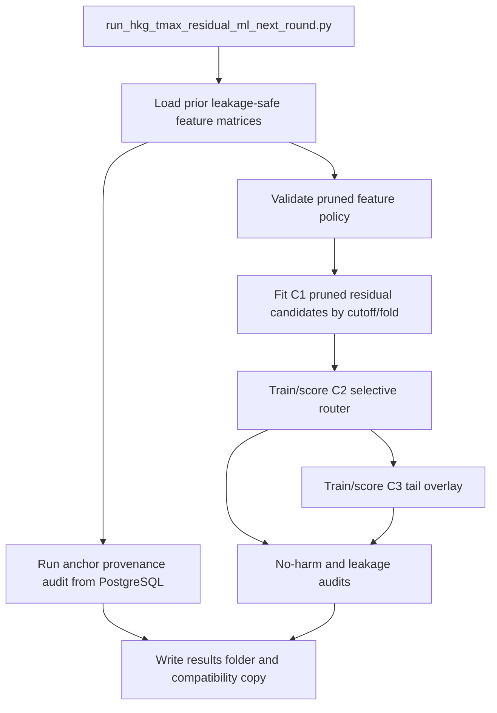

# HKG Tmax Residual ML Next-Round Selective Router Implementation Deep Dive

## Executive Summary

The GPT-Pro next-round memo asked for three tracks: a selective correction router, a tail-error specialist overlay, and an early-cutoff forecast-anchor provenance audit. This implementation adds those tracks as an organized HKG Tmax experiment under `experiments/hkg_tmax/0002_selective_no_harm_router_20260705/`, while keeping canonical code in `code/src/hkg_tmax/`, configs in `configs/hkg_tmax/`, and the runnable entry point in `scripts/`.

The run completed and produced 37 files in `experiments/hkg_tmax/0002_selective_no_harm_router_20260705/results/`. The mandatory artifact checklist is complete: 34/34 requested artifacts exist. The primary result is `no_promote`: C2 selective router improved over raw official but did not beat the existing A7 baseline. At T-1 23:59 HKT, A0 raw official MAE was `0.930858`, A7 was `0.898665`, C2 was `0.902930`, and C3 was `0.902893`.

## Reader Orientation And Document Map

Read this document to understand exactly what was implemented, how the experiment runs, where outputs live, and why the result was not promoted.

- Scope Boundaries: what is included and what is not.
- Source Inputs: source-of-truth files and run evidence.
- Requirements Traceability: memo requirements mapped to code and outputs.
- Change Inventory: every changed or generated file group.
- Architecture And Flow: entry point through artifacts.
- File Deep Dive: module responsibilities and important behavior.
- Verification Evidence: exact commands and outcomes.
- Operational Runbook: how to rerun and inspect the experiment.
- Known Limitations: remaining caveats for the next round.

## Scope Boundaries

Included:

- Organized experiment namespace under `experiments/hkg_tmax/`.
- Next-round config for pruned features, router grids, tail grids, and early-cutoff audit.
- Pruned raw feature policy with a 90-feature maximum; selected count is 64.
- C1 pruned residual ensemble candidate pass.
- C2 selective router with threshold selection on rolling rows only.
- C3 tail overlay with separate audit and scoreboard.
- Early-cutoff provenance audit for 15:00, 16:30, 18:00, 21:00, and 23:59 HKT.
- Leakage, no-harm, row-count, feature-lineage, prediction-row, and model-card artifacts.
- Focused tests for router, tail, no-harm, provenance, and leakage contracts.

Not included:

- Promotion to live trading. The result did not beat the current A7 baseline.
- Neural nets or unrestricted hyperparameter search. The memo explicitly ruled those out.
- Deleting or moving old flat experiment folders. The old `experiments/hkg_tmax_residual_ml_strategy/results/` folder is preserved for compatibility.

## Source-Of-Truth Inputs

- GPT-Pro memo copied to `experiments/hkg_tmax/0002_selective_no_harm_router_20260705/inputs/gpt_pro_next_round_memo_20260705.txt`.
- Prior leakage-safe artifacts from `experiments/hkg_tmax_residual_ml_strategy/results/`.
- Prior feature matrices: `feature_matrix_trainval.parquet`, `feature_matrix_presealed_holdout.parquet`, and `feature_matrix_sealed_confirmation.parquet`.
- Prior A0-A8 prediction rows from `prediction_rows.parquet`.
- Live PostgreSQL audit source `public.hko_historical_forecasts_2000_2026` for anchor provenance.
- Verification commands recorded in this document.

## Requirements-To-Implementation Traceability

| Requirement | Implementation | Verification |
|---|---|---|
| Separate code from experiment results | Code remains in `code/src`, configs in `configs`, scripts in `scripts`, results under `experiments/hkg_tmax/0002.../results` | Folder index files and project map updated |
| Pruned feature policy <= 90 raw features | `features/pruned_feature_policy.py`; run selected 64 features | `summary.json`, `feature_policy_report.csv` |
| Reproduce A0-A8 ladder | Prior prediction rows are loaded and included unchanged in `prediction_rows.*` and scoreboards | A7 and C0 match exactly at primary cutoff |
| Score C1 pruned residual ensemble | `run_pruned_candidate_pass` in the next-round runner | `scoreboard.csv`, `ensemble_weights.json` |
| Score C2 selective router | `modeling/selective_router.py` and runner fold-heldout scoring | `router_oof_diagnostics.csv`, `router_threshold_selection.csv` |
| Score C3 tail overlay | `modeling/tail_specialist.py` and runner tail pass | `tail_specialist_scoreboard.csv`, `tail_specialist_audit.json` |
| No sealed threshold selection | Threshold payload marks `sealed_rows_used_for_selection=false`; leakage audit checks it | `leakage_audit.json` pass |
| No raw-error labels as features | Feature guard rejects evaluation-only columns | Unit tests and `leakage_audit.json` pass |
| Anchor provenance audit | `data/anchor_provenance_audit.py` | `anchor_provenance_audit.csv`, `anchor_provenance_summary.json` |
| Mandatory artifacts | Runner writes the requested artifact set | 34/34 required files present |

## Change Inventory

| Path | Type | Purpose | Verification |
|---|---|---|---|
| `configs/hkg_tmax/residual_ml_next_round.yaml` | added config | Next-round dates, cutoffs, feature policy, router grids, tail grids, provenance cutoffs | Used by completed run |
| `code/src/hkg_tmax/features/pruned_feature_policy.py` | added code | Defines 64-feature policy, candidate meta features, family map, evaluation-only guard | Unit tests, run summary |
| `code/src/hkg_tmax/modeling/selective_router.py` | added code | Builds labels, candidate meta, router models, threshold selection, abstention/caps | Unit tests, router artifacts |
| `code/src/hkg_tmax/modeling/tail_specialist.py` | added code | Tail labels, tail classifiers/regressor, overlay rule | Unit tests, tail artifacts |
| `code/src/hkg_tmax/evaluation/no_harm_reporting.py` | added code | Help/worse rows, apply-rate slices, benefit deciles, no-harm gate report | Unit tests, no-harm audit |
| `code/src/hkg_tmax/data/anchor_provenance_audit.py` | added code | Broad forecast candidate audit around early cutoffs | Unit tests, provenance artifacts |
| `code/src/hkg_tmax/modeling/residual_models.py` | modified code | Adds LGBM classifier, benefit regressor, robust-linear fallback and probability prediction helper | Compile and unit tests |
| `code/src/hkg_tmax/features/leakage_guards.py` | modified code | Adds next-round leakage checks for router/tail/evaluation-only columns | Unit tests, leakage audit |
| `code/src/hkg_tmax/evaluation/reporting.py` | modified code | Adds next-round model-card and summary payload writers | Generated model card and summary |
| `code/src/hkg_tmax/evaluation/ablation_runner.py` | modified code | Registers C0-C3 IDs in scoreboard family | Generated scoreboards |
| `scripts/run_hkg_tmax_residual_ml_next_round.py` | added script | Orchestrates C1, C2, C3, provenance audit, artifact writing | Completed experiment run |
| `code/tests/test_hkg_tmax_next_round_selective_router.py` | added tests | Covers router/tail/no-harm/provenance/leakage contracts | 10 tests passed |
| `docs/PROJECT_STRUCTURE_AND_CODE_MAP.md` | modified docs | Adds new modules, script, test, and evidence paths | Reviewed and updated |
| `experiments/hkg_tmax/README.md` | added docs | Describes the organized HKG Tmax experiment namespace and code/result separation | Files present |
| `experiments/hkg_tmax/EXPERIMENT_INDEX.md` | added docs | Lists numbered HKG Tmax experiment folders and their main artifacts | Files present |
| `experiments/hkg_tmax/0001_residual_ml_strategy_20260705/README.md` | added docs | Registers the prior residual-ML strategy as experiment 0001 and points to legacy artifacts | Files present |
| `experiments/hkg_tmax/0002_selective_no_harm_router_20260705/README.md` | added docs | Registers the next-round selective router experiment and canonical code/config paths | Files present |
| `experiments/hkg_tmax/0002_selective_no_harm_router_20260705/IMPLEMENTATION_DEEP_DIVE.md` | added docs | Provides this evidence-backed implementation handoff | Documentation quality gate scoped to task files |
| `experiments/hkg_tmax_residual_ml_next_round/results/` | generated compatibility copy | Matches GPT-Pro memo output path request | 37 files present |

## Architecture And Control Flow



The runner intentionally reuses the previous leakage-safe matrix artifacts instead of rebuilding all raw features. That preserves the already-audited source contracts and avoids recomputing the expensive matrix build. C1 still fits new pruned models using those matrix rows. C2 and C3 operate on out-of-fold candidate predictions and write row-level diagnostics.

## File-By-File Deep Dive

### `configs/hkg_tmax/residual_ml_next_round.yaml`

Defines the exact run contract: dates, cutoffs, source tables, sealed-blind mode, previous artifact reuse, maximum raw feature count, candidate model toggles, router threshold grids, tail threshold grids, and early-cutoff audit profiles. The runner treats this as the single config source.

### `features/pruned_feature_policy.py`

Defines `PRUNED_FEATURES`, `CANDIDATE_META_FEATURES`, `EVALUATION_ONLY_COLUMNS`, family mapping, and helpers that validate feature availability. It raises if raw feature count exceeds the configured maximum unless explicitly overridden. It prevents raw-error and helped/worsened labels from entering router feature lists.

### `modeling/selective_router.py`

Implements router candidate metadata, labels, model fitting, score prediction, threshold grid search, cap application, and final abstention. `apply_selective_router` returns zero correction when thresholds are not met and clips positive/negative corrections asymmetrically when they are. `select_router_thresholds` filters selection rows to rolling validation or router inner OOF stages and records that sealed rows were not used.

### `modeling/tail_specialist.py`

Implements tail labels for abs residuals above 1.5 C and 2.0 C, tail risk classifiers, sign probability, residual prediction, and an overlay rule. Tail correction only replaces router correction when the tail gate passes and predicted tail benefit exceeds router expected benefit.

### `evaluation/no_harm_reporting.py`

Adds helped/worsened/tied columns, apply-rate slices, benefit deciles, wrong-sign diagnostics, and the no-harm audit payload. The audit checks apply-rate bounds, sealed threshold isolation, monthly degradation versus raw, and presealed RMSE/p90 guardrails versus current A7.

### `data/anchor_provenance_audit.py`

Loads all forecast candidates from `public.hko_historical_forecasts_2000_2026` and explains strict-anchor availability by target date and cutoff. The summary shows 15:00 has 0 percent 2011-onward coverage, 16:30 has 79.04 percent and remains below the 80 percent modeling gate, while 18:00, 21:00, and 23:59 clear that coverage gate.

### `modeling/residual_models.py`

Adds `fit_lgbm_classifier`, `fit_lgbm_benefit_regressor`, `fit_robust_linear_residual`, and `predict_proba_with_fitted`. The Huber path now uses `max_iter=2000`, catches convergence warnings, and falls back to Ridge with explicit diagnostics.

### `features/leakage_guards.py`

Adds `next_round_leakage_audit_payload`, which extends existing source-time checks with router/tail-specific checks: no raw-error features, no tail labels as features, sealed rows excluded from threshold selection, and no same-fold router training rows.

### `evaluation/reporting.py`

Adds `next_round_model_card` and `next_round_summary_payload`. These write the final no-promote decision, selected threshold, audit status, feature count, and primary score rows.

### `evaluation/ablation_runner.py`

Adds `NEXT_ROUND_MODEL_IDS` and includes `C*` models in the ablation scoreboard filter. A0-A8 behavior remains intact.

### `scripts/run_hkg_tmax_residual_ml_next_round.py`

This is the main entry point. It loads prior artifacts, validates feature policy, fits C1 pruned candidates, scores C2 router and C3 tail overlay by cutoff, runs anchor provenance, writes all requested artifacts, and creates a non-destructive compatibility copy under `experiments/hkg_tmax_residual_ml_next_round/results/`.

### `code/tests/test_hkg_tmax_next_round_selective_router.py`

Adds 10 synthetic tests for router OOF leakage, evaluation-only features, abstention, asymmetric caps, tail gates, no-harm monthly degradation, 15:00 provenance reason, sealed threshold isolation, raw-error feature rejection, and prediction diagnostic columns.

## Public Interfaces And Contracts

CLI:

```powershell
.\.venv\Scripts\python.exe scripts\run_hkg_tmax_residual_ml_next_round.py `
  --config configs\hkg_tmax\residual_ml_next_round.yaml `
  --output-dir experiments\hkg_tmax\0002_selective_no_harm_router_20260705\results `
  --compat-output-dir experiments\hkg_tmax_residual_ml_next_round\results
```

New public module functions include:

- `validate_pruned_features`
- `router_feature_names`
- `build_router_labels`
- `fit_router_models`
- `select_router_thresholds`
- `apply_selective_router`
- `build_tail_labels`
- `fit_tail_models`
- `apply_tail_overlay`
- `build_anchor_provenance_audit`
- `summarize_anchor_provenance`
- `no_harm_audit`

## Data Model And Persistence

No database schema or migration changed. The experiment writes filesystem artifacts only. The anchor provenance audit reads PostgreSQL but does not write to the database. Main persisted outputs are CSV, JSON, Markdown, and Parquet under the experiment results folder.

## Error Handling And Failure Modes

- Missing pruned features are reported in the feature policy payload; over-limit feature counts raise.
- Huber convergence warnings fall back to Ridge and write diagnostics.
- If anchor provenance DB access fails, the runner writes a failing audit row and summary instead of crashing after model work.
- Compatibility copy is non-destructive and uses `dirs_exist_ok=True`, so it does not delete prior files.
- Sealed rows are allowed in final reporting but blocked from threshold selection.

## Security, Privacy, And Safety Review

The runner uses the same local database URL pattern as the previous residual-ML scripts. It does not print or persist secrets beyond config source names and artifact paths. Generated prediction rows contain weather features and targets, not personal data. No network calls were added. The audit reads broad forecast candidates but does not mutate database state.

## Performance, Scalability, And Concurrency

The completed run took longer than the first 30-minute command timeout and finished during a bounded wait. It fits C1 candidates across three cutoffs and six folds, then scores router and tail models. The prior feature matrix reuse avoids the largest feature-build cost. Prediction CSV is large at about 267 MB; Parquet is about 22 MB and should be preferred for downstream programmatic analysis.

## Testing And Verification Evidence

Command:

```powershell
.\.venv\Scripts\python.exe -m compileall code\src\hkg_tmax scripts\run_hkg_tmax_residual_ml_next_round.py
```

Result: passed. This proves Python syntax/import compilation for the changed HKG Tmax modules and next-round runner.

Command:

```powershell
.\.venv\Scripts\python.exe -m pytest code\tests\test_hkg_tmax_next_round_selective_router.py
```

Result: 10 passed. This proves the new router, tail, no-harm, provenance, and leakage contracts on synthetic cases.

Command:

```powershell
.\.venv\Scripts\python.exe -m pytest code\tests\test_hkg_tmax_residual_ml_strategy.py code\tests\test_hkg_tmax_next_round_selective_router.py
```

Result: 14 passed. This proves the prior residual-ML guard tests still pass alongside the new next-round tests.

Experiment command:

```powershell
.\.venv\Scripts\python.exe scripts\run_hkg_tmax_residual_ml_next_round.py --config configs\hkg_tmax\residual_ml_next_round.yaml --output-dir experiments\hkg_tmax\0002_selective_no_harm_router_20260705\results --compat-output-dir experiments\hkg_tmax_residual_ml_next_round\results
```

Result: completed after the first 30-minute command timeout while the orphaned process was still running. Artifacts were written successfully. `summary.json` records leakage `pass`, no-harm `pass`, and promotion `no_promote`.

Artifact checklist:

- Required files present: 34/34.
- Total result files: 37.
- Compatibility result folder present: `experiments/hkg_tmax_residual_ml_next_round/results/`.

## Operational Runbook

To rerun the experiment, run the CLI command above from the nested repo root. Prefer reading `prediction_rows.parquet` instead of `prediction_rows.csv` because the CSV is large. Inspect the decision first in:

- `results/summary.json`
- `results/next_round_model_card.md`
- `results/no_harm_audit.json`
- `results/leakage_audit.json`

For anchor-cutoff work, inspect:

- `results/anchor_provenance_summary.json`
- `results/anchor_provenance_audit.csv`

For router behavior, inspect:

- `results/router_threshold_selection.csv`
- `results/router_oof_diagnostics.csv`
- `results/router_apply_rate_by_split.csv`
- `results/router_benefit_deciles.csv`

## Compatibility, Rollback, And Upgrade Notes

The prior flat residual-ML folder remains unchanged and usable. The new organized namespace points to the old run as experiment `0001` and stores the next-round run as experiment `0002`. Rollback is filesystem-local: stop using the new script/config/results and continue using `scripts/run_hkg_tmax_residual_ml_strategy.py` plus `experiments/hkg_tmax_residual_ml_strategy/results/`.

## Known Limitations And Follow-Up Work

- The selective router did not beat A7. It should not be promoted.
- Tail overlay had zero apply rate under selected thresholds in the final apply-rate report, so it did not create meaningful tail improvement.
- C2 worsened versus A7 on rolling and presealed, but slightly beat A7 on sealed MAE. Because sealed is confirmation-only, that cannot rescue promotion.
- 16:30 is close to viable coverage at 79.04 percent from 2011 onward, but it remains below the configured 80 percent gate.
- `prediction_rows.csv` is large; downstream tools should prefer Parquet.

## Reviewer Checklist

- Changed files are listed in Change Inventory.
- New CLI and config are documented.
- A0-A8 prior ladder remains included.
- C1, C2, and C3 are scored.
- Leakage audit passed.
- No-harm audit passed.
- Sealed rows are confirmation-only.
- 15:00 anchor failure is explained.
- Focused tests passed.
- Final model card states no-promote.
