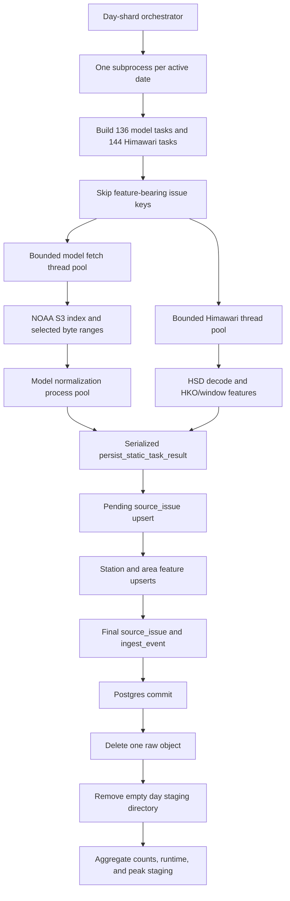

# Public Weather Backfill Optimized Pipeline Implementation and Validation

## Executive Summary

Experiment `0012_public_weather_backfill_optimized_pipeline_validation_20260709` converted the
earlier public-weather acquisition prototype into a bounded, DB-backed pipeline that can process
GFS, GEFS control, and Himawari B13/S0510 source issues with point-in-time timestamps and minimal
raw-file retention. The accepted path covers source discovery, selective download, payload
validation, normalization, Postgres persistence, audit events, retries, idempotent reruns, and
raw cleanup.

The implementation is centered on `scripts/backfill_public_weather_to_postgres.py`. That script
owns task construction, NOAA GRIB byte-range selection, Himawari acquisition and decoding,
feature extraction, database schema application, source/feature upserts, failure recording,
metrics, and cleanup. `scripts/run_public_weather_backfill_day_shards.py` runs independent dates
as bounded subprocesses, aggregates metrics, and measures aggregate staging. Model downloads use
threads, model GRIB normalization uses processes, Himawari uses bounded threads, and Postgres
writes remain serialized in each day worker.

The primary safety decision is commit-before-delete. An optimized task first creates or updates
its `source_issue`, inserts normalized features, updates the final source status, writes one audit
event, and commits. Only then can `safe_delete_file` remove the raw object. Natural-key upserts
make completed issue reruns idempotent, while failed issues remain retryable because they have no
features.

The final 29-day database audit found all 8,120 expected source issues. All 3,944 GFS/GEFS model
issues were successful after a targeted retry. Himawari had 4,111 successful scans and 65
source-side 404s. Every successful issue had features, no leakage timestamp was null, duplicate
natural-key groups were zero, peak aggregate staging was 230.2 MiB, and final staging was zero.

The implementation is accepted with notes and scored `89/100`. The honest fresh-day median is
11.3 minutes, with a 6.9-minute day-equivalent measured across seven dates using two day workers.
The desired true 3-5 minute fresh-day target was not reached, and CPU telemetry was unavailable
because `psutil` was absent from the active virtual environment.

## Reader Orientation and Document Map

Primary readers are the engineer launching the decade backfill, the maintainer changing source
or feature contracts, and the researcher constructing leakage-safe model datasets.

Fast path:

- Read **Final Outcome and Decision** for the accepted result.
- Read **Architecture and Control Flow** for the end-to-end lifecycle.
- Read **Operational Runbook** before launching or resuming a backfill.

Maintenance path:

- Read **File-by-File Deep Dive** before editing the scripts.
- Read **Public Interfaces and Contracts** before changing CLI defaults or source aliases.
- Read **Data Model, Persistence, and Leakage Contract** before changing SQL or training queries.

Risk path:

- Read **Failure Modes and Recovery** for partial-task behavior.
- Read **Performance, Concurrency, and Disk Discipline** before increasing workers.
- Read **Known Limitations and Follow-Up Work** before calling this pipeline fully optimized.

Database capacity is documented separately in
[POSTGRES_STORAGE_CAPACITY_ESTIMATE_2017_TO_2026.md](POSTGRES_STORAGE_CAPACITY_ESTIMATE_2017_TO_2026.md).

## Scope Boundaries

### Included

- GFS deterministic and GEFS control cycles `00/06/12/18`.
- Forecast leads `0..48h` every three hours.
- Himawari AHI infrared band B13, segment `S0510`, ten-minute scans.
- Target station `hko:HKO` at latitude `22.301944`, longitude `114.174167`.
- Model bounding box longitude `113.0..115.5`, latitude `21.5..23.5`.
- Selective NOAA S3 `.idx` byte-range fetching for aged-out model dates.
- Station and area feature persistence in schema `weather_backfill`.
- Conservative source availability timestamps and downstream as-of filtering.
- Serial compatibility mode and opt-in optimized mode.
- Two-worker day sharding for multi-day throughput.
- Transient raw deletion and disk-limit enforcement.
- Dry run, one-day smoke, idempotency rerun, seven-day rehearsal, 29-day robustness run, targeted
  retry, and final DB audit.

### Excluded from the accepted 0012 result

- Radar. Radar support remains in the reusable script, but the accepted 0012 robustness command
  used only GFS, GEFS control, and Himawari.
- GEFS perturbation members. The experiment uses control member `gec00` only.
- Forecast leads after 48 hours.
- Himawari bands other than B13 and segments other than `S0510`.
- Full raw GRIB grids, full satellite rasters, and permanent raw-object archives.
- Model-skill or MAE evaluation. This experiment validates acquisition and persistence, not
  predictive value.
- A true end-to-end CPU utilization profile. The telemetry hook ran without `psutil` data.
- A full 2017-present live backfill. Runtime and capacity are extrapolated from validated runs.

### Meaning of "all required data"

The pipeline stores all configured modeling features and source metadata required by this
experiment. It does not claim to preserve every message in a complete GFS/GEFS product or every
pixel/band from Himawari. That distinction is deliberate: retaining full source payloads would
create multi-terabyte storage demand that is not needed for the current HKO Tmax feature set.

## Source-of-Truth Inputs

This document was written from the final code and measured artifacts, not from the original plan
alone.

| Evidence | Role |
| --- | --- |
| `scripts/backfill_public_weather_to_postgres.py` | Final acquisition, normalization, DB, metrics, and cleanup behavior |
| `scripts/run_public_weather_backfill_day_shards.py` | Final multi-day subprocess orchestration and aggregate monitoring |
| `code/tests/test_public_weather_backfill_to_postgres.py` | Focused unit and filesystem safety coverage |
| Parent `RUN_CONFIG.yaml` | Accepted worker, source, cycle, lead, disk, and retry settings |
| Parent `RESULTS.md` and `STATUS.yaml` | Runtime, count, integrity, and disk outcomes |
| `full_robustness_jun10_jul8_rerun4/` | Corrected 29-day run evidence |
| `targeted_gfs_retry_after_full_rerun4/` | Six-transient-failure recovery evidence |
| Live `weather_backfill` queries on 2026-07-10 local time | Final row, null, duplicate, relation-size, and index measurements |
| Git branch `master`, base commit `206089f` | Repository orientation; the working tree was dirty and scoped files were not committed |

The experiment folder contains results from earlier failed or superseded attempts. The accepted
full-run evidence is explicitly `full_robustness_jun10_jul8_rerun4`; earlier full-run directories
must not be mistaken for the final result.

## Requirements-to-Implementation Traceability

| Requirement | Implementation location | Delivered behavior | Verification | Caveat |
| --- | --- | --- | --- | --- |
| Add optimized mode without removing serial fallback | `build_arg_parser`, `run_backfill` | `--execution-mode serial|optimized`, default `serial` | `test_optimized_cli_defaults_are_opt_in` | Full live validation focused on optimized mode |
| Fetch all configured model runs/leads | `build_tasks_for_day`, inherited task builders | 4 cycles x 17 leads x 2 model sources = 136 model objects/day | Dry-run inventory: 136/day | GEFS is control-only |
| Fetch all expected Himawari scans | `build_tasks_for_day`, `build_himawari_tasks` | 144 B13/S0510 tasks/day | Dry-run inventory: 144/day | Source 404s are recorded, not fabricated |
| Reduce GRIB request overhead safely | `parse_grib_idx_ranges`, `merge_selected_ranges`, `fetch_s3_idx_range_model` | Adjacent selected byte ranges merge with `gap=0` and no added bytes | Two coalescing unit tests; live runs | Nonzero gaps remain experimental |
| Parallelize fetch/decode without unbounded CPU | `process_optimized_model_tasks`, `process_optimized_himawari_tasks` | Bounded thread/process pools and normalization backlog | Seven-day and 29-day live runs | CPU percentages unavailable |
| Keep DB writes serialized | `persist_static_task_result` called in parent day process | Worker results return to one connection before upsert/commit | Full DB audit and no duplicate keys | Two day subprocesses still write concurrently to Postgres |
| Commit before deleting raw | `persist_static_task_result` `committed` guard and `finally` block | Raw removal occurs only after successful commit or recorded failure commit | Final staging zero; DB coverage complete | No isolated fake-DB ordering unit test exists |
| Preserve leakage-safe timestamps | `fetch_to_issue_record`, `insert_*_normalization` | `available_at_utc` copied onto source and feature rows | Null counts all zero | Availability is conservative proxy, not provider publication telemetry |
| Make reruns idempotent | PKs, upserts, `source_issue_has_features`, `--skip-existing-complete` | Completed feature-bearing issues skip; failed issues retry | One-day rerun completed in 1.5 s with 278 skips | Audit events remain append-only |
| Keep temporary disk bounded | `check_disk_limits`, bounded in-flight queues, `safe_delete_file` | Stops scheduling over configured staging/free-space limits | Peak 230.2 MiB; final zero | Default script cap is 4 GiB; accepted run used 1 GiB |
| Record every missing/failing issue | `upsert_source_issue`, `insert_ingest_event` | Status/error metadata persist even without features | 65 Himawari 404 rows present | Permanent 404 classification is source-specific evidence |
| Prove correctness over multiple durations | Experiment protocol and day-shard runner | Dry, one-day, rerun, seven-day, and 29-day gates | Parent `RESULTS.md` | Full 29-day runtime contains skips and is not a fresh-speed benchmark |

## Change Inventory

### Runtime and test files

| File | Status | Main symbols | Runtime effect | Verification |
| --- | --- | --- | --- | --- |
| `scripts/backfill_public_weather_to_postgres.py` | Added/expanded | `merge_selected_ranges`, optimized worker functions, `persist_static_task_result`, `ResourceSampler`, CLI | Executes source-to-Postgres pipeline with bounded raw staging | 11 focused tests, Ruff, live DB runs |
| `scripts/run_public_weather_backfill_day_shards.py` | Added/expanded | `DayJob`, `build_worker_command`, `aggregate_metrics`, `run` | Runs multiple dates concurrently and aggregates disk/runtime metrics | Seven-day and 29-day live runs |
| `code/tests/test_public_weather_backfill_to_postgres.py` | Added | 11 tests | Guards parsing, inventory, coalescing, opt-in mode, deletion scope, and nested staging size | `11 passed` |

### Experiment contract and evidence files

| File | Status | Purpose |
| --- | --- | --- |
| `experiments/hkg_tmax/0012_public_weather_backfill_optimized_pipeline_validation_20260709/README.md` | Updated | Plain-language experiment status and documentation links |
| `experiments/hkg_tmax/0012_public_weather_backfill_optimized_pipeline_validation_20260709/HYPOTHESIS.md` | Updated | Final three-source acquisition/performance hypothesis |
| `experiments/hkg_tmax/0012_public_weather_backfill_optimized_pipeline_validation_20260709/PROTOCOL.md` | Updated | Day lifecycle, optimized concurrency, DB ordering, and validation gates |
| `experiments/hkg_tmax/0012_public_weather_backfill_optimized_pipeline_validation_20260709/ASOF_CONTRACT.md` | Updated | Model and Himawari availability semantics plus training cutoff rule |
| `experiments/hkg_tmax/0012_public_weather_backfill_optimized_pipeline_validation_20260709/DATA_MANIFEST.yaml` | Corrected | Final 29-day source/date scope and explicit radar exclusion |
| `experiments/hkg_tmax/0012_public_weather_backfill_optimized_pipeline_validation_20260709/RUN_CONFIG.yaml` | Updated | Accepted primary run and retry configuration |
| `experiments/hkg_tmax/0012_public_weather_backfill_optimized_pipeline_validation_20260709/REPRODUCE.md` | Updated | Exact dry-run, robustness, and targeted-retry commands |
| `experiments/hkg_tmax/0012_public_weather_backfill_optimized_pipeline_validation_20260709/RESULTS.md` | Updated | Final run table, DB audit, speed, disk, source failures, and limits |
| `experiments/hkg_tmax/0012_public_weather_backfill_optimized_pipeline_validation_20260709/CONCLUSION.md` | Updated | Accepted-with-notes decision and `89/100` score |
| `experiments/hkg_tmax/0012_public_weather_backfill_optimized_pipeline_validation_20260709/STATUS.yaml` | Updated | Machine-readable final audit and runtime/disk metrics |

### Repository navigation and handoff files

| File | Status | Purpose |
| --- | --- | --- |
| `CHANGELOG.md` | Updated | Records optimized pipeline, orchestration, tests, and experiment addition |
| `docs/PROJECT_STRUCTURE_AND_CODE_MAP.md` | Updated | Maps both runtime scripts into the canonical project code map |
| `experiments/hkg_tmax/EXPERIMENT_INDEX.md` | Added/updated | Indexes experiments 0005-0012 and points 0012 to its evidence |
| `documentation/README.md` | Added | Documentation entry point and headline decision table |
| `documentation/PUBLIC_WEATHER_BACKFILL_IMPLEMENTATION_AND_VALIDATION.md` | Added | This complete implementation and operations handoff |
| `documentation/LIVE_POSTGRES_MEASUREMENT_SNAPSHOT_20260710.md` | Added | Live relation, row-width, index, and host-disk evidence |
| `documentation/POSTGRES_STORAGE_CAPACITY_ESTIMATE_2017_TO_2026.md` | Added | 2017-present database footprint and provisioning calculation |

Generated per-run shard logs and metrics are evidence artifacts rather than hand-authored source
files. They remain under the named run directories and are intentionally summarized rather than
listed one file at a time.

## Architecture and Control Flow



### One model task

1. The day worker creates a `FetchTask` containing source, cycle, lead, issue time, valid time,
   conservative availability time, URL, and staging path.
2. Optimized mode reads the NOAA `.idx`, selects only the configured variable/level messages,
   merges directly adjacent ranges, and downloads those ranges concurrently.
3. The selected GRIB messages are concatenated in original offset order and validated.
4. A process worker opens the filtered GRIB using `cfgrib`, takes the nearest grid point to HKO,
   crops the HKG bounding box, and computes spatial statistics.
5. The main day process upserts the source issue before inserting features. This ordering is
   required by feature foreign keys.
6. One transaction writes features, final status, and audit event.
7. The raw GRIB is deleted after commit.

### One Himawari task

1. The task represents one B13/S0510 ten-minute scan.
2. A bounded thread downloads and validates the compressed HSD object.
3. The HSD decoder extracts counts, quality codes, radiance, and brightness temperature.
4. Projection metadata maps the HKO latitude/longitude to the local segment pixel.
5. HKO-pixel, segment, window, contrast, and gradient attributes are normalized.
6. The main process follows the same source-issue, feature, event, commit, and delete sequence.

### Multi-day execution

The orchestrator keeps at most `--max-workers` day subprocesses active. Experiment 0012 used two.
Every date has an isolated shard result directory and staging subtree. The parent polls workers,
records aggregate staging/free disk, reads terminal metrics, and produces a combined report.

## File-by-File Deep Dive

### `scripts/backfill_public_weather_to_postgres.py`

**Role after the change:** This is the authoritative single-day and serial multi-day acquisition
engine for public model/satellite features and the owner of the `weather_backfill` persistence
contract.

**Source and task parsing:**

- `normalize_sources` maps `gefs` to `gefs_control`, Himawari aliases to
  `himawari_b13_s0510`, and radar aliases to `radar`; unknown names fail argument parsing.
- `parse_leads` accepts `0:48:3`, comma-separated leads, or the named default.
- `date_span` is inclusive and rejects reversed windows.
- `build_tasks_for_day` delegates exact source task construction to the previously validated
  public rehearsal module while overriding the per-run staging root and cycle list.

**Selective model acquisition:**

- `MODEL_SELECTOR_LEVELS` permits 15 canonical variables/levels: `TMP`, `DPT`, `RH`, `TMAX`,
  `TMIN`, `UGRD`, `VGRD`, `PRMSL`, `GUST`, `APCP`, `DSWRF`, `CAPE`, `CIN`, `PWAT`, and `TCDC`.
- `parse_grib_idx_ranges` parses NOAA index offsets and selects only those variable/level pairs.
- `merge_selected_ranges` sorts selected ranges and merges only gaps less than or equal to the
  configured value. Production candidate `gap=0` merges adjacent messages without adding bytes.
- `fetch_s3_idx_range_model` performs a HEAD for object length, fetches the `.idx`, issues bounded
  Range GETs, preserves byte order, validates the result, hashes it, and records selected versus
  downloaded bytes.
- Optimized mode prefers S3 index/range acquisition directly. Serial mode can try NOMADS filtered
  retrieval and fall back to S3 on 403/404.

**Normalization:**

- `normalize_model_result_full` opens all compatible GRIB datasets without persistent cfgrib
  index files. For each decodable field, it stores the nearest HKO grid value and bounding-box
  minimum, mean, median, p10, p50, p90, maximum, standard deviation, valid/missing counts, and
  east-west/south-north half gradients.
- Kelvin values become Celsius and pressure Pa becomes hPa. Other unit strings are normalized
  into stable feature suffixes.
- `normalize_himawari_result_full` decodes HSD calibration/projection blocks, computes HKO pixel
  count, quality, radiance, brightness temperature, segment percentiles, 3x3/5x5/11x11/21x21/
  41x41 window features, HKO-minus-window contrasts, and local spatial gradients.

**Persistence:**

- `upsert_source_issue` owns issue metadata and merges new JSONB metadata on conflict.
- `insert_station_features` and `insert_area_features` separate numeric and text values, infer
  units, and upsert stable natural keys.
- `persist_static_task_result` is the optimized transaction boundary. It first upserts a pending
  source issue, then feature rows, then the final issue status and event, then commits.
- This pending-upsert ordering fixes the initial optimized full-run foreign-key defect in which
  feature inserts could precede a new `source_issue` row.
- `source_issue_has_features` powers idempotent skip behavior. A source error with no features is
  intentionally retried on the next run.

**Concurrency and cleanup:**

- `process_optimized_model_tasks` uses `model_fetch_workers` threads and
  `model_normalize_workers` processes. Normalization backlog is bounded to four times the process
  count.
- `process_optimized_himawari_tasks` bounds in-flight tasks to twice the Himawari worker count.
- `safe_delete_file` resolves both target and staging root and refuses deletion outside staging.
- `check_disk_limits` prevents new scheduling above the staging cap or below the free-disk floor.
- `ResourceSampler` can collect host CPU and staging samples when `psutil` exists.

**Outputs and side effects:**

- Applies schema DDL, writes Postgres rows, writes per-run JSON/Markdown metrics, and creates
  temporary raw files under staging.
- Network calls target NOAA/NOMADS public endpoints and Himawari public objects.
- No raw payload remains after a successful committed task.

**Maintenance rule:** Any new model variable must update selector levels, normalization naming,
feature expectations, storage estimates, and leakage audits together. Any change to delete order
must preserve the committed guard.

### `scripts/run_public_weather_backfill_day_shards.py`

**Role after the change:** This script increases multi-day wall-clock throughput by launching
isolated one-day invocations of the core pipeline and measuring them as one operation.

**Important behavior:**

- `build_worker_command` passes all optimized worker counts, coalescing gap, retries, disk limits,
  source/cycle/lead settings, and a date-specific staging root to the child.
- `launch_day` opens dedicated stdout/stderr logs, propagates the DB URL through the environment,
  and starts a subprocess in the repository root.
- `run` maintains a bounded `running` map, polls exit codes, samples every date's staging subtree,
  and appends monitor events to `parallel_monitor.jsonl`.
- `aggregate_metrics` sums counts, retains maximum staging/raw sizes, captures per-day elapsed
  values, and reports nonzero exit days.
- The orchestrator returns nonzero only when a day subprocess exits nonzero. Source-level 404s
  can still yield a completed day with recorded fetch failures.

**Failure boundary:** Child processes own their DB transactions and terminal metrics. If a child
crashes before writing metrics, the parent records its exit code and omits unavailable metrics
rather than manufacturing success counts.

**Maintenance rule:** Increasing `--max-workers` multiplies model thread/process pools and DB
connections. Capacity must be calculated as day workers times per-day worker counts, not by
looking at one flag in isolation.

### `code/tests/test_public_weather_backfill_to_postgres.py`

**Role after the change:** The focused test module guards deterministic behavior that can be
verified without network or a live database.

The 11 tests cover:

- Default/range lead parsing and deduplication.
- Inclusive date spans.
- Source aliases and unknown-source rejection.
- Expected task inventory across a 13-day window.
- GRIB `.idx` variable/level selection and byte boundaries.
- Exact-byte preservation for `gap=0` coalescing.
- Explicit accounting of added bytes for nonzero coalescing.
- Serial default and optimized worker defaults.
- Refusal to delete outside staging.
- Recursive staging byte measurement.

The module does not fake Postgres transaction ordering, exercise cfgrib/HSD decoding, or test
remote endpoints. Those contracts were validated by live experiment runs and DB audits.

### Experiment evidence files

`HYPOTHESIS.md`, `PROTOCOL.md`, and `ASOF_CONTRACT.md` define the claim, execution sequence, and
leakage boundary. `RUN_CONFIG.yaml` binds the accepted worker/retry settings.
`DATA_MANIFEST.yaml` binds the final source/date scope. `REPRODUCE.md` preserves commands without
credentials. `RESULTS.md`, `CONCLUSION.md`, and `STATUS.yaml` provide human and machine-readable
outcomes. These files must stay mutually consistent when future evidence supersedes 0012.

## Public Interfaces and Contracts

### Core CLI

| Flag | Accepted/default value | Contract |
| --- | --- | --- |
| `--start-date`, `--end-date` | ISO date; defaults retained from draft | Inclusive UTC issue-day window |
| `--sources` | Aliases normalized to source set | Selects GFS, GEFS control, Himawari, and optionally radar |
| `--cycles` | `0,6,12,18` | Model issue cycles |
| `--leads` | `0:48:3` | Inclusive forecast leads |
| `--execution-mode` | `serial` default, `optimized` opt-in | Preserves compatibility fallback |
| `--model-fetch-workers` | 8 | Maximum concurrent model object fetches per day process |
| `--model-range-workers` | 4 | Maximum Range GETs within one model fetch |
| `--model-normalize-workers` | 2 | Maximum model cfgrib process workers |
| `--himawari-workers` | 8 | Himawari fetch/decode thread count |
| `--model-range-coalesce-gap-bytes` | 0 | Adjacent-only production-safe range merge |
| `--max-staging-gb` | 4 default; 1 in accepted run | Hard scheduling stop for transient raw staging |
| `--stop-free-gb` | 50 | Hard scheduling stop for host free space |
| `--max-attempts` | 5 | Bounded retries; targeted recovery used 7 |
| `--skip-existing-complete` | true | Skip feature-bearing issue keys |
| `--retain-failed-raw` | false | Failed raw objects are normally removed |
| `--cpu-telemetry` | false | Enables sampling hook; requires `psutil` for CPU values |
| `--staging-root` | Auto/explicit path | Keeps short transient paths and isolates workers |

### Day-shard CLI

The day-shard runner adds `--max-workers`, accepted at 2 for the experiment, and
`--monitor-interval-seconds`. It forwards source-level worker settings unchanged to each child.

### Environment

`HKG_TMAX_DATABASE_URL` is preferred. `HKG_TMAX_DB_DSN` is accepted by the core script as a
fallback. Credentials must not appear in experiment artifacts, logs, or documentation.

## Data Model, Persistence, and Leakage Contract

### `ingest_run`

One row identifies a pipeline invocation with date range, sources, config JSONB, status, summary,
completion time, and terminal error. `run_id` is the primary key. Day sharding normally creates
one run per date.

### `source_issue`

`issue_key` is the stable primary key. The row stores source/product, issue/observation/valid
times, availability proxy and method, retrieval time, status, raw hash/byte count, raw-retention
policy, cycle, lead, band, segment, normalization state, error, and metadata JSONB.

Model issue identity is based on source, issue cycle, and lead through the task's stable item ID.
Himawari identity is based on the scan object item ID. Upserts update status and merge metadata.

### `station_feature`

Primary key: `(issue_key, station_id, feature_name)`. Every row stores one numeric or text feature,
unit, valid time, non-null availability time, run ID, and feature context. The lookup index is
`(station_id, feature_name, available_at_utc)`.

### `area_feature`

Primary key: `(issue_key, area_key, variable_name, statistic)`. Model rows use area key
`hkg_bbox_113.0_115.5_21.5_23.5`. Himawari rows use a local-window area key. The lookup index is
`(area_key, variable_name, statistic, available_at_utc)`.

### `ingest_event`

Append-only audit rows record run, issue, source, event type, terminal status, message, elapsed
seconds, metadata, and creation time. Feature idempotency does not deduplicate audit events.

### Availability semantics

- Model `issued_at_utc` is the model cycle. `available_at_utc` is conservatively
  `issued_at_utc + 6 hours` unless stronger captured metadata supersedes it.
- Himawari `observed_at_utc` is the scan time. `available_at_utc` is the later of native HSD file
  creation and observation plus 30 minutes.
- Every persisted feature copies its source issue availability. No feature may be selected for a
  forecast cutoff unless `available_at_utc <= cutoff_utc`.

These values are availability proxies, not proof of exact historical provider publication to the
second. Their buffers intentionally bias toward later availability to reduce leakage risk.

## Error Handling, Edge Cases, and Failure Modes

### Remote failures

`request_with_retries` retries HTTP 408/429/500/502/503/504, timeouts, URL errors, and httpx
errors with bounded delay. Deterministic 404s are not treated as transient. A terminal failure
creates or updates `source_issue` with error state, writes an audit event when DB persistence is
available, and deletes failed raw bytes unless retention was explicitly enabled.

### Partial payloads and invalid GRIB

Payload validation can return `invalid_payload` or `missing_selected_messages`. The task is
recorded without creating successful feature rows. A missing range chunk or range that does not
begin with `GRIB` raises an error and follows the failure path.

### Normalization failure

Model/Himawari normalizers return structured error results containing partial metadata and the
root exception. The source issue receives normalization status `error`; the raw file is deleted
after the failure has been durably recorded when failed raw retention is false.

### Database failure

Any feature/event exception rolls back the active transaction. The handler attempts a smaller
error source-issue/event transaction. Raw deletion is guarded by the resulting committed state in
the optimized path. A failure that cannot be recorded does not masquerade as a completed issue.

### Disk-limit failure

Before scheduling more work, the pipeline checks aggregate staging and free disk. Exceeding the
configured threshold raises and terminates the run after recording terminal run metrics where
the DB remains available. Already committed issue rows remain safe for idempotent resume.

### Process failure

A model normalization process exception is converted into a structured normalization error.
A whole day subprocess crash appears as a nonzero shard exit in the orchestrator report. The
operator reruns only failed dates with completed-feature skipping enabled.

## Security, Privacy, and Safety Review

- Database credentials come from process environment or an explicit CLI argument. Experiment
  commands use a redacted connection marker and no credential value is written to documentation.
- SQL writes use psycopg parameters; dynamic SQL is limited to fixed internal table names in
  measurement tooling, not untrusted CLI values.
- External URLs are generated from fixed public source templates and parsed task values.
- Raw deletion resolves internally generated paths and rejects the tested outside-staging case.
- The pipeline does not require elevated filesystem privileges and does not delete source data.
- Source hashes and URLs are metadata, not authentication secrets.
- No personal data is processed. The main operational risk is disk exhaustion or accidental
  broad deletion, both constrained by hard limits and path checks.

The current containment check compares normalized path strings. All accepted-run paths were
internally generated beneath staging, but the helper should be changed to a path-component-aware
containment test before any future public API is allowed to supply deletion targets.

## Performance, Scalability, and Disk Discipline

### Concurrency model

Per day process at accepted settings:

- Up to 8 concurrent model fetch tasks.
- Up to 4 HTTP byte-range requests inside each model fetch.
- Up to 2 model normalization processes.
- Up to 8 Himawari fetch/decode threads.
- One serialized DB connection/commit path.

Across the accepted robustness configuration, at most two day processes were active. The
theoretical HTTP concurrency can therefore be materially larger than eight; worker changes must
account for this multiplication and remote-source limits.

### Backpressure

Model fetch scheduling pauses when the normalization backlog reaches four times the process
worker count. Himawari in-flight tasks are capped at twice its thread count. Disk checks run
before new submissions. This prevents all 280 daily raw objects from being resident at once.

### Measured performance

| Metric | Result |
| --- | ---: |
| Fresh day p50 | 676.0 s / 11.3 min |
| Fresh day p90 | 714.1 s / 11.9 min |
| Seven-day wall time, two workers | 2,894.2 s / 48.2 min |
| Measured throughput | 6.9 min per day-equivalent |
| One-day smoke | 780.9 s |
| Peak aggregate staging | 241,375,243 bytes / 230.2 MiB |
| Peak one-worker staging | 156,263,623 bytes / 149.0 MiB |
| Final staging | 0 bytes |

The corrected 29-day run took 110.6 minutes plus a 125.9-second retry, but many completed issue
keys were skipped. Its apparent 3.8 minutes/calendar-day must not be used as fresh-backfill speed.

### Full-history estimate

At the directly observed 6.8908 minutes/day-equivalent, 3,476 dates through 2026-07-08 require
approximately 399 hours or 16.6 continuous days. The operational budget is 18-21 days for source
variation and retries. Long-run two-worker scheduling may approach the 5.6-6.0 minute/day range
as tail effects amortize, but that was not proven over a fresh decade.

## Configuration and Environment

The accepted primary run used:

```yaml
sources: [gfs, gefs_control, himawari_b13_s0510]
cycles: [0, 6, 12, 18]
leads: [0, 3, 6, 9, 12, 15, 18, 21, 24, 27, 30, 33, 36, 39, 42, 45, 48]
execution_mode: optimized
model_fetch_workers: 8
model_range_workers: 4
model_normalize_workers: 2
himawari_workers: 8
model_range_coalesce_gap_bytes: 0
max_day_workers: 2
max_staging_gb: 1
stop_free_gb: 50
max_attempts: 5
skip_existing_complete: true
retain_failed_raw: false
```

The targeted retry reduced model fetch workers to four and raised max attempts to seven. No new
runtime dependency was added. `psutil` remained absent, which explains null CPU telemetry.

## Testing and Verification Evidence

| Command/check | Result | Proves | Does not prove |
| --- | --- | --- | --- |
| `.\.venv\Scripts\python.exe -m pytest code\tests\test_public_weather_backfill_to_postgres.py` | `11 passed in 8.20s` | Deterministic parsing, coalescing, CLI defaults, path safety, staging size | Live endpoints, DB transactions, decoders |
| `.\.venv\Scripts\ruff.exe check scripts\backfill_public_weather_to_postgres.py scripts\run_public_weather_backfill_day_shards.py code\tests\test_public_weather_backfill_to_postgres.py` | Passed | Touched Python files satisfy Ruff | Runtime correctness |
| Dry run for 2026-06-21 | Passed | Exact 136 model + 144 Himawari inventory, no DB/raw side effects | Fetch/normalize behavior |
| One-day optimized smoke | 278/280 successful; final staging zero | Full source-to-DB lifecycle for one day | Multi-day stability |
| Same-day idempotency rerun | 278 completed skips in 1.5 s | Feature-bearing issue skip path | Retry behavior for all error classes |
| Seven-day rehearsal | Completed in 48.2 min; three GFS transient misses recovered | Two-day concurrency and repeatable fresh-day timings | Decade-scale source consistency |
| Corrected 29-day robustness run | Completed; zero normalize/task errors | Multi-day DB writes, cleanup, and failure recording | Fresh 29-day speed because prior rows existed |
| Targeted six-key GFS retry | 6/6 recovered | Idempotent selective recovery | Permanent provider outage handling |
| Final DB audit | 8,120/8,120 issues, 0 null availability, 0 duplicate groups | Persistence integrity and leakage-clock completeness | Predictive skill or exact publication latency |
| Raw residue audit | No raw-like files; staging root removed | Cleanup outcome | Cleanup after power loss between commit and delete |

## Validation Run Narrative

### Dry-run inventory

The day `2026-06-21` generated 280 static tasks: 68 GFS, 68 GEFS control, and 144 Himawari. It
performed no DB writes and retained no raw data.

### One-day smoke and idempotency

The first optimized day completed in 780.9 seconds. Both model sources completed 68/68. Himawari
completed 142/144, with two recorded 404s. The run inserted 15,838 station and 28,550 area
features and ended with zero staging. The rerun skipped all 278 successful feature-bearing issues
and touched only the two missing scans, completing in approximately 1.5 seconds.

### Seven-day rehearsal

Two day workers processed `2026-06-15..2026-06-21` in 2,894.2 seconds. The first pass had 17
Himawari 404s and three GFS `RemoteDisconnected` errors. A forced GFS refetch closed all three.
Individual day runtimes ranged from 648.0 to 718.5 seconds.

### Full robustness run and defect correction

An earlier full attempt exposed a foreign-key ordering defect in optimized persistence: feature
rows could be inserted before a new `source_issue`. The accepted implementation fixed
`persist_static_task_result` to upsert the pending source issue before normalization features.
The corrected run `full_robustness_jun10_jul8_rerun4` completed the 29-day window. Six transient
GFS disconnects remained after the primary pass and were recovered by the targeted retry.

### Final database audit

The final source inventory was 1,972 GFS, 1,972 GEFS control, and 4,176 Himawari. All model issues
were successful. The 65 Himawari error rows all had `HTTP Error 404: Not Found`. Successful issue
keys with no features were zero; source/feature null availability counts were zero; duplicate
feature primary-key groups were zero.

## Operational Runbook

### Preflight

1. Confirm the intended PostgreSQL database and available host disk.
2. Export `HKG_TMAX_DATABASE_URL` without printing it.
3. Run a one-day dry inventory.
4. Confirm no unrelated process is using the chosen staging root.
5. Start with two day workers; do not increase to four without CPU, disk, DB, and provider
   telemetry.

### Recommended historical command shape

```powershell
$experimentId = '0013_public_weather_full_backfill_2017_20260710'
.\.venv\Scripts\python.exe .\scripts\run_public_weather_backfill_day_shards.py `
  --experiment-id $experimentId `
  --experiment-dir ".\experiments\hkg_tmax\$experimentId" `
  --start-date 2017-01-01 --end-date 2026-07-10 `
  --sources gfs,gefs_control,himawari_b13_s0510 `
  --execution-mode optimized `
  --model-fetch-workers 8 --model-range-workers 4 `
  --model-normalize-workers 2 --himawari-workers 8 `
  --model-range-coalesce-gap-bytes 0 `
  --max-workers 2 --max-attempts 5 `
  --max-staging-gb 1 --stop-free-gb 50 `
  --progress-every 50 --monitor-interval-seconds 60
```

Create a new immutable experiment ID for the actual decade run; do not write production output
back into experiment 0012. The example end date is a capacity upper bound. At launch time, use
the most recent **fully complete** UTC source date rather than a partially published current day.

### Monitoring

Inspect:

- Parent `logs/parallel_monitor.jsonl` for running/pending days, staging bytes, and free disk.
- Per-day `logs/worker_stdout.log` and `worker_stderr.log`.
- Per-day `results/metrics.json` for fetch/normalize/task errors.
- Postgres `ingest_run` status and `source_issue` error categories.
- Host free disk and Postgres WAL directory growth.

### Resume and targeted recovery

Rerun failed date ranges with default completed-feature skipping. Successful issues are skipped;
missing or failed issues are attempted again. For a small transient GFS list, narrow the date
window, select only `gfs`, and raise max attempts to seven. Do not force-refetch the entire
decade unless feature contract/versioning requires a full replacement.

### Completion audit

Completion requires:

- Expected issue count equals present issue count for every date/source.
- Every successful issue has station or area features.
- Every source/feature `available_at_utc` is non-null.
- Duplicate natural-key groups are zero.
- Model failures are zero or individually explained and recovered.
- Himawari missing objects have source-side evidence.
- Staging is empty and no raw-like file remains under the run root.

## Compatibility, Rollback, and Upgrade Notes

Serial execution remains the CLI default, so existing callers are not silently moved onto the
new concurrency model. Optimized behavior is opt-in.

Database DDL uses `CREATE TABLE/INDEX IF NOT EXISTS`, and writes use upsert semantics. Rolling
back the Python scripts does not remove persisted rows. If data must be removed, delete only rows
bound to an explicitly audited issue/date scope and preserve a backup or manifest; no destructive
rollback command is part of this experiment.

Feature meaning is tied to issue keys and feature names. A future normalization/schema semantic
change should use a new experiment/data version rather than silently overwriting historical
meaning under the same natural key.

## Known Limitations and Follow-Up Work

| Limitation | Impact | Reason | Blocks current acceptance? | Revisit trigger |
| --- | --- | --- | --- | --- |
| CPU mean/max unavailable | Cannot prove host CPU headroom numerically | `psutil` absent | No; worker counts and disk were bounded | Before increasing day/process workers |
| Fresh single-day runtime remains 11-12 min | Does not meet 3-5 min/day single-worker goal | cfgrib decode and source I/O remain dominant | No for backfill correctness | Benchmark `wgrib2` direct extraction or lower-overhead decoder |
| No fake-DB commit/delete ordering test | Ordering guarantee relies on code review plus live evidence | Test suite is focused and network/DB-light | No, but meaningful test gap | Before substantial persistence refactor |
| Availability values are conservative proxies | Exact historical publication second is unknown | Public archives do not expose a complete exact availability ledger | No; conservative buffers reduce leakage | If provider-native publication metadata becomes available |
| Historical source shape may vary | Runtime, features, and DB size may differ by era | 2026 sample cannot prove every 2017 archive object | No for launching with monitoring | First month/year of actual backfill |
| Two feature tables are unpartitioned | 154M projected rows may increase maintenance cost | Partitioning was outside 0012 scope | No for acquisition validation | Before full load if broad time-range maintenance is required |
| Radar excluded from accepted run | 0012 cannot certify radar speed/capacity | Final robustness scope was three sources | No for GFS/GEFS/Himawari backfill | Separate radar validation experiment |
| Serial cleanup lacks the optimized `committed` guard | A DB failure inside the legacy serial error-recording path can still reach its `finally` cleanup | Serial compatibility path predates optimized persistence | No; the accepted production command uses optimized mode | Before using serial mode for a production historical load |
| Path containment uses a normalized string prefix | A crafted sibling path sharing the staging-name prefix is not a supported caller input but is not component-safe | Helpers currently receive only internally generated paths | No for accepted internal task flow | Before exposing deletion paths to external/user input |

## Final Outcome and Decision

Experiment 0012 proves that the current optimized stack is reliable enough to execute the
GFS/GEFS-control/Himawari historical feature backfill with low transient disk use and a strict
point-in-time database contract.

Accepted conclusions:

- Correctness and persistence: accepted.
- Model source coverage in the 29-day window: 100% after targeted retry.
- Himawari missing handling: accepted as explicit source-side 404 records.
- Leakage-clock completeness: accepted with zero nulls.
- Idempotency and duplicate prevention: accepted.
- Raw cleanup: accepted with zero final staging.
- Fresh throughput: approximately 6.9 minutes/day-equivalent with two day workers.
- Full 2017-present runtime planning value: approximately 16.6 continuous days; budget 18-21.
- Overall significance: `89/100`.

The result is production-credible for the current source/feature contract. It is not evidence that
the extracted features improve Tmax MAE, and it is not the final word on decoding speed.

## Reviewer Checklist

- [x] Core and orchestration scripts are documented by exact symbols and responsibilities.
- [x] All explicit optimization, persistence, leakage, disk, and validation requirements map to evidence.
- [x] CLI flags, environment variables, source inventory, schema keys, and indexes are documented.
- [x] Commit-before-delete ordering and the corrected foreign-key defect are documented.
- [x] Retry, source 404, normalization, DB rollback, process, and disk-limit paths are documented.
- [x] Exact test/lint/live-run results are separated from unverified claims.
- [x] Fresh-speed evidence is separated from cached/idempotent runtime.
- [x] Raw staging and retained Postgres capacity are treated as separate budgets.
- [x] Known test, CPU telemetry, historical-era, partitioning, and radar gaps are explicit.
- [x] No credential value, unfinished implementation marker, or claim of predictive improvement is included.
