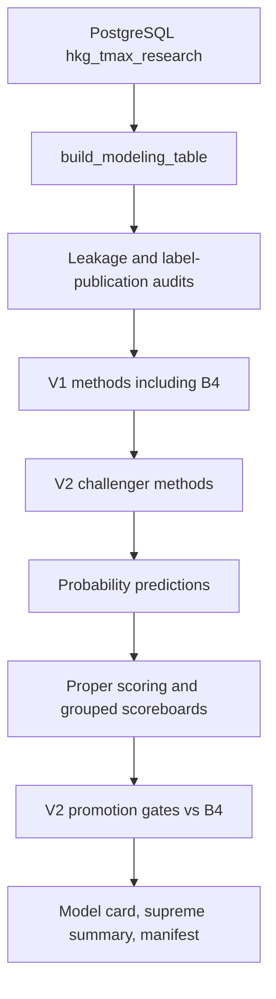

# HKG Tmax Probability Distribution Methods V2 Implementation Deep Dive

## Executive Summary

V2 adds a governed probability-method benchmark around the existing HKG Tmax probability package. It does not replace or mutate the V1 champion `B4_hierarchical_residual_pmf`; it imports B4 as the reference method and tests whether more complex distribution engines deserve promotion.

The benchmark now covers V1 methods plus true EMOS-style location-scale distributions, asymmetric two-piece Normal EMOS, a shallow tree location-scale model, quantile and threshold CDF gradient boosting, a time-decay B4 variant, and a conservative B4-plus-challenger linear pool. The result is that B4 remains supreme because no challenger clears the fold/presealed/NLL/Brier promotion gates.

Verification evidence:

- `.\.venv\Scripts\python.exe -m pytest code\tests\test_hkg_tmax_probability_distribution_methods_v2.py -q` -> `9 passed`.
- Full V2 benchmark produced the required scoreboards and artifacts under `results/`.
- Leakage audit: pass, zero violations.
- Row-identity gate: pass, zero violations.
- Live probability output no-trading audit: pass.

## Reader Orientation

Read in this order:

1. `results/supreme_method_summary.md` for the final leaderboard and champion decision.
2. `results/scoreboard.csv` for the raw sortable metrics.
3. `code/src/hkg_tmax_probability/distribution_methods_v2.py` for model implementations.
4. `code/src/hkg_tmax_probability/leaderboard_v2.py` for promotion gates.
5. `scripts/run_hkg_tmax_probability_distribution_methods_v2.py` for the experiment flow.

## Scope Boundaries

Included:

- Weather probability distribution generation from the official forecast data surface.
- Proper scoring and calibration diagnostics.
- Fold/presealed/sealed temporal governance.
- Cutoff sensitivity for `18:00`, `21:00`, and `23:59 HKT`.

Excluded:

- Market prices.
- Expected value.
- Order books.
- Kelly sizing.
- PnL.
- Market-implied blending.
- Trade recommendations.

## Requirements-to-Implementation Traceability

| Requirement | Implementation | Verification |
|---|---|---|
| Keep B4 as reference champion unless promotion gates pass | `leaderboard_v2.apply_v2_champion_gates` | `scoreboard.csv`, `test_scoreboard_champion_logic_keeps_b4_when_gains_are_below_thresholds` |
| Add true EMOS-style methods | `distribution_methods_v2.emos_predict`, `two_piece_emos_predict` | EMOS tests and full scoreboard rows `E1`, `E2`, `E3` |
| Add nonlinear and CDF challengers | `gamlss_tree_location_scale_predict`, `quantile_cdf_gb_predict`, `threshold_cdf_gb_predict` | CDF monotonicity test and scoreboard rows `G1`, `Q1`, `Q2` |
| Add time-decay B4 and hybrid pool | `time_decay_b4_predict`, `predict_distribution_methods_v2` | Scoreboard rows `T1`, `H1`; stack weights artifact |
| No leakage or sealed tuning | `distribution_v2_predictor_columns`, existing `train_validation_frames`, runner audits | `leakage_audit.json`, sealed-governance test |
| Preserve V1 B4 probabilities | V2 imports B4 read-only and returns only challenger outputs | `test_v1_b4_probabilities_remain_unchanged_when_v2_runs` |
| Write all required artifacts | V2 runner artifact writers | Artifact presence check passed; manifest generated |

## Change Inventory

| File | Change Type | Purpose |
|---|---|---|
| `code/src/hkg_tmax_probability/distribution_methods_v2.py` | Added code | Implements V2 probability challengers and method-detail exports. |
| `code/src/hkg_tmax_probability/leaderboard_v2.py` | Added code | Applies V2 B4 promotion gates and champion selection. |
| `configs/hkg_tmax/probability_distribution_methods_v2.yaml` | Added config | Declares V2 split governance, method grids, bootstrap settings, and weather-only exclusions. |
| `scripts/run_hkg_tmax_probability_distribution_methods_v2.py` | Added script | Runs the benchmark, writes scoreboards, audits, diagnostics, model card, summary, and manifest. |
| `code/tests/test_hkg_tmax_probability_distribution_methods_v2.py` | Added tests | Covers bucket rules, EMOS probability validity, CDF monotonicity, leakage, governance, B4 preservation, and champion gates. |
| `experiments/hkg_tmax_probability_distribution_methods_v2/*` | Added experiment docs/results | Stores reproducible run metadata, result files, conclusion, and this handoff. |
| `docs/PROJECT_STRUCTURE_AND_CODE_MAP.md` | Modified docs | Adds V2 code, script, config, test, and result paths. |
| `CHANGELOG.md` | Modified docs | Records the V2 implementation and outcome. |
| `EXPERIMENT_INDEX.md` | Modified docs | Adds accepted HKG-PROB-V2 entry. |

## Architecture and Control Flow



The runner evaluates primary split rows at `T-1 23:59 HKT` for champion selection. It also evaluates `18:00` and `21:00 HKT` cutoff sensitivity, but those rows do not decide the champion.

## File-by-File Deep Dive

### `distribution_methods_v2.py`

This module owns all new challenger probability methods. Inputs are training and validation modeling frames with the same forecast and target columns used by V1. Outputs are `MethodOutput` probability matrices plus JSON-serializable method details and, for continuous methods, row-level parameter parquet rows.

Important functions:

- `emos_predict`: fits ridge location and heteroskedastic ridge scale models. It selects hyperparameters on an inner chronological split by RPS, then fits on the outer train set.
- `two_piece_normal_bucket_probs`: converts an asymmetric split-normal CDF into the exact market buckets.
- `gamlss_tree_location_scale_predict`: uses shallow gradient boosting regressors for residual location and log absolute residual scale.
- `quantile_cdf_gb_predict`: trains quantile regressors, interpolates a CDF at the bucket boundaries, then projects to a valid monotone CDF.
- `threshold_cdf_gb_predict`: trains one binary CDF model per bucket boundary and applies monotone projection.
- `time_decay_hierarchical_pmf_predict`: reuses B4's hierarchy with exponentially decayed residual weights.
- `predict_distribution_methods_v2`: combines all challengers and adds `H1_b4_challenger_linear_pool`.

Maintenance invariant: this module must not import market data, prices, EV, Kelly, or trade logic.

### `leaderboard_v2.py`

This module keeps the promotion policy separate from scoring. `apply_v2_champion_gates` accepts the overall, fold1-4, and presealed scoreboards, then adds:

- fold1-4 RPS and relative gain vs B4;
- presealed RPS and relative gain vs B4;
- promotion-pass flag;
- gate-failure labels;
- final `champion_flag`.

B4 is the reference champion unless a challenger beats it by all declared gates.

### `run_hkg_tmax_probability_distribution_methods_v2.py`

The runner is the experiment entrypoint. It:

1. Loads config.
2. Builds the PostgreSQL-backed modeling table.
3. Writes modeling and forecast-row artifacts.
4. Runs leakage and label-publication audits.
5. Runs V1 and V2 methods across governed splits.
6. Runs cutoff sensitivity.
7. Writes scoreboards, parquet predictions, diagnostics, stack weights, logs, model card, supreme summary, and manifest.

The full run completed the expensive modeling/scoring work. The first attempt failed only while rendering Markdown tables because `tabulate` is not installed. The runner was patched to use an internal Markdown table writer, and the final docs/manifest were regenerated from the produced scoreboards and parquet artifacts.

### `probability_distribution_methods_v2.yaml`

The config preserves the V1 target, bucket rules, cutoffs, and temporal governance. It adds method grids for the V2 challengers and repeats the hard weather-only scope exclusions.

### `test_hkg_tmax_probability_distribution_methods_v2.py`

The test file uses synthetic frames to verify the math and contracts without relying on the live database. It covers boundary buckets, EMOS scale positivity, Student-t determinism, two-piece Normal CDF validity, quantile/threshold CDF monotonicity, predictor leakage, sealed-governance behavior, B4 preservation, and promotion-gate behavior.

## Public Interfaces and Contracts

CLI:

```powershell
.\.venv\Scripts\python.exe scripts\run_hkg_tmax_probability_distribution_methods_v2.py --config configs\hkg_tmax\probability_distribution_methods_v2.yaml --output-dir experiments\hkg_tmax_probability_distribution_methods_v2\results
```

Primary artifact contract:

- `scoreboard.csv`: primary leaderboard with ranks, metrics, gates, and champion flag.
- `scoreboard_by_split.csv`: per-split scores.
- `scoreboard_by_cutoff.csv`: cutoff sensitivity.
- `proper_score_deltas_bootstrap.csv`: bootstrap RPS deltas vs B4.
- `per_fold_predictions.parquet`: per-method validation predictions.
- `bucket_probabilities.parquet`: compact bucket probabilities.
- `continuous_distribution_params.parquet`: row-level continuous-method parameters.
- `method_selection_log.json`: hyperparameter and method-selection details.
- `leakage_audit.json`: leakage status.
- `row_identity_gate.json`: row-set equivalence status.
- `final_probability_model_card.md`: benchmark model card.
- `supreme_method_summary.md`: final champion explanation.
- `reproducibility_manifest.json`: output file hashes.

## Error Handling and Failure Modes

- Empty train/validation windows are skipped with a structured log entry.
- Constant threshold-CDF labels are handled by deterministic constant CDF rows.
- Probability matrices are normalized with floors to avoid invalid NLL inputs.
- If H1 has no selected challenger, it defaults to 100% B4.
- If a challenger has lower raw RPS but fails gates, B4 remains champion.

## Security, Privacy, and Safety Review

No secrets are written. The configured PostgreSQL DSN is the same local research DSN already used by V1. No external network requests are added. No market/trading fields are used by the V2 methods. The live-output no-trading audit passed.

## Performance Notes

The full benchmark is materially slower than V1 because it adds gradient boosting and repeated inner chronological selection. The recorded full run took roughly 30 minutes on this machine before final report rendering. Reruns should be treated as batch work, not an interactive quick check.

## Verification Evidence

Commands run from repository root:

```powershell
.\.venv\Scripts\python.exe -m pytest code\tests\test_hkg_tmax_probability_distribution_methods_v2.py -q
```

Result: `9 passed`.

```powershell
.\.venv\Scripts\python.exe scripts\run_hkg_tmax_probability_distribution_methods_v2.py --config configs\hkg_tmax\probability_distribution_methods_v2.yaml --output-dir experiments\hkg_tmax_probability_distribution_methods_v2\results
```

Result: modeling/scoring artifacts were produced. Initial final Markdown rendering failed on missing optional dependency `tabulate`; runner was patched and final docs/manifest were regenerated from the produced artifacts.

Audit checks:

- Champion: `B4_hierarchical_residual_pmf`.
- Champion RPS: `0.041523572306252`.
- Raw best: `B5_kernel_analog_pmf`, RPS `0.0412874816022434`, gates `fail:fold14_rps_gain,presealed_rps_gain,nll`.
- Leakage: pass, zero violations.
- Row identity: pass, zero violations.
- Live no-trading audit: pass.
- Required artifact presence: pass.

## Known Limitations

- V2 tests probability-generation methods on the existing official forecast surface only. It does not add external NWP, station-network, or market-derived features.
- The GBDT quantile/CDF methods were configured conservatively for runtime. They are included as challengers, not promoted methods.
- The full runner was not rerun end-to-end after the Markdown writer patch because the expensive scoring had already completed and the patch affected only final report rendering.

## Reviewer Checklist

- Confirm `scoreboard.csv` has `B4_hierarchical_residual_pmf` as `champion_flag=true`.
- Confirm `leakage_audit.json` is pass with zero violations.
- Confirm `row_identity_gate.json` is pass with zero violations.
- Confirm `live_inference_no_trading_audit.json` is pass.
- Confirm `test_hkg_tmax_probability_distribution_methods_v2.py` passes.
- Confirm V2 methods remain weather-probability-only.
- Confirm B4 implementation in `models.py` remains unchanged.
