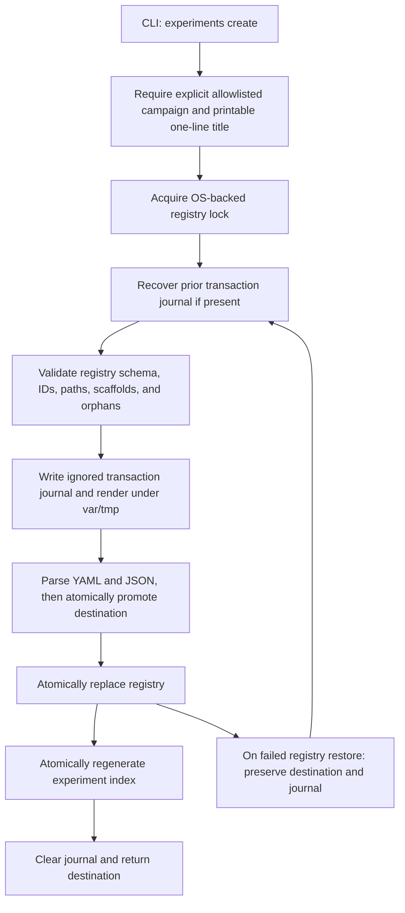

# Decision Log

## D-001 — Focus station

**Decision:** Begin with the contract-authoritative Hong Kong Observatory target rather than a generalized all-city production model.

**Reason:** Deep station/source specialization reduces semantic and physical heterogeneity. Software remains modular for later expansion.

## D-002 — Historical label status

**Decision:** Treat `CLMMAXT station=HKO` as a candidate proxy until parity with first-published Daily Extract is proven.

**Reason:** Source-product/revision differences can invalidate otherwise excellent modelling.

## D-003 — Primary horizon

**Decision:** Do not hard-code T-24 yet. Evaluate H39, H27, H24N, and H15, then freeze one in G2.

**Reason:** “24 hours before settlement” is ambiguous; forecast information and market liquidity arrive on distinct schedules.

## D-004 — ML sequencing

**Decision:** ML blocked until G1–G7.

**Reason:** Understanding, provenance, baselines, and classical signal must precede high-capacity fitting.

## D-005 — Reanalysis

**Decision:** Reanalysis is retrospective by default.

**Reason:** It incorporates information unavailable at forecast cutoff.

## D-006 — Profit claims

**Decision:** No profitability claim without executable prices, fees, slippage, latency, and fills.

**Reason:** meteorological edge and tradeable edge are different.

## D-007 — Experiment immutability

**Decision:** Never overwrite an experiment.

**Reason:** preserves research history, prevents hindsight rewriting, and enables context recovery.

## D-008 — Autonomous principal engineering and governed experiment transactions

**Decision:** Treat `AGENTS.md` as the mandatory project engineering contract,
require explicit artifact ownership and experiment campaign selection, keep Git
and bootstrap work bounded on Windows, and enforce experiment allocation through
a validated, recoverable filesystem transaction rather than prose alone.

**Reason:** Autonomous implementation is safe only when exact paths, authority
boundaries, validation, rollback, and recovery are executable contracts. Silent
defaults, duplicate dependency manifests, direct writes into final experiment
folders, stale startup documents, and nested-repository bootstrap behavior all
create the same failure pattern: a future task can be locally reasonable while
making the workspace harder to understand.

## Executive Summary

The HKG Tmax project now has one additive startup sequence and an exact ownership
map for domain code, T-24 code, probability, database, demo, frontend, scripts,
tests, configuration, packaging, containers, security, documentation, runtime
state, and governed research. Coding requests are explicitly principal-engineer
work: establish contracts, place behavior with its owner, preserve compatibility,
cover failure paths, run independent review passes, and leave no unexplained
tracked or untracked files.

The experiment command now requires an allowlisted campaign. Allocation validates
the complete registry before issuing an ID, renders into ignored runtime staging,
parses the resulting YAML and JSON, promotes the directory atomically, replaces
the registry and index through sibling temporary files, and records enough
transaction state to recover after interruption. If the live registry is still
the original snapshot, the next allocation removes only exact directories with
token-bound child ownership proof. Campaign proof alone cannot authorize child
deletion. Marker publication uses an atomic token-named pending file; malformed
final markers fail closed, while exact pending crash residue is recoverable. A
partly deleted child restores its proof only when the same device/inode directory
survives. If the new registry was committed, the destination is preserved and the
derived index is repaired. A failed rollback therefore cannot delete an unowned
collision or the directory that the live registry references.

Both bootstrap scripts now refuse the wrong Git root, a non-directory or reparse
`.git`, and any local `core.fsmonitor` value other than `false`. They set numerical
thread limits to one, run the scoped repository doctor and bounded fast suite,
avoid manifest churn, and point to current entry documents. The stale
`requirements.txt` and `requirements-dev.txt` copies were removed; `pyproject.toml`
is the sole Python dependency authority used by local setup and Docker.

## Reader Orientation

The primary readers are future coding agents, maintainers reviewing experiment
governance, and operators diagnosing an interrupted allocation. For a fast review,
read D-008, the requirements table, the architecture sequence, and verification
evidence. For maintenance, continue through the source-module deep dives and
public contracts. For incident recovery, read the transaction phases, failure
rules, rollback section, and known limitations before touching ignored `var/`
state.

The governing implementation entry points are
`projects/hkg-tmax/AGENTS.md`,
`projects/hkg-tmax/src/hkg_tmax/experiment_registry.py`,
`projects/hkg-tmax/src/hkg_tmax/experiment_transaction.py`, and
`projects/hkg-tmax/src/hkg_tmax/experiment_index.py`. The compatibility import
surface remains `projects/hkg-tmax/src/hkg_tmax/experiments.py`.

## Scope Boundaries

In scope are project agent instructions, startup routing, exact file ownership,
Git and CPU safety, bootstrap behavior, dependency authority, governed experiment
allocation, registry validation, index projection, transaction recovery,
documentation layout validation, focused tests, and canonical change records.

No forecast model, feature definition, target contract, as-of cutoff, source
catalog entry, database schema, provider request, scheduler, service, market
connection, or trading behavior changed. No live provider call, database mutation,
container startup, model run, backfill, or order action was performed. The Docker
image was not built because that would download and install dependencies; its
changed contract is checked statically and remains available for an explicitly
authorized build smoke test.

The implementation reduces CPU-spike risk through bounded commands, serial Git,
thread caps, ignored runtime staging, and disabled fsmonitor integration. It does
not claim that software can prevent every operating-system, hardware, antivirus,
or unrelated-process CPU spike.

## Source-of-Truth Inputs

- The user required autonomous principal-engineer behavior, exact code and
  experiment placement, anti-clutter enforcement, well-tested modular code, and
  Git practices that avoid the prior Windows CPU failure mode.
- `AGENTS.md` at repository root supplied the mandatory Git-first startup order,
  authority boundaries, bounded scanning rules, and prohibition on nested Git
  repositories and broad staging.
- Existing package layout, callers, `pyproject.toml`, Make targets, bootstrap
  scripts, experiment templates, registry schema, campaign documentation guard,
  and tests established compatibility requirements.
- Local Git evidence established the standalone root, branch
  `migration/restructure-20260710`, real top-level `.git`, configured upstream,
  and local `core.fsmonitor=false`.
- Independent reviews reproduced quoted-title YAML corruption, duplicate ID
  allocation from stale `next_id`, incomplete rollback, Ctrl+C residue, hostile
  journal deletion, marker-publication crash windows, promotion collisions,
  linked-template traversal, reparse traversal, nested `git init`, and
  contradictory startup/dependency routes.

## Requirements-to-Implementation Traceability

| Requirement | Implementation location | Delivered behavior | Verification | Caveat |
|---|---|---|---|---|
| New coding chats act as principal engineers | `projects/hkg-tmax/AGENTS.md` sections 1, 3, 4, and 9 | Acceptance criteria, responsibility placement, failure design, compatibility, tests, review passes, and completion evidence are mandatory | Contract review plus scoped text audit | Compliance depends on the agent loading the applicable contract |
| Code always goes to an exact owner | `projects/hkg-tmax/AGENTS.md`; `projects/hkg-tmax/docs/architecture/PROJECT_STRUCTURE_AND_CODE_MAP.md` | Production, T-24, probability, DB, demo, frontend, package/config/container/security, scripts, tests, docs, and runtime paths are mapped | Repository path audit and link checks | A genuinely new responsibility still requires an architecture decision |
| Experiments get dedicated governed folders | `projects/hkg-tmax/src/hkg_tmax/cli.py`; `projects/hkg-tmax/src/hkg_tmax/experiment_transaction.py` | `--campaign` is required; the creator allocates `EXP-0001`-style IDs beneath one allowlisted campaign | `tests/test_experiments.py` CLI, campaign, and layout cases | Historical folders retain their original names |
| Failed creation does not create a junk trail | `experiment_transaction.py`; `experiment_registry.py` | Ignored bounded staging, OS lock, atomic replacement, cross-validated journal, token-bound markers, residue audit, rollback, and forward repair keep registry/destination state reconcilable without claiming unowned paths | Render/copy/write/index/interrupt/collision/hostile-journal/double-failure/recovery tests | A recovery journal is repaired by the next create command, not by read-only validation |
| Git/bootstrap cannot recreate the CPU incident path | `projects/hkg-tmax/scripts/bootstrap.ps1`; `projects/hkg-tmax/scripts/bootstrap.sh`; `projects/hkg-tmax/tests/test_bootstrap_safety_contract.py` | Exact-root and fsmonitor checks replace nested `git init`; thread limits and bounded gates replace broad bootstrap work | shell parsing, PowerShell parsing, safety tests, repository doctor | Explicit dependency installation remains network work when bootstrap is intentionally invoked |
| One dependency authority | `projects/hkg-tmax/pyproject.toml`; `projects/hkg-tmax/Dockerfile` | Docker installs from `pyproject.toml`; duplicate requirements files are removed | static dependency-authority test | No lock file is invented; reproducible locking remains a separate governed decision |

## Change Inventory

| File | Status | Unique purpose in this change |
|---|---|---|
| `projects/hkg-tmax/AGENTS.md` | Modified | Defines autonomy boundaries, one startup sequence, principal engineering rules, exact owners, experiment workflow, resource/Git protocol, and completion gates |
| `projects/hkg-tmax/START_HERE.md` | Modified | Defers to the one canonical startup order and gives the direct Windows doctor command |
| `projects/hkg-tmax/README.md` | Modified | Routes first-time readers through AGENTS and records exact no-Make setup/fast-validation commands |
| `projects/hkg-tmax/CHANGELOG.md` | Modified | Records the behavior and safety contract delivered on 2026-07-10 |
| `projects/hkg-tmax/docs/architecture/PROJECT_OVERVIEW.md` | Modified | Replaces nonexistent legacy entry documents with current research, as-of, next-action, and production-gate owners |
| `projects/hkg-tmax/docs/architecture/PROJECT_STRUCTURE_AND_CODE_MAP.md` | Modified | Adds legacy/current T-24 distinction, probability, package, frontend build, container, hook, ignore, and security owners |
| `projects/hkg-tmax/docs/operations/CODEX_OPERATING_MANUAL.md` | Modified | Removes divergent startup and raw-output advice and narrows market work to evidence/replay |
| `projects/hkg-tmax/docs/research/REPRODUCIBILITY.md` | Modified | Removes nested repository initialization and broad staging from reproducibility guidance |
| `projects/hkg-tmax/docs/decisions/DECISION_LOG.md` | Modified | Adds D-008 as the canonical implementation and maintenance record |
| `projects/hkg-tmax/experiments/AGENTS.md` | Modified | Requires explicit campaign creation, compact evidence, transaction-state preservation, and final guards |
| `projects/hkg-tmax/experiments/README.md` | Modified | Documents campaign semantics and the validated transactional creator |
| `projects/hkg-tmax/experiments/campaigns/README.md` | Modified | Adds the explicit general campaign and corrects H24N/T-24 scope |
| `projects/hkg-tmax/experiments/campaigns/general/README.md` | Added | Reserves general for explicitly cross-cutting falsifiable hypotheses, never routine engineering |
| `projects/hkg-tmax/experiments/templates/standard/STATUS.yaml` | Modified | Uses YAML-safe typed substitution tokens for ID, title, and creation time |
| `projects/hkg-tmax/experiments/templates/standard/DATA_MANIFEST.yaml` | Modified | Uses the YAML-safe experiment-ID token |
| `projects/hkg-tmax/experiments/templates/standard/RUN_CONFIG.yaml` | Modified | Uses the YAML-safe experiment-ID token |
| `projects/hkg-tmax/src/hkg_tmax/experiment_registry.py` | Added | Owns registry schema, canonical campaigns/IDs/paths, reparse rejection, scaffold validation, and atomic file primitives |
| `projects/hkg-tmax/src/hkg_tmax/experiment_transaction.py` | Added | Owns campaign provisioning, OS locking, bounded no-follow template staging, token-bound ownership, journal recovery, commit, rollback, and creation orchestration |
| `projects/hkg-tmax/src/hkg_tmax/experiment_index.py` | Added | Owns bounded status discovery, generated index projection, and metrics-enriched status reads |
| `projects/hkg-tmax/src/hkg_tmax/experiments.py` | Modified | Preserves the established public import API as a small façade over the three cohesive owners |
| `projects/hkg-tmax/src/hkg_tmax/cli.py` | Modified | Requires `--campaign`, exposes registry validation, and delegates creation/index commands |
| `projects/hkg-tmax/src/hkg_tmax/milestones.py` | Modified | Makes generated milestone status link the current production gate instead of a retired numbered path |
| `projects/hkg-tmax/src/hkg_tmax/validation.py` | Modified | Delegates registry checks and validates YAML through bounded non-reparse roots with long-path support |
| `projects/hkg-tmax/Makefile` | Modified | Requires `CAMPAIGN`, includes bootstrap/validation safety tests, and runs the documentation layout guard |
| `projects/hkg-tmax/scripts/bootstrap.ps1` | Modified | Fails closed on Windows repository identity/fsmonitor and runs serial bounded setup checks |
| `projects/hkg-tmax/scripts/bootstrap.sh` | Modified | Applies the equivalent Unix-shell root, thread, and bounded-check contract |
| `projects/hkg-tmax/Dockerfile` | Modified | Installs from `pyproject.toml` without copying stale dependency lists or upgrading pip |
| `projects/hkg-tmax/.gitignore` | Modified | Ignores exact atomic index/registry residue, transaction-marker, marker-publication, and runtime `var/` paths |
| `projects/hkg-tmax/requirements.txt` | Deleted | Removes a divergent runtime dependency list that was not the install authority |
| `projects/hkg-tmax/requirements-dev.txt` | Deleted | Removes the divergent development dependency list and recursive requirements indirection |
| `projects/hkg-tmax/tests/test_experiments.py` | Modified | Covers explicit campaigns, schema/path/title contracts, bounded no-follow staging, hostile journals, marker crash windows, promotion collisions, partial rollback, forward recovery, reparse refusal, and CLI side effects |
| `projects/hkg-tmax/tests/test_validation.py` | Modified | Covers bounded YAML discovery and refusal to traverse linked directories |
| `projects/hkg-tmax/tests/test_bootstrap_safety_contract.py` | Added | Locks down root/fsmonitor/thread/test/document/dependency behavior in both bootstrap scripts and Docker |
| `projects/hkg-tmax/tests/test_campaign_documentation_producers.py` | Modified | Uses a non-credential fixture value so the repository doctor can remain a mandatory clean gate |

## Architecture and Control Flow

The command path is intentionally layered:



Stable contract and validation code lives in `experiment_registry.py`; mutable
transaction orchestration lives in `experiment_transaction.py`; derived read
models live in `experiment_index.py`. The CLI knows argument and composition
rules only. `validation.py` converts registry-domain failures into the project
validation interface. This dependency direction prevents CLI, Markdown, and
filesystem transaction concerns from becoming model/domain dependencies.

## File-by-File Deep Dive

### `projects/hkg-tmax/src/hkg_tmax/experiment_registry.py`

This module defines the six campaign names, supported registry version,
canonical ID and directory grammar, required scaffold files, and the validation
used both before allocation and by `hkg-tmax validate registry`. It rejects bool
values masquerading as integers, stale or duplicate IDs, duplicate directories,
nonportable separators, traversal, unknown campaigns, title drift, orphan
governed folders, reparse paths, missing campaign READMEs, malformed YAML/JSON,
and ID mismatch across status, data-manifest, and run-config files. Atomic text
and YAML replacement use unique sibling files and `os.replace`, so the live
registry or index is never opened for truncating in-place writes.

### `projects/hkg-tmax/src/hkg_tmax/experiment_transaction.py`

`create_experiment` validates the current ledger while holding a crash-released
operating-system lock stored under ignored `var/run`. It snapshots original and
updated registries plus the original generated index into an atomic JSON journal,
validates every journal field as one exact registry transition, and renders the
standard template under ignored `var/tmp/experiment-creation`. Template and
staging traversal reject links/reparse entries and stop at 512 entries or 16 MiB.
Promotion occurs only after the scaffold parses. Transaction phases bracket
promotion, registry commit, and index commit. Child and campaign markers are
published from token-bound pending files; recursive deletion requires the exact
child marker, never only a campaign marker. If deletion stops partway, proof is
recreated only when the same directory identity remains. A final residue audit
prevents journal loss after a second marker-publication failure. `BaseException`
handling includes Ctrl+C and process exit: successful rollback re-raises the
original interruption; an unprovable or failed registry restoration preserves
forward state and raises an actionable recovery error. On a later create, journal
recovery compares the live registry with both snapshots and chooses rollback or
forward index repair without guessing.

### `projects/hkg-tmax/src/hkg_tmax/experiment_index.py`

The index module reads only direct campaign and top-level experiment status
files. Every directory boundary refuses symlink and Windows reparse entries.
`generate_index` projects stable status fields into `EXPERIMENT_INDEX.md` and
writes atomically. `experiment_statuses` optionally attaches parsed metrics and
raises a domain error for malformed JSON. Neither function allocates IDs or
changes the registry.

### `projects/hkg-tmax/src/hkg_tmax/experiments.py`

The former all-in-one module is now a compatibility façade. Existing imports in
the CLI, validation layer, and external callers retain the public names while new
maintenance work has one of three precise owners. This avoids a breaking import
migration and prevents the transaction implementation from growing back into a
single mixed-responsibility file.

### `projects/hkg-tmax/src/hkg_tmax/validation.py`

Registry validation delegates to the registry owner and translates
`ExperimentError` to `ValidationError`. YAML-tree validation no longer calls an
unbounded recursive glob. It scans explicit canonical roots, uses
`follow_symlinks=False`, rejects Windows reparse attributes, skips unavailable
linked paths, supports Windows extended-length file paths, and emits one summary
line with validated and skipped counts.

### `projects/hkg-tmax/scripts/bootstrap.ps1` and `projects/hkg-tmax/scripts/bootstrap.sh`

Both scripts calculate the project path from their own location, ask Git for the
real top level with fsmonitor disabled, require the `weather_data_extraction`
root and a real top-level `.git`, and require local fsmonitor `false`. They cap
OMP, OpenBLAS, MKL, and NumExpr threads at one, install the editable project,
run both doctors, execute the exact fast test list, validate project contracts,
and run the campaign documentation guard. They do not initialize Git, upgrade
pip, run the full suite, write a repository manifest, or route to retired docs.

### `projects/hkg-tmax/tests/test_experiments.py`

The experiment suite exercises every allowlisted campaign and rejects omitted,
unknown, upper-case, absolute, and traversal campaign inputs. It covers quoted,
apostrophe, backslash, Unicode, control-character, Unicode-separator, and
overlength titles; stale IDs; schema/ID/path/orphan corruption; manifest/config
identity drift; invalid metrics; staging location; partial-copy, render,
registry-write, and index failures; Ctrl+C before and after registry replacement;
failed restoration with forward preservation; hostile journal paths; missing,
malformed, and pending ownership markers; both pre-marker crash windows;
secondary proof-restoration failure; promotion collision; linked-template
rejection; next-run journal repair; and linked campaign refusal. Sentinel tests
prove that unowned source, experiment, campaign, and collision paths survive. The
CLI test invokes `main` against a temporary root and asserts both placement and
index output.

### `projects/hkg-tmax/tests/test_bootstrap_safety_contract.py`

This static contract test reads both shell implementations and asserts that the
root, `.git`, fsmonitor, thread caps, scoped doctor, exact fast tests, current
docs, and documentation guard remain present. It rejects nested Git
initialization, retired entry names, parallel pytest, pip self-upgrade, and
manifest generation. A separate assertion fixes `pyproject.toml` as the sole
dependency authority and rejects reintroduction of either requirements file or
Docker COPY reference.

## Public Interfaces and Contracts

The creation command is:

```powershell
.\.venv\Scripts\python.exe -m hkg_tmax experiments create `
  --campaign hkg-t24 `
  --title "Falsifiable hypothesis title"
```

`--campaign` is required and accepts `hkg-tmax`, `hkg-t24`,
`residual-modeling`, `probability`, `market-edges`, or `general`. The Python
boundary is `create_experiment(root: Path, title: str, campaign: str) -> Path`;
there is no default campaign. New entries contain `id`, `title`, `campaign`,
`directory`, `created_at_utc`, and `status`, while `next_id` must exceed every
allocated numeric ID. Registered directories use the portable shape
`campaigns/{campaign}/EXP-0001-{slug}`.

Runtime transaction state is ignored and internal: the OS lock and JSON journal
live under `var/run`; staging lives under `var/tmp/experiment-creation`. Exact
token-bound child/campaign markers exist only during a transaction and are
ignored. Those paths are not research evidence and must not be edited to bypass a
failure. The tracked experiment contract remains one README, three YAML
contracts, and `results/metrics.json`.

## Failure, Security, and Resource Behavior

Invalid campaign, title, registry, template, path, scaffold, or reparse state
fails before registry mutation. Provider credentials and environment values are
not read or printed by experiment creation. Atomic sibling residue has exact
ignore entries, while normal exception and interrupt paths remove only
marker-proven state. A destination that appears during promotion without the
transaction child marker is preserved. The journal remains whenever exact
transaction residue or an unprovable state still needs recovery.

Git remains single-owner and serial. Startup uses tracked-only status with
`core.fsmonitor=false`; discovery and staging use explicit path scopes. Bootstrap
and agent-run numerical work use one thread. Network, database, scheduler,
service, backfill, production, and trading actions remain outside this change and
fail closed without explicit authority.

## Testing and Verification Evidence

| Command/check | Result | Proves | Does not prove |
|---|---|---|---|
| Ruff check and format check on 11 changed Python modules/tests | Passed | Import order, formatting, and enabled static lint rules | Runtime correctness |
| Mypy on 7 changed source modules | Passed with no issues | Typed boundaries and platform-lock abstraction satisfy configured typing rules | Runtime filesystem behavior |
| Explicit `compileall` on 7 changed source modules | Passed | Python syntax and bytecode compilation | Behavioral correctness |
| `pytest -rA tests/test_experiments.py` | 56 passed, 1 environment-dependent symlink case skipped | Allocation, hostile-state preservation, rollback/recovery, registry/path, CLI, and index contracts | Provider, DB, or production behavior |
| Bootstrap, validation, producer, and campaign-documentation focused suite | 29 passed, 1 environment-dependent symlink case skipped | Bootstrap, dependency authority, bounded YAML, producer, and docs-layout contracts | Full project integration |
| Exact fast suite recorded in `README.md` | 96 passed, 2 environment-dependent symlink cases skipped | Cross-area compatibility for config, experiments, validation, HKO backfill, T-24 schema/policy, and demo migration | Full release suite and live integrations |
| `python -m hkg_tmax validate all` | Passed with the pre-existing target/horizon warnings | Project config, source, acquisition, template, registry, and bucket contracts | G1 target verification or G2 horizon selection |
| `python -m hkg_tmax validate yaml` | Passed for 326 bounded files; 129 reparse/unavailable paths skipped | Canonical YAML can be parsed without following linked trees | Contents of skipped historical linked paths |
| `python scripts/manage_campaign_documentation.py check` | Passed with 27 canonical READMEs | Consolidated human-document layout | Scientific correctness of experiment conclusions |
| Project doctor | Passed | Python, Git discovery, config, catalog, paths, and project root | Remote services |
| Scoped repository doctor | Passed with zero errors and warnings | Nested repo, secret-shape, reparse, and structure policy in scope | Unrelated projects outside the scope |
| Bash parser and PowerShell parser | Passed | Both bootstrap scripts are syntactically valid | A networked dependency installation run |
| `git diff --check` on `projects/hkg-tmax` | Passed | No whitespace-error diff | Semantic correctness |

Exact final command outputs and commit identity are recorded in the task handoff;
the table distinguishes static, focused, project-wide bounded, and skipped checks
so a clean lint result is never presented as a live-system test.

## Deployment, Operations, and Rollback

There is no schema or data migration. The code becomes active when the changed
branch is checked out and a user invokes the project CLI or bootstrap. Existing
historical experiment directories are not renamed, rewritten, or registered.
The empty general campaign README is a navigation contract only.

For an interrupted create, run the same explicit create command again. While
holding the OS lock, recovery either removes the uncommitted destination/staging
recorded by the original snapshot and proven by exact ownership, or completes
index repair for the committed updated registry. If the journal, registry,
markers, directory identity, or path relationship cannot be reconciled, the tool
preserves all evidence and reports the journal path; do not delete files to force
progress.

Code rollback is a normal revert of this scoped commit. Because no database,
provider, or external data state changed, no data rollback is needed. Reverting
the dependency cleanup would require restoring both deleted requirements files
and the Docker COPY line together; partial restoration would recreate the
authority conflict D-008 removes.

## Known Limitations and Follow-Up Work

- Journal reconciliation runs before the next create command. Read-only
  `validate registry` reports inconsistent state but intentionally does not
  mutate it.
- A hard disk failure that corrupts both the live registry and both journal
  snapshots cannot be resolved automatically; the tool preserves state and
  requires evidence-based recovery.
- Directory-link creation is unavailable in the current Windows test context,
  so one synthetic symlink case is skipped. Windows reparse checks are also
  exercised by the live bounded YAML scan and scoped repository doctor.
- Docker build execution is outside scope because it would install dependencies
  from external indexes. The Dockerfile contract is checked statically.
- Target canonical status and primary horizon remain open research gates. Their
  existing validation warnings are unrelated to engineering autonomy.
- Hardware, operating-system, security-scanner, and unrelated-process load remain
  outside repository control; the delivered rules reduce known amplification
  paths rather than promise impossible machine-wide zero CPU spikes.

## Reviewer Checklist

- [x] One Git-first additive startup sequence governs project work.
- [x] Exact code, config, test, docs, container, security, and runtime owners are documented.
- [x] Campaign selection is explicit at CLI, Make, and Python boundaries.
- [x] Registry schema, IDs, directories, scaffolds, and orphan folders fail closed.
- [x] Ordinary exceptions, Ctrl+C, failed restoration, and interrupted transactions have tests.
- [x] Hostile journals, unowned promotion collisions, partial deletion, and both marker-publication crash levels preserve evidence and fail safely.
- [x] Template/staging discovery is bounded and refuses links or Windows reparse entries.
- [x] Bootstrap cannot initialize a nested repository or enable fsmonitor.
- [x] Runtime staging and atomic residue are ignored and bounded.
- [x] Duplicate dependency manifests are removed from the active project.
- [x] Every changed path appears in the inventory with a distinct reason.
- [x] No live network, database, scheduler, service, backfill, or trading action was performed.
- [x] Verification evidence distinguishes passed, skipped, warned, and unexecuted checks.
