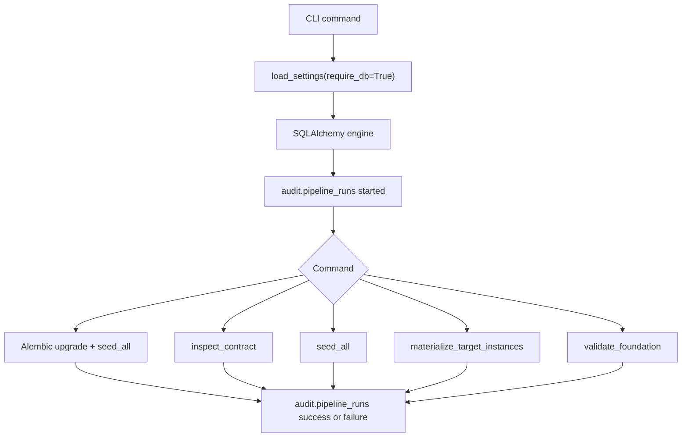

# KLGA Task 00 Foundation Implementation Deep Dive

## Executive Summary

Task `00_foundation_universal_ingestion_contract_and_availability_ledger` is now implemented as a new Python package at `bootstrap/klga_tmax/implementation`. The package creates the KLGA foundation database contract, exposes the `klga-tmax` CLI, computes IANA timezone-safe target cutoffs, seeds the registry, materializes target/cutoff rows, and validates the leakage-critical foundation rules before provider ingestion starts.

The implementation is intentionally isolated from the old `ml/src/weather_ml/klga_daily_tmax_dist` code because the old package is MySQL-oriented and same-day modeling oriented. The new package uses PostgreSQL, Alembic, SQLAlchemy, Typer, and the canonical `KLGA_DB_URL` environment variable from `supplemental_doc_1.md`.

The database side creates 8 schemas and 17 foundation tables. The migration includes the patched expression unique index for `silver.availability_ledger`, a revision-capable `silver.target_daily_actuals`, task-00 generic bronze/silver/gold tables, audit tables, registry tables, and low-cost report metadata tables from `supplemental_doc_1_patch_1.md`.

Runtime verification passed against local PostgreSQL 16 database `klga_tmax_research` with DSN `postgresql+psycopg://<user>:<password>@127.0.0.1:5432/klga_tmax_research`. The contract inspection reported 8 schemas, 17 tables, 4 critical indexes, 4 cutoff rows, 34 station rows, 1 default feature-version row, and 24 materialized target instances for `2026-06-25..2026-06-30`.

No Wunderground, IEM, GribStream, Open-Meteo, NOAA, or Polymarket provider fetch was implemented. This task only creates the database skeleton, registry seeds, timing rules, audit hooks, leakage checks, and command surface needed before those source-specific tasks begin.

## Reader Orientation and Document Map

Primary readers are the next Codex implementation session, a reviewer checking the migration before provider ingestion, and the operator running the first KLGA backfill jobs.

Read `Scope Boundaries` first to avoid confusing this foundation task with data acquisition. Read `Public Interfaces and Contracts` before running commands. Read `Data Model, Persistence, and Migration Notes` before editing DDL. Read `Testing and Verification Evidence` before trusting the local database state. Read `File-by-File Deep Dive` when changing a module.

This document contains:

1. Inputs and requirements used for the implementation.
2. A requirement-to-code trace.
3. A changed-file inventory.
4. CLI, schema, and environment contracts.
5. Control flow for migration, inspection, seeding, materialization, and validation.
6. File-specific maintenance notes.
7. Verification evidence and limitations.

## Scope Boundaries

In scope:

- New isolated package under `bootstrap/klga_tmax/implementation`.
- Alembic migration directory and initial migration `0001_klga_tmax_core_schema.py`.
- SQLAlchemy model definitions for task-00 and patch-relevant tables.
- Typer CLI commands: `db migrate`, `db inspect-contract`, `registry seed`, `registry materialize-targets`, `validate foundation`.
- `KLGA_DB_URL` config enforcement with exit code `10`.
- Audit-row creation and update in `audit.pipeline_runs` for DB-touching commands.
- Cutoff calculation with `zoneinfo`.
- Station/cutoff/default-feature seed data.
- Target/cutoff materialization in `gold.target_instances`.
- Availability and leakage helpers.
- Focused tests and local PostgreSQL smoke checks.

Out of scope:

- Provider data fetches.
- Source-specific Wunderground/IEM/GribStream/Open-Meteo/NOAA/Polymarket loaders.
- Model training, PMF creation, calibration, backtesting, and trading decisions.
- Live trading persistence beyond the low-cost report tables included by patch.
- Production deployment and secret management.

Deferred by design:

- Source-specific normalization loaders from existing acquisition tables. The foundation tables now exist; source tasks can add deterministic loaders when real fetched table shapes are known.
- Full `supplemental_doc_1.md` modeling and trading CLI command set. Task 00 only implements the universal layer requested in the plan.

## Source-of-Truth Inputs

- User implementation plan for KLGA Task 00.
- `bootstrap/klga_tmax/strategy_spec/data_aquisition/00_foundation_universal_ingestion_contract_and_availability_ledger/00_universal_ingestion_contract_and_availability_ledger.md`.
- `bootstrap/klga_tmax/strategy_spec/data_aquisition/01_station_universe_and_coordinates/10_station_universe_and_coordinates.md`.
- `bootstrap/klga_tmax/strategy_spec/KLGA_strategy_spec/supplemental_doc_1.md`.
- `bootstrap/klga_tmax/strategy_spec/KLGA_strategy_spec/supplemental_doc_1_patch_1.md`.
- Local PostgreSQL context file `bootstrap/klga_tmax/strategy_spec/context/KLGA_TMAX_POSTGRES_PERSISTENCE_CONTEXT.md`.
- Command evidence from compile, pytest, CLI help, migration, inspection, materialization, validation, idempotent migration rerun, console-script help, and direct `psql`.

## Requirements-to-Implementation Traceability

| Requirement | Implementation location | Delivered behavior | Verification | Caveat |
|---|---|---|---|---|
| New isolated package under `bootstrap/klga_tmax/implementation`. | `bootstrap/klga_tmax/implementation/pyproject.toml`, `bootstrap/klga_tmax/implementation/src/klga_tmax/__init__.py` | Package `klga-tmax` uses `src` layout and installs editable. | `python -m pip install -e .` passed; `python -m klga_tmax.cli --help` passed. | Generated `src/klga_tmax.egg-info` was removed after install. |
| Alembic-backed Postgres schemas. | `bootstrap/klga_tmax/implementation/alembic/versions/0001_klga_tmax_core_schema.py` | Creates 8 required schemas and `pgcrypto`. | `db inspect-contract` passed; `psql` returned `schemas=8`. | Alembic version table remains in default schema. |
| Task-00 tables exist. | Migration plus `bootstrap/klga_tmax/implementation/src/klga_tmax/db/migrations_check.py` | Creates registry, bronze, silver, gold, reports, and audit foundation tables. | `db inspect-contract` returned `tables_checked=17`. | Provider-specific silver tables beyond target labels are deferred. |
| Expression uniqueness for availability ledger. | Migration, `REQUIRED_INDEXES` in `migrations_check.py` | Creates `ux_availability_ledger_identity` with `COALESCE(...)`. | Unit test `test_availability_ledger_expression_unique_index_is_declared`; `psql` returned `availability_expression_index=1`. | SQLAlchemy model does not render the expression index; migration is authoritative. |
| Canonical `KLGA_DB_URL`. | `bootstrap/klga_tmax/implementation/src/klga_tmax/config.py`, updated Postgres context doc | DB-touching commands require `KLGA_DB_URL`; missing config exits `10`. | `tests/test_cli_config.py` passed. | `KLGA_ARTIFACT_ROOT` defaults only in local env. |
| Cutoff calendar uses IANA zones. | `bootstrap/klga_tmax/implementation/src/klga_tmax/registry/cutoffs.py` | Computes all four cutoffs via `ZoneInfo` and UTC conversion. | `tests/test_timezones_cutoffs.py` passed; validator passed. | Local day end is stored as exclusive next local midnight for clean duration math. |
| Registry seeds. | `seed_cutoffs.py`, `seed_stations.py`, `seed.py` | Seeds 4 cutoffs, 34 station/pseudo-point rows, and default feature version. | Migration output showed row counts; inspector confirmed seed counts. | 34 rows include station-spec rows plus supplemental pseudo defaults. |
| Target materialization. | `registry/materialize_targets.py`, CLI command | Inserts `gold.target_instances` per date/cutoff and joins current KLGA labels when available. | `registry materialize-targets ... --replace` inserted 24 rows. | Labels remain null until Wunderground actuals are loaded. |
| Availability eligibility. | `ingestion/eligibility.py` | Uses `our_ingested_at_utc`, provider availability, then conservative lag; cutoff comparison is inclusive. | `tests/test_availability_eligibility.py` passed. | Source-specific lag constants are not encoded here. |
| Bronze duplicate/revision decision. | `ingestion/bronze.py` | Returns existing record for duplicate payload hash; creates next revision and supersedes current for changed payload. | `tests/test_hashes_and_revisions.py` passed. | DB insert function is deferred until source loaders exist. |
| Feature trace leakage rejection. | `features/leakage.py` | Rejects source traces whose max availability is after cutoff and rejects T-1/T label usage. | `tests/test_feature_trace.py` and `tests/test_label_guards.py` passed. | Full feature materializer is deferred. |
| Manifest writer exists. | `ingestion/manifest.py` | Builds and writes source manifest JSON with row counts, errors, warnings, git SHA, and config hash. | Compile passed. | No source-specific job calls it yet. |
| Audit all DB commands. | `db/audit.py`, `cli.py` | DB commands create and update `audit.pipeline_runs`. | DB commands completed after audit bootstrap; `db migrate` also records failure if migration raises. | `--help` intentionally does not create DB rows. |
| Documentation deliverable. | This file and updated Postgres context doc | Records files, schema, commands, verification, limits, and handoff notes. | Documentation quality gate run after drafting. | This doc describes task 00, not full MVP. |

## Change Inventory

| File | Status | Main symbols/objects | Why it changed | Runtime effect | Verification |
|---|---|---|---|---|---|
| `bootstrap/klga_tmax/implementation/pyproject.toml` | Added config | project metadata, dependencies, console script, pytest path | Defines installable package and test import path. | `klga-tmax` console script and editable install are available. | `python -m pip install -e .` |
| `bootstrap/klga_tmax/implementation/alembic.ini` | Added config | Alembic script location and logging | Allows programmatic migration execution. | Migration config resolves from project root. | `db migrate` |
| `bootstrap/klga_tmax/implementation/alembic/env.py` | Added migration wiring | Alembic online/offline hooks | Reads `KLGA_DB_URL` and model metadata. | Alembic can apply the revision. | `db migrate` |
| `bootstrap/klga_tmax/implementation/alembic/script.py.mako` | Added migration template | revision template | Supports future revisions. | No runtime effect in task 00. | Compile |
| `bootstrap/klga_tmax/implementation/alembic/versions/0001_klga_tmax_core_schema.py` | Added migration/schema | schemas, tables, indexes, downgrade | Creates task-00 database contract. | 8 schemas and 17 tables created. | `db migrate`, `psql` |
| `bootstrap/klga_tmax/implementation/src/klga_tmax/__init__.py` | Added package | `__version__` | Marks package import root. | Package imports cleanly. | Compile |
| `bootstrap/klga_tmax/implementation/src/klga_tmax/constants.py` | Added config code | paths, timezones, exit codes | Centralizes constants used by CLI and validators. | Exit codes and canonical names are shared. | Pytest |
| `bootstrap/klga_tmax/implementation/src/klga_tmax/config.py` | Added config code | `Settings`, `load_settings`, `ConfigError` | Enforces `KLGA_DB_URL` for DB commands. | Missing DB config exits `10`. | `tests/test_cli_config.py` |
| `bootstrap/klga_tmax/implementation/src/klga_tmax/cli.py` | Added CLI | Typer apps and commands | Exposes migration, inspection, seed, materialize, validate commands. | Operators can run task-00 workflow. | CLI help and DB commands |
| `bootstrap/klga_tmax/implementation/src/klga_tmax/db/__init__.py` | Added package marker | module docstring | Marks DB package. | Import path available. | Compile |
| `bootstrap/klga_tmax/implementation/src/klga_tmax/db/audit.py` | Added DB code | `ensure_audit_table`, `start_pipeline_run`, `finish_pipeline_run` | Audits DB command execution. | Writes `audit.pipeline_runs`. | DB commands |
| `bootstrap/klga_tmax/implementation/src/klga_tmax/db/engine.py` | Added DB code | `make_engine` | Creates SQLAlchemy engine from settings. | DB commands share engine construction. | DB commands |
| `bootstrap/klga_tmax/implementation/src/klga_tmax/db/migrations_check.py` | Added validation code | required schemas/tables/columns/indexes, `inspect_contract` | Implements `db inspect-contract`. | Fails missing schema/table/index/seed state. | Inspect command and unit test |
| `bootstrap/klga_tmax/implementation/src/klga_tmax/db/models.py` | Added model code | SQLAlchemy declarative classes | Gives application code typed table definitions. | Imports model metadata for Alembic env. | Compile |
| `bootstrap/klga_tmax/implementation/src/klga_tmax/features/__init__.py` | Added package marker | module docstring | Marks feature package. | Import path available. | Compile |
| `bootstrap/klga_tmax/implementation/src/klga_tmax/features/aliases.py` | Added feature code | `FEATURE_ALIASES`, `resolve_feature_alias` | Implements patch alias map. | Shorthand names resolve to canonical long names. | Compile |
| `bootstrap/klga_tmax/implementation/src/klga_tmax/features/leakage.py` | Added leakage code | trace and label guards | Enforces cutoff and label-history leakage rules. | Late features and T-1 labels are rejected. | Feature trace and label tests |
| `bootstrap/klga_tmax/implementation/src/klga_tmax/ingestion/__init__.py` | Added package marker | module docstring | Marks ingestion package. | Import path available. | Compile |
| `bootstrap/klga_tmax/implementation/src/klga_tmax/ingestion/bronze.py` | Added ingestion code | bronze revision dataclasses and decision function | Captures duplicate/revision contract. | Source loaders can call deterministic decision policy. | Bronze tests |
| `bootstrap/klga_tmax/implementation/src/klga_tmax/ingestion/eligibility.py` | Added ingestion code | `AvailabilityInput`, eligibility functions | Encodes availability priority order. | Candidate rows can be tested against cutoffs. | Availability tests |
| `bootstrap/klga_tmax/implementation/src/klga_tmax/ingestion/hash_keys.py` | Added ingestion code | JSON canonicalization and SHA helpers | Builds deterministic request IDs and payload hashes. | Source requests can be reproduced and deduped. | Hash tests |
| `bootstrap/klga_tmax/implementation/src/klga_tmax/ingestion/manifest.py` | Added ingestion code | manifest dataclass, builder, writer | Provides required source-job manifest artifact writer. | Future source jobs can emit manifest JSON. | Compile |
| `bootstrap/klga_tmax/implementation/src/klga_tmax/registry/__init__.py` | Added package marker | module docstring | Marks registry package. | Import path available. | Compile |
| `bootstrap/klga_tmax/implementation/src/klga_tmax/registry/cutoffs.py` | Added registry code | `CutoffSpec`, cutoff functions | Computes UTC cutoffs and target day windows. | DST-safe materialization. | Cutoff tests |
| `bootstrap/klga_tmax/implementation/src/klga_tmax/registry/materialize_targets.py` | Added registry code | `materialize_target_instances` | Inserts `gold.target_instances`. | Creates date/cutoff rows with current label join. | Materialization command |
| `bootstrap/klga_tmax/implementation/src/klga_tmax/registry/seed.py` | Added registry code | `seed_all`, feature-version seed | Orchestrates registry seed flow. | `db migrate` and `registry seed` insert registry data. | Migration output |
| `bootstrap/klga_tmax/implementation/src/klga_tmax/registry/seed_cutoffs.py` | Added registry code | `seed_cutoffs` | Seeds 4 canonical cutoffs. | Cutoff registry populated. | Migration output |
| `bootstrap/klga_tmax/implementation/src/klga_tmax/registry/seed_stations.py` | Added registry code | station and pseudo-point seeds | Seeds station universe and supplemental pseudo defaults. | 34 station rows available. | Inspect command |
| `bootstrap/klga_tmax/implementation/src/klga_tmax/utils/__init__.py` | Added package marker | module docstring | Marks utility package. | Import path available. | Compile |
| `bootstrap/klga_tmax/implementation/src/klga_tmax/utils/git.py` | Added utility code | `current_git_sha` | Captures repo SHA for audit and feature seed rows. | Audit rows and feature version store source SHA or `unknown`. | DB commands |
| `bootstrap/klga_tmax/implementation/src/klga_tmax/validation/__init__.py` | Added package marker | module docstring | Marks validation package. | Import path available. | Compile |
| `bootstrap/klga_tmax/implementation/src/klga_tmax/validation/foundation.py` | Added validation code | `validate_foundation` | Runs contract, cutoff, and gold leakage checks. | `validate foundation` fails unsafe foundation state. | Validator command |
| `bootstrap/klga_tmax/implementation/tests/test_timezones_cutoffs.py` | Added test | DST and example cutoff assertions | Pins IANA cutoff behavior. | Detects fixed-offset regressions. | Pytest |
| `bootstrap/klga_tmax/implementation/tests/test_availability_eligibility.py` | Added test | availability boundary assertions | Pins inclusive cutoff eligibility. | Detects after-cutoff leakage. | Pytest |
| `bootstrap/klga_tmax/implementation/tests/test_label_guards.py` | Added test | label-history assertions | Pins T-2 maximum label date. | Detects T-1/T label leakage. | Pytest |
| `bootstrap/klga_tmax/implementation/tests/test_feature_trace.py` | Added test | source trace assertions | Pins source availability guard. | Detects future-source feature use. | Pytest |
| `bootstrap/klga_tmax/implementation/tests/test_hashes_and_revisions.py` | Added test | hash and bronze revision assertions | Pins deterministic IDs and revision policy. | Detects unstable hashing or duplicate inserts. | Pytest |
| `bootstrap/klga_tmax/implementation/tests/test_schema_contract.py` | Added test | contract list and migration index assertions | Pins task-00 tables and expression index DDL. | Detects index regression. | Pytest |
| `bootstrap/klga_tmax/implementation/tests/test_cli_config.py` | Added test | help and config exit assertions | Pins no-DB help and exit `10`. | Detects accidental DB requirement for help. | Pytest |
| `bootstrap/klga_tmax/strategy_spec/context/KLGA_TMAX_POSTGRES_PERSISTENCE_CONTEXT.md` | Modified docs | `KLGA_DB_URL` and SQLAlchemy DSN | Aligns local DB context with supplement. | Future runs use canonical env var. | Manual read |
| `bootstrap/klga_tmax/strategy_spec/context/KLGA_TMAX_00_FOUNDATION_IMPLEMENTATION_DEEP_DIVE.md` | Added docs | this handoff | Documents implementation and evidence. | Future maintainers can inspect task-00 state. | Documentation quality gate |

## Architecture and Control Flow



`db migrate` bootstraps `audit.pipeline_runs`, applies Alembic revision `0001_klga_tmax_core_schema`, and then calls `seed_all`. `seed_all` inserts or refreshes the 4 cutoff rows, 34 station rows, and default `klga_tmax_core / supplemental_doc_1_v1` feature version.

`db inspect-contract` reflects the database and verifies `pgcrypto`, schemas, task-00 tables, required columns, critical indexes, and seed counts. `validate foundation` adds runtime checks for 30 DST/non-DST dates, the exact 2026-06-28 cutoff examples, and a SQL scan proving no existing gold feature row has `max_source_available_at_utc > cutoff_utc`.

`registry materialize-targets` deletes selected `gold.target_instances` rows only when `--replace` is passed. It reinserts one row per target date and active cutoff, computes New York local day UTC bounds with `zoneinfo`, and left joins current KLGA target labels if `silver.target_daily_actuals` already contains them.

## File-by-File Deep Dive

### `bootstrap/klga_tmax/implementation/pyproject.toml`

Defines the package name, Python range, dependencies, console script, setuptools `src` layout, and pytest import path. The dependency set is deliberately limited to task-00 needs: SQLAlchemy, Alembic, psycopg, Typer, and Rich. Heavy modeling packages from the supplement are not pulled into this foundation task.

### `bootstrap/klga_tmax/implementation/alembic.ini`

Stores Alembic script location and logger defaults. `cli.py` overrides the URL with `KLGA_DB_URL`, so the file contains no secret or local DSN.

### `bootstrap/klga_tmax/implementation/alembic/env.py`

Loads `src` onto `sys.path`, imports `Base.metadata`, and reads the database URL from Alembic config or `KLGA_DB_URL`. Failure to provide a DB URL raises before any migration runs.

### `bootstrap/klga_tmax/implementation/alembic/script.py.mako`

Standard Alembic revision template kept for later migrations. It is not used by runtime commands after the initial revision exists.

### `bootstrap/klga_tmax/implementation/alembic/versions/0001_klga_tmax_core_schema.py`

Authoritative task-00 DDL. The upgrade creates `pgcrypto`, all 8 schemas, registry tables, audit tables, bronze request/record tables, generic silver facts, availability ledger, revision-capable target labels, gold target/features/matrix tables, and report metadata tables. Expression uniqueness from the patch is implemented through `CREATE UNIQUE INDEX`, including `ux_availability_ledger_identity`. The downgrade drops task-00 tables in reverse dependency order.

### `bootstrap/klga_tmax/implementation/src/klga_tmax/constants.py`

Centralizes project root, target station, timezone names, default feature version, formula contract hash, and exit codes. CLI, registry, config, and validation modules import these constants instead of duplicating literals.

### `bootstrap/klga_tmax/implementation/src/klga_tmax/config.py`

Parses environment configuration once. `load_settings(require_db=True)` raises `ConfigError` with exit code `10` when `KLGA_DB_URL` is absent. `KLGA_ENV` defaults to `local`, `KLGA_TRADING_MODE` defaults to `paper`, `KLGA_ARTIFACT_ROOT` defaults to `./artifacts/klga_tmax` only in local env, and `KLGA_N_JOBS` defaults to `1`.

### `bootstrap/klga_tmax/implementation/src/klga_tmax/cli.py`

Defines the Typer command surface. Date flags are accepted as ISO strings and parsed with `date.fromisoformat` because the installed Typer version does not support `datetime.date` option annotations. DB commands start an audit run, execute their operation, and update the audit run as `success` or `failed`. `db migrate` maps migration failure to exit `20`; inspection, seed, materialization, and validation failures map to exit `30`; missing DB config maps to exit `10`.

### `bootstrap/klga_tmax/implementation/src/klga_tmax/db/audit.py`

Bootstraps and writes `audit.pipeline_runs`. The bootstrap DDL matches the migration table contract so `db migrate` can log before Alembic applies the revision. JSON command args and row counts are cast to `jsonb` through SQL parameters.

### `bootstrap/klga_tmax/implementation/src/klga_tmax/db/engine.py`

Creates a SQLAlchemy engine with `future=True` and `pool_pre_ping=True`. It is the only module that constructs engines for the CLI.

### `bootstrap/klga_tmax/implementation/src/klga_tmax/db/migrations_check.py`

Defines the inspection contract used by `db inspect-contract` and `validate foundation`. It checks extension presence, schemas, tables, required columns, critical indexes, expression index content, and seed row counts.

### `bootstrap/klga_tmax/implementation/src/klga_tmax/db/models.py`

Defines SQLAlchemy declarative classes for the task-00 schema and patch-relevant report tables. The classes give application code typed access to columns and keep Alembic env metadata importable. The migration remains authoritative for expression indexes.

### `bootstrap/klga_tmax/implementation/src/klga_tmax/features/aliases.py`

Implements the patch-required `FEATURE_ALIASES` map and `resolve_feature_alias`. This prevents future modeling code from inserting shorthand feature names into `gold.feature_values`.

### `bootstrap/klga_tmax/implementation/src/klga_tmax/features/leakage.py`

Contains two guard families. `validate_feature_trace_for_cutoff` rejects source traces with availability after cutoff. `assert_daily_high_label_history_safe` rejects KLGA daily-high label dates after `T-2`.

### `bootstrap/klga_tmax/implementation/src/klga_tmax/ingestion/bronze.py`

Encodes bronze duplicate/revision policy as pure dataclasses and `decide_bronze_revision`. A duplicate payload hash returns the current ID. A changed payload returns next revision number, prior current ID as superseded ID, and `mark_prior_current_false=True`.

### `bootstrap/klga_tmax/implementation/src/klga_tmax/ingestion/eligibility.py`

Implements the task-00 availability priority order. The function first uses `our_ingested_at_utc`, then provider availability, then run/valid time plus conservative lag. All timestamps are normalized to UTC and the cutoff comparison is inclusive.

### `bootstrap/klga_tmax/implementation/src/klga_tmax/ingestion/hash_keys.py`

Provides canonical JSON serialization, SHA-256 hashing, payload hashing, retrieval-time bucketing, and deterministic source request IDs. Request ID generation includes source name, endpoint, sorted params, and a UTC retrieval bucket.

### `bootstrap/klga_tmax/implementation/src/klga_tmax/ingestion/manifest.py`

Builds source manifests with job ID, source name, git SHA, config hash, timestamps, row counts, errors, and warnings. The writer stores a JSON artifact under `artifact_root/manifests/{job_id}.json`.

### `bootstrap/klga_tmax/implementation/src/klga_tmax/registry/cutoffs.py`

Owns canonical cutoff definitions, cutoff lookup, UTC conversion, New York local day window calculation, materialized cutoff row construction, and a fixed set of 30 DST/non-DST validation dates. It uses `ZoneInfo` only.

### `bootstrap/klga_tmax/implementation/src/klga_tmax/registry/seed_cutoffs.py`

Upserts the 4 canonical cutoff rows. The command updates timezone, time, offset, description, and active state on conflict.

### `bootstrap/klga_tmax/implementation/src/klga_tmax/registry/seed_stations.py`

Defines and upserts 34 registry rows. It includes 19 airport/station rows from the station acquisition spec, 10 `GP_*` gridded pseudo-points from the station spec, and 5 `PSEUDO_*` defaults from the supplement. `regional_context` is stored in `station_group`; `station_role` uses supplement-allowed values.

### `bootstrap/klga_tmax/implementation/src/klga_tmax/registry/seed.py`

Orchestrates cutoffs, stations, and feature version seeding. The feature version row uses feature set `klga_tmax_core`, feature version `supplemental_doc_1_v1`, the current git SHA, and formula hash `supplemental_doc_1_plus_patch_1`.

### `bootstrap/klga_tmax/implementation/src/klga_tmax/registry/materialize_targets.py`

Materializes `gold.target_instances` for an inclusive date range. With `replace=True`, it deletes selected target instances in one transaction before insert. Without replace, `ON CONFLICT DO NOTHING` skips existing date/cutoff rows.

### `bootstrap/klga_tmax/implementation/src/klga_tmax/utils/git.py`

Runs `git -C C:/Users/ahmad/Desktop/generalFiles/git/weather_markets/weather_data_extraction rev-parse --short HEAD` with a 5-second timeout. If git is unavailable, it returns `unknown` rather than blocking a local command.

### `bootstrap/klga_tmax/implementation/src/klga_tmax/validation/foundation.py`

Composes contract inspection with runtime foundation checks. It verifies timezone-aware UTC cutoffs for the sample date set, exact 2026-06-28 expected UTC cutoffs, and zero gold feature rows whose source availability exceeds the target cutoff.

### Test Files

`bootstrap/klga_tmax/implementation/tests/test_timezones_cutoffs.py` pins cutoff examples, DST day durations, and pre-local-day ordering. `test_availability_eligibility.py` pins inclusive cutoff eligibility and fallback availability. `test_label_guards.py` pins T-2 label history. `test_feature_trace.py` pins source availability rejection. `test_hashes_and_revisions.py` pins canonical JSON, request bucket stability, and bronze revision decisions. `test_schema_contract.py` pins required task-00 tables and the availability expression index. `test_cli_config.py` pins no-DB help and exit code `10`.

### Documentation Files

`bootstrap/klga_tmax/strategy_spec/context/KLGA_TMAX_POSTGRES_PERSISTENCE_CONTEXT.md` now names `KLGA_DB_URL` as canonical and adds the SQLAlchemy `postgresql+psycopg` DSN. `bootstrap/klga_tmax/strategy_spec/context/KLGA_TMAX_00_FOUNDATION_IMPLEMENTATION_DEEP_DIVE.md` records the implementation and verification evidence for this task.

## Public Interfaces and Contracts

CLI:

```powershell
python -m klga_tmax.cli db migrate
python -m klga_tmax.cli db inspect-contract
python -m klga_tmax.cli registry seed
python -m klga_tmax.cli registry materialize-targets --start-date 2026-06-25 --end-date 2026-06-30 --replace
python -m klga_tmax.cli validate foundation
```

Console script:

```powershell
& "$env:APPDATA\Python\Python311\Scripts\klga-tmax.exe" --help
```

The console script was generated by editable install, but `C:\Users\ahmad\AppData\Roaming\Python\Python311\Scripts` is not on PATH in this shell. The `python -m klga_tmax.cli ...` form is the reliable invocation from this environment.

Environment:

```powershell
$env:KLGA_DB_URL = "postgresql+psycopg://<user>:<password>@127.0.0.1:5432/klga_tmax_research"
```

Exit codes:

| Code | Meaning | Implemented in |
|---:|---|---|
| `0` | Command succeeded. | All CLI commands |
| `10` | Required config missing or invalid. | `config.py`, `cli.py` |
| `20` | Migration failed. | `db migrate` |
| `30` | Inspection, validation, seed, or materialization failed. | Non-migration DB commands |

## Data Model, Persistence, and Migration Notes

Schemas created:

```text
registry, bronze, silver, gold, predictions, trading, reports, audit
```

Foundation tables created:

```text
registry.stations
registry.cutoffs
registry.feature_versions
registry.model_versions
audit.pipeline_runs
audit.ingestion_manifests
audit.data_quality_failures
bronze.source_requests
bronze.source_records
silver.normalized_facts
silver.availability_ledger
silver.target_daily_actuals
gold.target_instances
gold.feature_values
gold.feature_matrix
reports.backtest_runs
reports.metrics
```

Key indexes:

```text
ux_availability_ledger_identity
ux_target_daily_actuals_one_current
ux_model_versions_identity
ux_bronze_source_records_one_current
```

Migration order is `db migrate` first, then optional `registry seed`, then `registry materialize-targets`. `db migrate` already seeds the registry, so `registry seed` is an idempotent refresh command.

Rollback is available through Alembic downgrade, but it drops task-00 tables. Do not run downgrade after provider acquisition starts unless a backup exists and the user approves deleting foundation data.

## Error Handling, Edge Cases, and Failure Modes

Missing `KLGA_DB_URL` fails before any database connection attempt and exits `10`. Typer help does not require DB config. Invalid date strings in `registry materialize-targets` fail during CLI parameter parsing. A migration exception updates the audit run as failed when the audit table exists and exits `20`. Validation failures are printed as JSON failure lists and exit `30`.

The audit bootstrap table is created before Alembic runs so `db migrate` itself can be audited. The bootstrap DDL matches the migration table to avoid a shape mismatch when Alembic later executes `CREATE TABLE IF NOT EXISTS`.

Target materialization uses one transaction from the CLI helper. With `--replace`, target rows are deleted for the selected range and then reinserted. Dependent feature rows would cascade through the `ON DELETE CASCADE` foreign keys on `gold.feature_values` and `gold.feature_matrix`.

## Security, Privacy, and Safety Review

No provider credentials were added. The only local credential documented is the already-established local PostgreSQL admin password in the private context file. CLI commands do not print `KLGA_DB_URL`. Request headers in future bronze records have a `request_headers_redacted` field; source loaders must redact secrets before insert.

SQL uses SQLAlchemy parameter binding for runtime values. The migration is static DDL. The only subprocess call is `git rev-parse --short HEAD` with fixed arguments and a timeout.

The generated `klga-tmax.exe` is installed in the user Python Scripts directory. The source tree does not retain generated `klga_tmax.egg-info` metadata after cleanup.

## Performance, Scalability, and Concurrency

Task-00 commands operate on small registry and schema metadata. The only loop with date-range scale is target materialization, which inserts four rows per target date. This is adequate for a multi-year training range because row count is roughly `4 * number_of_days`.

Database integrity is protected by unique constraints and indexes: target instances are unique on `(target_date, cutoff_id)`, feature rows are unique by target/feature/build version, current bronze records have a partial unique index, and availability identity uses the required expression unique index.

No parallel execution or background work is introduced. `KLGA_N_JOBS` defaults to `1` for future deterministic training commands.

## Configuration and Environment

Required for DB commands:

```text
KLGA_DB_URL
```

Optional or defaulted:

```text
KLGA_ARTIFACT_ROOT: defaults to ./artifacts/klga_tmax only when KLGA_ENV=local
KLGA_ENV: defaults to local
KLGA_TRADING_MODE: defaults to paper
KLGA_N_JOBS: defaults to 1
KLGA_LOG_LEVEL: defaults to INFO
```

Dependencies installed during verification:

```text
alembic>=1.13,<2
typer>=0.12,<1
rich>=13,<15
```

The editable package install was required so `python -m klga_tmax.cli` resolves from the `src` layout without manually setting `PYTHONPATH`.

## Testing and Verification Evidence

| Command/check | Directory | Result | Evidence | What it proves | What it does not prove |
|---|---|---|---|---|---|
| `python -m compileall -q src tests` | `bootstrap/klga_tmax/implementation` | Passed | Exit `0` | Python files parse. | Runtime DB behavior. |
| `python -m pytest -q` | `bootstrap/klga_tmax/implementation` | Passed | `20 passed in 2.29s` | Unit contracts for cutoffs, availability, leakage, hashing, schema constants, CLI config. | Live provider ingestion. |
| `python -m klga_tmax.cli --help` | `bootstrap/klga_tmax/implementation` | Passed | Help listed `db`, `registry`, `validate`. | Module CLI resolves. | DB connectivity. |
| `python -m klga_tmax.cli db migrate` | `bootstrap/klga_tmax/implementation` | Passed | `{"ok": true, "row_counts": {"registry.cutoffs": 4, "registry.feature_versions": 1, "registry.stations": 34}}` | Migration applies and seeds registry. | Provider data correctness. |
| `python -m klga_tmax.cli db inspect-contract` | `bootstrap/klga_tmax/implementation` | Passed | `ok=true`, 8 schemas, 17 tables, 4 indexes, 4 cutoffs, 34 stations | Contract is present in Postgres. | Future source mappings. |
| `python -m klga_tmax.cli registry materialize-targets --start-date 2026-06-25 --end-date 2026-06-30 --replace` | `bootstrap/klga_tmax/implementation` | Passed | `target_instances_inserted=24` | Target/cutoff rows materialize. | Training labels exist. |
| `python -m klga_tmax.cli validate foundation` | `bootstrap/klga_tmax/implementation` | Passed | `late_feature_rows=0`, `target_instance_rows=24` | Contract, cutoff examples, DST sample set, and gold leakage scan pass. | Source-specific feature formulas. |
| Second `python -m klga_tmax.cli db migrate` | `bootstrap/klga_tmax/implementation` | Passed | Exit `0`, row counts refreshed | Migration command is safe to rerun. | Downgrade path. |
| Direct `psql` query | `bootstrap/klga_tmax/implementation` | Passed | `schemas=8`, `tables=17`, `cutoffs=4`, `stations=34`, `target_instances=24`, `availability_expression_index=1` | Database state exists outside app reflection. | Data acquisition coverage. |
| `& "$env:APPDATA\Python\Python311\Scripts\klga-tmax.exe" --help` | `bootstrap/klga_tmax/implementation` | Passed | Help output listed same commands | Console script exists. | Console script on PATH. |

## Operational Runbook

Set the DB URL:

```powershell
Set-Location C:\Users\ahmad\Desktop\generalFiles\git\weather_markets\weather_data_extraction\bootstrap\klga_tmax\implementation
$env:KLGA_DB_URL = "postgresql+psycopg://<user>:<password>@127.0.0.1:5432/klga_tmax_research"
```

Apply or refresh foundation:

```powershell
python -m klga_tmax.cli db migrate
python -m klga_tmax.cli db inspect-contract
python -m klga_tmax.cli validate foundation
```

Materialize a target-date range:

```powershell
python -m klga_tmax.cli registry materialize-targets --start-date 2026-06-25 --end-date 2026-06-30 --replace
```

Direct database inspection:

```powershell
$env:PGPASSWORD = "root"
& "C:\Program Files\PostgreSQL\16\bin\psql.exe" -h 127.0.0.1 -p 5432 -U postgres -d klga_tmax_research
```

## Compatibility, Rollback, and Upgrade Notes

This package does not modify the old ML package. It creates new schemas inside `klga_tmax_research`; if the database already contains provider acquisition tables in another layout, those tables are untouched by task 00.

`db migrate` can be rerun. `registry seed` can be rerun. `registry materialize-targets` is idempotent without `--replace` and destructive only for selected `gold.target_instances` rows with `--replace`.

Rollback command, only before source data matters:

```powershell
$env:KLGA_DB_URL = "postgresql+psycopg://<user>:<password>@127.0.0.1:5432/klga_tmax_research"
Set-Location C:\Users\ahmad\Desktop\generalFiles\git\weather_markets\weather_data_extraction\bootstrap\klga_tmax\implementation
python -m alembic -c alembic.ini downgrade base
```

## Known Limitations and Follow-Up Work

1. No provider data is fetched. Impact: labels, observations, forecasts, and market snapshots remain empty. Follow-up: implement `02_wunderground_settlement_actuals` next.
2. Source-specific silver tables for MOS, observations, and gridded forecasts are not included except `silver.target_daily_actuals`. Impact: future loaders must add their exact tables or map into `silver.normalized_facts`. Follow-up trigger: first provider ingestion task.
3. Bronze DB insert/revision function is not implemented. Impact: `decide_bronze_revision` pins policy, but source loaders still need a transaction-level insert function. Follow-up trigger: first external fetcher.
4. Feature materialization is not implemented. Impact: `gold.feature_values` and `gold.feature_matrix` schemas exist, but no model-ready features are produced. Follow-up trigger: after source tables contain data.
5. Console script directory is not on PATH. Impact: `klga-tmax` works by absolute path or after PATH update; `python -m klga_tmax.cli` works now. Follow-up trigger: local shell setup preference.

## Reviewer Checklist

- [x] `KLGA_DB_URL` is canonical in code and context documentation.
- [x] Alembic migration creates required schemas and task-00 tables.
- [x] `silver.availability_ledger` expression uniqueness is an index.
- [x] Cutoff logic uses IANA `zoneinfo`.
- [x] Registry seeds include cutoffs, station universe, pseudo-points, and default feature version.
- [x] DB commands audit to `audit.pipeline_runs`.
- [x] Target instances materialize date/cutoff rows.
- [x] Unit tests cover required task-00 behavior.
- [x] Local Postgres migration, inspection, materialization, validation, rerun, and direct `psql` checks passed.
- [x] No provider credentials or source fetch code were added.
