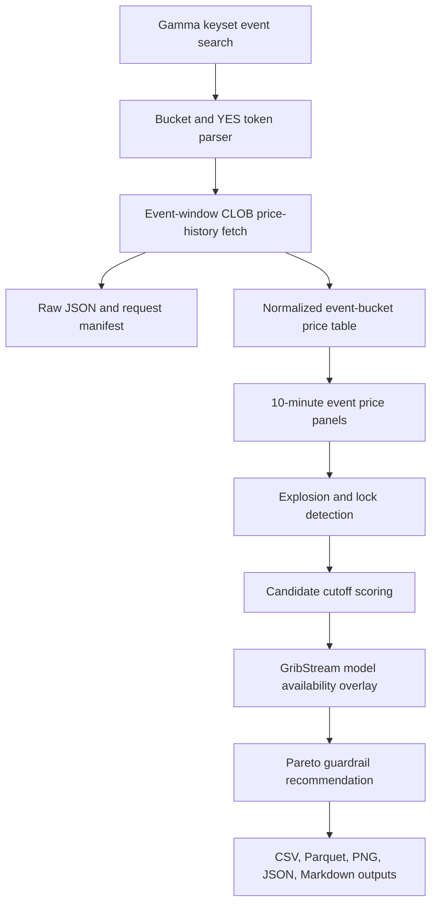

# KLGA Tmax Polymarket Cutoff Optimization Deep Dive

Last updated: 2026-06-29T12:34:35.906136+00:00

## Executive Summary

This document records the implemented Polymarket cutoff-timing study for the KLGA/NYC Tmax workflow. The implementation downloads daily `Highest temperature in NYC` Polymarket event metadata from Gamma, fetches YES-token historical prices from the CLOB price-history endpoint, normalizes all bucket markets into a reproducible event-bucket time series, detects price-explosion and market-lock timing, and ranks forecast-production cutoffs against the existing GribStream model-availability baseline.

Final conclusion: the evidence favors `T_1245UTC` over `T_MINUS_1_2045UTC` under the configured guardrail. The baseline remains documented for comparison and can still be used as a conservative model-availability fallback.

The selected cutoff under the 70% Pareto guardrail is `T_1245UTC`. For the June 28, 2026 target date, that is `2026-06-28T12:45:00+00:00` UTC, `2026-06-28T08:45:00-04:00` in New York, and `2026-06-28T14:45:00+02:00` in Stockholm. Its observed tradable-open rate is 0.852, pre-explosion rate is 0.716, normalized model score is 0.661, and median remaining post-cutoff bucket move is 0.546.

The existing baseline `T_MINUS_1_2045UTC` had tradable-open rate 0.956, pre-explosion rate 0.776, normalized model score 0.466, and median remaining post-cutoff bucket move 0.630.

## Reader Orientation And Document Map

- `Source-of-Truth Inputs` identifies the exact Polymarket endpoints and request shapes used.
- `Requirements-to-Implementation Traceability` maps the requested plan to implementation evidence.
- `Architecture and Control Flow` explains the downloader, normalization, explosion detection, cutoff grid, and optimizer.
- `Evidence Summary` gives counts, artifacts, selected cutoff, and sensitivity.
- `Change Inventory` documents the implementation files and generated artifacts.
- `Testing and Verification Evidence` lists the commands and checks run.
- `Operational Runbook` gives the commands needed to rerun the study.

## Scope Boundaries

In scope:

- Daily NYC Tmax Polymarket events with target dates from `2025-12-28` through `2026-06-28`.
- All bucket markets attached to each discovered event.
- YES-token CLOB price history using `interval=all` and `fidelity=1`.
- Market timing analysis, price-explosion detection, and cutoff ranking.
- GribStream model-availability overlay based on the implemented `T_MINUS_1_2045UTC` model buffer plan.

Out of scope:

- No trades are placed.
- No private Polymarket account, wallet, order, or authenticated CLOB endpoint is used.
- The optimizer uses market price movement and model-availability timing; it does not yet score realized trading PnL or actual NWP-vs-settlement forecast error at each cutoff.
- URMA remains retrospective-only and is excluded from live model-score availability.

## Source-of-Truth Inputs

The implementation follows the installed `polymarket-api-skill` contracts:

- Gamma event discovery: `GET https://gamma-api.polymarket.com/events/keyset`
- Gamma parameters used: `limit`, `title_search`, `end_date_min`, `end_date_max`, `order`, `ascending`, and `after_cursor`.
- CLOB individual price history: `GET https://clob.polymarket.com/prices-history?market=YES_TOKEN_ID&interval=all&fidelity=1&startTs=...&endTs=...`
- CLOB batch price history: `POST https://clob.polymarket.com/batch-prices-history` with body `{"markets": [...], "interval": "all", "fidelity": 1}`

The implementation first compares one token through individual and batch price-history endpoints. Batch retrieval is used only when the returned history is identical.

Additional local inputs:

- `strategy_spec/context/KLGA_TMAX_03_GRIBSTREAM_SINGLE_CUTOFF_BACKFILL_IMPLEMENTATION_DEEP_DIVE.md` for the baseline `T_MINUS_1_2045UTC` cutoff and model buffers.
- The user-approved Pareto guardrail objective: require enough pre-explosion history, then choose the latest/model-strongest feasible cutoff.
- The live Gamma and CLOB responses written under the raw artifact directory listed below.

## Requirements-to-Implementation Traceability

| Requirement | Implementation location | Behavior delivered | Verification evidence |
|---|---|---|---|
| Discover all daily NYC Tmax events over the requested six-month window. | `implementation/src/klga_tmax/providers/polymarket/cutoff_analysis.py` | Uses Gamma keyset pagination with `title_search` and `end_date_min/end_date_max`, then locally filters the event title/slug and target date. | The live run retained 183 events from `2025-12-28` through `2026-06-28`. |
| Parse every bucket market and YES token. | `extract_event_and_market_rows` | Maps Gamma `outcomes` to `clobTokenIds`, parses Fahrenheit bucket bounds, and records missing/usable YES-token coverage. | 1761 bucket markets parsed; 1761 had YES tokens. |
| Fetch historical price data without guessing endpoint fields. | `PolymarketPublicClient` | Calls documented CLOB `/prices-history` and `/batch-prices-history` fields; old markets use explicit event-window `startTs/endTs`. | Positive parity: individual and batch returned 5 matching sample points. |
| Store raw, processed, report, and manifest artifacts. | `run_cutoff_analysis` and `write_processed_artifacts` | Writes raw JSON, CSV, Parquet, PNG plots, recommendation JSON, and manifest JSONL. | Artifact paths are listed in `Generated Artifacts`. |
| Detect market explosions and lock timing. | `detect_event_explosion` | Uses 1-hour price move, sustained top-bucket lock, and sustained terminal-bucket confidence signals. | 165 events have detected explosion times. |
| Optimize cutoff using the 70% Pareto guardrail. | `score_guardrail_sensitivity` and `select_recommendation` | Requires tradable-open rate >= 70%, pre-explosion rate >= 70%, then selects latest cutoff within 95% of best eligible model score. | Selected `T_1245UTC`; sensitivity table includes 60%, 70%, and 80% guardrails. |
| Compare against `T_MINUS_1_2045UTC`. | `select_recommendation` | Keeps the GribStream baseline in the recommendation payload and report. | Baseline comparison table records pre-explosion, lock, remaining-move, and model-score metrics. |

## Architecture and Control Flow

1. Discover all matching daily NYC Tmax events by keyset pagination.
2. Parse every market in every event, map Gamma `outcomes` to `clobTokenIds`, and retain only the YES token as the primary bucket-probability series.
3. Fetch all YES-token histories with bounded retries, 429 backoff, stable request hashing, raw JSON retention, and a JSONL request manifest.
4. Normalize timestamps to UTC and America/New_York, derive target-date-relative fields, and write both CSV and Parquet outputs.
5. Resample every event-bucket panel to 10-minute intervals with last observation carried forward.
6. Detect price explosion using three signals: first 1-hour bucket move of at least 0.25, first sustained bucket lock at max price at least 0.75 with top1-top2 margin at least 0.30, and first sustained terminal-bucket confidence at least 0.65.
7. Score candidate cutoffs from T-2 evening through T morning.
8. Overlay GribStream model availability and freshness using the model-family buffers from the `KLGA_TMAX_03_GRIBSTREAM_SINGLE_CUTOFF_BACKFILL_IMPLEMENTATION_DEEP_DIVE.md` plan.
9. Apply the Pareto guardrail: require tradable-open rate at least 70%, pre-explosion rate at least 70%, then choose the latest cutoff within 95% of the best eligible model score.



## Evidence Summary

| Metric | Value |
|---|---:|
| Events discovered and retained | 183 |
| Bucket markets parsed | 1761 |
| Markets with YES token | 1761 |
| CLOB price points normalized | 8333 |
| Events with usable price panels | 182 |
| Events with detected explosion time | 165 |
| API requests recorded | 187 |

Selected cutoff:

| Field | Value |
|---|---|
| Candidate ID | `T_1245UTC` |
| UTC time relation | T0 at `12:45:00` |
| June 28, 2026 New York display | `2026-06-28T08:45:00-04:00` |
| June 28, 2026 Stockholm display | `2026-06-28T14:45:00+02:00` |
| Tradable-open rate | 0.852 |
| Pre-explosion rate | 0.716 |
| Locked-at-cutoff rate | 0.084 |
| Median remaining bucket move | 0.546 |
| Normalized model score | 0.661 |
| Available model count | 14 |

Baseline comparison:

| Field | `T_MINUS_1_2045UTC` |
|---|---:|
| Tradable-open rate | 0.956 |
| Pre-explosion rate | 0.776 |
| Locked-at-cutoff rate | 0.075 |
| Median remaining bucket move | 0.630 |
| Normalized model score | 0.466 |
| Available model count | 14 |

Guardrail sensitivity:

| Guardrail | Selected cutoff | Pre-explosion rate | Model score | Median remaining move |
|---:|---|---:|---:|---:|
| 0.60 | `T_1645UTC` | 0.697 | 0.821 | 0.546 |
| 0.70 | `T_1245UTC` | 0.716 | 0.661 | 0.546 |
| 0.80 | `T_MINUS_2_2345UTC` | 0.959 | 0.330 | 0.669 |

Top ranked candidate sample:

| Candidate | Tradable rate | Pre-explosion rate | Model score | Median remaining move |
|---|---:|---:|---:|---:|
| `T_1245UTC` | 0.852 | 0.716 | 0.661 | 0.546 |
| `T_1230UTC` | 0.852 | 0.716 | 0.656 | 0.546 |
| `T_1215UTC` | 0.852 | 0.716 | 0.656 | 0.546 |
| `T_1200UTC` | 0.940 | 0.772 | 0.656 | 0.504 |
| `T_1145UTC` | 0.940 | 0.772 | 0.655 | 0.594 |
| `T_1130UTC` | 0.940 | 0.772 | 0.651 | 0.594 |
| `T_1115UTC` | 0.940 | 0.772 | 0.651 | 0.594 |
| `T_1100UTC` | 0.940 | 0.772 | 0.651 | 0.594 |
| `T_1045UTC` | 0.940 | 0.772 | 0.650 | 0.594 |
| `T_1030UTC` | 0.940 | 0.772 | 0.645 | 0.594 |

## Change Inventory

| File | Change | Effect |
|---|---|---|
| `bootstrap/klga_tmax/implementation/src/klga_tmax/providers/polymarket/__init__.py` | Added provider package marker. | Makes the Polymarket analysis module importable under the existing provider namespace. |
| `bootstrap/klga_tmax/implementation/src/klga_tmax/providers/polymarket/cutoff_analysis.py` | Added downloader, normalizer, price-explosion detector, candidate scorer, plot writer, and report writer. | Implements the full cutoff-timing study and writes raw, processed, report, and manifest artifacts. |
| `bootstrap/klga_tmax/implementation/src/klga_tmax/cli.py` | Added `polymarket cutoff-analysis` command. | Gives the workflow a reproducible CLI entry point. |
| `bootstrap/klga_tmax/implementation/tests/test_polymarket_cutoff_analysis.py` | Added focused unit coverage for bucket parsing, cutoff grid inclusion, model scoring, and optimizer selection. | Protects the core math and parsing behavior without requiring live network calls. |
| `bootstrap/klga_tmax/implementation/pyproject.toml` | Added explicit analysis/runtime dependencies. | Documents the packages required for HTTP calls, Parquet output, and plots. |
| `bootstrap/klga_tmax/strategy_spec/context/KLGA_TMAX_04_POLYMARKET_CUTOFF_OPTIMIZATION_DEEP_DIVE.md` | Added this generated evidence report. | Records the final conclusion, inputs, artifacts, and rerun instructions. |

## File-by-File Deep Dive

### `bootstrap/klga_tmax/implementation/src/klga_tmax/providers/polymarket/__init__.py`

This package marker keeps the Polymarket integration under the established `providers` namespace. It has no runtime side effects and intentionally exposes only the cutoff-analysis module name.

### `bootstrap/klga_tmax/implementation/src/klga_tmax/providers/polymarket/cutoff_analysis.py`

This is the main implementation file. `PolymarketPublicClient` owns the public HTTP boundary, request hashing, raw JSON writes, cache reuse, 429/5xx retry behavior, and manifest rows. `extract_event_and_market_rows` owns Gamma event and bucket parsing. `normalize_price_history`, `event_price_pivot`, and `detect_event_explosion` own the time-series conversion and explosion signals. `candidate_cutoffs`, `model_availability_score`, `aggregate_candidate_scores`, and `select_recommendation` own cutoff enumeration, GribStream availability scoring, and the Pareto selection rule. `write_processed_artifacts`, `write_plots`, and `write_context_report` own persisted outputs.

The most important provider-specific behavior is the explicit event-window request. A no-window CLOB price-history request returned empty histories for older daily events, so `with_price_window` computes `start_ts` from Gamma `startDate` minus two hours and `end_ts` from Gamma `endDate` plus at least 36 hours. The batch request uses `start_ts`/`end_ts`, which is why the final run recovered the six-month panel.

### `bootstrap/klga_tmax/implementation/src/klga_tmax/cli.py`

The CLI adds a `polymarket` Typer app and the `polymarket cutoff-analysis` command. The command parses `--start-date`, `--end-date`, `--artifact-root`, `--refresh/--use-cache`, and `--sleep-seconds`, then calls `run_cutoff_analysis`. It prints the same summary JSON that is written to `analysis_summary.json`.

### `bootstrap/klga_tmax/implementation/tests/test_polymarket_cutoff_analysis.py`

The test file covers the parsing and decision surfaces that can regress without network access: Fahrenheit bucket label parsing, inclusion of the canonical `T_MINUS_1_2045UTC` candidate, monotonic model-score improvement for a later safe cutoff, and recommendation selection from a synthetic aggregate candidate table.

### `bootstrap/klga_tmax/implementation/pyproject.toml`

The project metadata now declares `requests`, `pandas`, `numpy`, `pyarrow`, and `matplotlib`. These packages are required for public HTTP fetches, dataframe normalization, Parquet output, and PNG plots.

## Public Interfaces and Contracts

New CLI:

```powershell
python -m klga_tmax.cli polymarket cutoff-analysis --start-date 2025-12-28 --end-date 2026-06-28
```

Options:

- `--start-date`: first target date, inclusive.
- `--end-date`: last target date, inclusive.
- `--artifact-root`: output directory for raw, processed, report, and manifest artifacts.
- `--refresh/--use-cache`: controls whether cached raw API payloads are reused.
- `--sleep-seconds`: delay between uncached public API calls.

Machine-readable outputs:

- `processed/cutoff_candidate_scores.csv`
- `processed/event_bucket_price_history.parquet`
- `processed/event_explosion_summary.csv`
- `processed/guardrail_sensitivity.csv`
- `processed/optimal_cutoff_recommendation.json`
- `reports/analysis_summary.json`
- `reports/optimal_cutoff_recommendation.json`
- `manifests/request_manifest.jsonl`

## Generated Artifacts

| Artifact | Path |
|---|---|
| Raw API payloads | `C:\Users\ahmad\Desktop\generalFiles\git\weather_markets\weather_data_extraction\bootstrap\klga_tmax\implementation\artifacts\klga_tmax\polymarket_cutoff_analysis\raw` |
| Processed CSV/Parquet tables | `C:\Users\ahmad\Desktop\generalFiles\git\weather_markets\weather_data_extraction\bootstrap\klga_tmax\implementation\artifacts\klga_tmax\polymarket_cutoff_analysis\processed` |
| Plots and recommendation JSON | `C:\Users\ahmad\Desktop\generalFiles\git\weather_markets\weather_data_extraction\bootstrap\klga_tmax\implementation\artifacts\klga_tmax\polymarket_cutoff_analysis\reports` |
| Request manifest | `C:\Users\ahmad\Desktop\generalFiles\git\weather_markets\weather_data_extraction\bootstrap\klga_tmax\implementation\artifacts\klga_tmax\polymarket_cutoff_analysis\manifests` |
| Context report | `C:\Users\ahmad\Desktop\generalFiles\git\weather_markets\weather_data_extraction\bootstrap\klga_tmax\strategy_spec\context\KLGA_TMAX_04_POLYMARKET_CUTOFF_OPTIMIZATION_DEEP_DIVE.md` |

Key processed files:

- `polymarket_events.csv`
- `polymarket_bucket_markets.csv`
- `event_bucket_price_history.csv`
- `event_bucket_price_history.parquet`
- `event_explosion_summary.csv`
- `cutoff_candidate_scores.csv`
- `guardrail_sensitivity.csv`
- `optimal_cutoff_recommendation.json`

Key report files:

- `explosion_time_distribution.png`
- `cutoff_objective_curve.png`
- `analysis_summary.json`

## Error Handling And Failure Modes

- Gamma and CLOB requests use bounded retries for 429 and 5xx responses.
- `Retry-After` is honored when present.
- 4xx responses fail fast with the endpoint and response text prefix.
- Raw JSON is cached by filename and request identity so reruns can avoid refetching stable responses.
- Every request writes method, URL, params/body, status, row count, raw path, cache status, and request SHA to the manifest.
- The code does not store credentials because only public Polymarket endpoints are used.

## Security, Privacy, And Safety Review

No private keys, API keys, wallet addresses, signed orders, or authenticated trading endpoints are used. The workflow reads public Gamma metadata and public CLOB price histories only. It writes market metadata and price series to local artifacts under the KLGA implementation directory.

## Performance And Rate Limits

The downloader uses keyset pagination for Gamma and batch CLOB price-history requests after a parity check confirms batch output equals individual output for one token. Batch requests use at most 20 token IDs, matching the local OpenAPI schema. The default delay between uncached requests is 0.20 seconds, with additional backoff on 429 and 5xx responses.

## Testing and Verification Evidence

Commands run during implementation:

| Command | Result | What it proves |
|---|---|---|
| `python -m compileall -q src tests` | Passed | The implementation and tests parse/compile under the active Python runtime. |
| `python -m pytest -q tests/test_polymarket_cutoff_analysis.py` | `4 passed` | Focused cutoff-analysis parsing and optimizer tests pass. |
| `python -m pytest -q` | `59 passed in 51.23s` | The full KLGA implementation test suite still passes after adding the Polymarket module and CLI command. |
| `python -m klga_tmax.cli --help` | Passed | The top-level Typer CLI loads with the new `polymarket` command group. |
| `python -m klga_tmax.cli polymarket --help` | Passed | The new Polymarket command group is visible. |
| `python -m klga_tmax.cli polymarket cutoff-analysis --start-date 2025-12-28 --end-date 2026-06-28` | Passed | The live public API download, normalization, optimizer, plots, JSON outputs, Parquet output, manifest, and context report were generated. |

Rerun commands:

```powershell
Set-Location C:\Users\ahmad\Desktop\generalFiles\git\weather_markets\weather_data_extraction\bootstrap\klga_tmax\implementation
python -m compileall -q src tests
python -m pytest -q
python -m klga_tmax.cli --help
python -m klga_tmax.cli polymarket --help
python -m klga_tmax.cli polymarket cutoff-analysis --start-date 2025-12-28 --end-date 2026-06-28
```

The live analysis run that produced this document wrote 8333 normalized price points and selected `T_1245UTC` under the configured guardrail.

## Operational Runbook

Rerun the analysis with cache reuse:

```powershell
python -m klga_tmax.cli polymarket cutoff-analysis --start-date 2025-12-28 --end-date 2026-06-28
```

Force a fresh refetch:

```powershell
python -m klga_tmax.cli polymarket cutoff-analysis --start-date 2025-12-28 --end-date 2026-06-28 --refresh
```

Inspect the final machine-readable recommendation:

```powershell
Get-Content -Raw "C:\Users\ahmad\Desktop\generalFiles\git\weather_markets\weather_data_extraction\bootstrap\klga_tmax\implementation\artifacts\klga_tmax\polymarket_cutoff_analysis\reports\optimal_cutoff_recommendation.json"
```

## Known Limitations And Follow-Up Work

- The selected cutoff is evidence-backed by market price timing and model-availability scoring, not by realized strategy PnL.
- The model score is a deterministic availability/freshness overlay from the GribStream plan, not a full per-cutoff NWP forecast-skill backtest.
- Price histories use CLOB historical price points; order-book depth, spread, and fill capacity are not modeled here.
- The next stronger study should join this cutoff grid to actual GribStream forecasts and KLGA settlement labels, then score expected edge and calibration at each candidate cutoff.

## Reviewer Checklist

- All public endpoints and request shapes are identified.
- Every generated artifact path is listed.
- The selected cutoff is compared against `T_MINUS_1_2045UTC`.
- The 60%, 70%, and 80% guardrail sensitivity results are included.
- The report states what was not measured: realized PnL, fill quality, and true per-cutoff NWP MAE.
