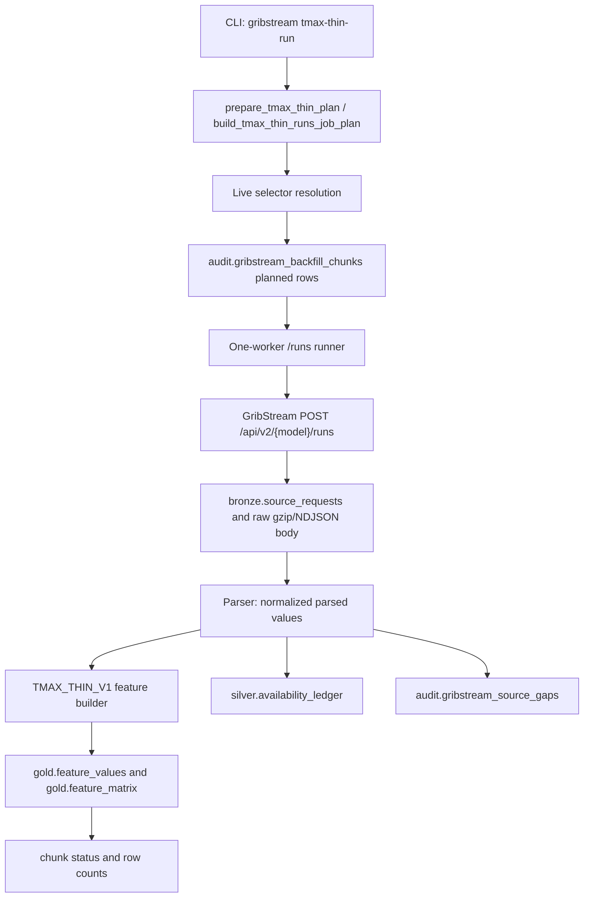

# KLGA Tmax GribStream T_1245UTC Thin Backfill Implementation Deep Dive

## Executive Summary

This document records the implemented and executed KLGA `T_1245UTC` thin Tmax GribStream backfill.

The broad `klga_t1245utc_runs_fast_backfill_v1` path was not resumed. A new job, `klga_t1245utc_tmax_thin_backfill_v1`, was implemented and run with a `TMAX_THIN_V1` feature profile. The new path uses GribStream `POST /api/v2/{model}/runs` requests with exact run `timesList`, a one-worker 2 second throttle, live selector resolution, bronze raw persistence, job/chunk audit rows, availability ledger rows, source-gap tracking, and compact gold feature persistence. In default mode it does not write full atomic rows to `silver.grib_forecast_values`.

The live backfill completed for all planned chunks:

- Job ID: `klga_t1245utc_tmax_thin_backfill_v1`
- Cutoff ID: `T_1245UTC`
- Target through date: `2026-06-28`
- Planned and completed chunks: `438 / 438`
- Failed, blocked, rate-limited, auth-failed, or still-running chunks: `0`
- Authenticated HTTP requests: `438`, all HTTP `200`
- Bronze raw records/files: `438`
- Total recorded response bytes: `305,330,424`
- Gold feature upserts: `1,528,742`
- Availability rows upserted: `1,325,836`
- Job-scoped source gaps recorded from chunks: `419`
- Estimated credits planned and completed: `404,160 / 404,160`
- Atomic `silver.grib_forecast_values` rows tied to this thin job: `0`
- Runtime: `110.13` minutes, from `2026-06-29 21:57:53Z` to `2026-06-29 23:48:01Z`

The actual credit count is within the planned thin range and is approximately `64.9%` lower than the earlier approximately `1.15M` broad plan.

## Reader Orientation And Document Map

Read this document if you need to reproduce, resume, audit, or extend the KLGA `T_1245UTC` GribStream backfill.

The main sections answer these questions:

- Scope Boundaries: what this implementation did and did not do.
- Source-of-Truth Inputs: where the request, code, database, and provider evidence came from.
- Requirements Traceability: how each requested requirement maps to code and runtime evidence.
- Change Inventory: every implementation file changed for the thin path.
- Architecture And Control Flow: how the CLI, planner, resolver, runner, parser, and persistence path connect.
- Data Model And Execution Results: what was persisted and what the final DB audit says.
- Testing And Verification Evidence: exact commands and results.
- Operational Runbook: how to inspect or rerun the job safely.
- Known Limitations: what still needs interpretation or downstream work.

## Scope Boundaries

Included:

- Added KLGA single-point coordinate support for thin models.
- Added the `TMAX_THIN_V1` GribStream feature profile.
- Added mixed coordinate-tier planning: Tier B only where spatial-gradient temperature features are useful, KLGA-only where a single point is sufficient.
- Added live selector-group resolution for thin temperature, ensemble-temperature, RTMA current-state, native Tmax, and NBMQMD percentile groups.
- Added direct gold feature construction from parsed GribStream rows.
- Added `gold_only` persistence mode that writes bronze raw lineage, availability metadata, source gaps, `gold.feature_values`, and `gold.feature_matrix`.
- Added CLI commands to plan, run, and smoke-test the thin backfill.
- Ran the full live backfill through `2026-06-28`.

Excluded:

- URMA was excluded from the live cutoff backfill because it is retrospective-only and not live evidence at `T_1245UTC`.
- Dewpoint, humidity, wind, cloud, precipitation, pressure, and other broad variables were not fetched except for the RTMA current-state thin set.
- The broad atomic silver write path remains available for other jobs, but it was intentionally not used for this job.
- The already fetched broad HRRR audit data was preserved and not deleted.
- This document does not score forecast accuracy or Polymarket trading performance. It documents data extraction and persistence readiness.

## Source-of-Truth Inputs

Inputs used:

- User implementation plan for `KLGA T_1245UTC Thin Tmax Backfill Action Plan`.
- Local GribStream skill: `C:\Users\ahmad\.codex\skills\gribstream-api\SKILL.md`.
- Local engineering skill: `C:\Users\ahmad\.codex\skills\engineering-excellence\SKILL.md`.
- Local documentation skill: `C:\Users\ahmad\.codex\skills\exceptional-code-document-writer\SKILL.md`.
- Existing KLGA context folder:
  - `KLGA_TMAX_03_GRIBSTREAM_SINGLE_CUTOFF_BACKFILL_IMPLEMENTATION_DEEP_DIVE.md`
  - `KLGA_TMAX_05_GRIBSTREAM_T1245UTC_BACKFILL_IMPLEMENTATION_DEEP_DIVE.md`
  - `KLGA_TMAX_POSTGRES_PERSISTENCE_CONTEXT.md`
- Live PostgreSQL database: `klga_tmax_research`.
- Live authenticated GribStream API requests using the project secret file:
  - `weather_data_extraction/.secrets/gribstream_api_token.txt`
- Live GribStream selector resolution and `/runs` responses.
- CLI/test outputs captured during this implementation run.

The API token value is intentionally not included in this document.

## Requirements-to-Implementation Traceability

| Requirement | Implementation location | Delivered behavior | Verification evidence | Caveat |
|---|---|---|---|---|
| Use job ID `klga_t1245utc_tmax_thin_backfill_v1` | `plan.py`, `backfill.py`, `cli.py` | Stable job ID used for planning, chunk audit, resume, and live run | DB chunk ledger has 438 rows for that job | None |
| Use cutoff `T_1245UTC` | `build_tmax_thin_runs_job_plan()` | Thin profile rejects other cutoff IDs | Unit tests and full run used `T_1245UTC` | None |
| Use HKG-style `/runs` exact run `timesList` | `plan.py`, `backfill.py` | Chunks are `/runs` requests with exact run-time lists and lead-time windows | 438 HTTP 200 source requests | None |
| Do not write full atomic silver by default | `persistence.py` `gold_only` branch | Bronze, availability, gaps, and gold features are written; atomic silver rows are skipped | DB query returned `silver_rows_for_thin_job = 0` | Broad silver rows from older jobs still exist |
| Resolve selectors live, do not guess | `catalog.py` | Thin variable groups are resolved through existing catalog/shared-parameter resolver | Dry plan and live pilots resolved all selectors before full run | Provider may still return missing valid-time data |
| Use KLGA-only point where possible | `station_universe.py`, `plan.py` | Coordinate tier `KLGA` / `A_KLGA` / `A1` maps to `GP_KLGA_EXACT`; Tier B retained for gradient models | Model plan and final chunks show mixed coordinate tier behavior | Existing Tier B remains unchanged |
| Keep one worker and 2 second spacing | `run_tmax_thin_backfill()` CLI options | Runner executed serially with `--spacing-seconds 2` | Process inspection showed one live runner; completed without 429 | Provider could require slower pacing later |
| Stop on `401/403/429` | `backfill.py` | Permanent auth/rate-limit stop behavior retained | Full run had zero auth/rate-limit chunks | Not exercised during final run |
| Preserve resume semantics by request hash | `plan.py`, `backfill.py`, `persistence.py` | Request hash includes thin profile and persistence mode; completed chunks skip on resume | Tests cover hash change and skip behavior | No crash occurred after the final repair |
| Build gold Tmax features | `features.py`, `persistence.py` | Deterministic, ensemble, NBMQMD, RTMA, and NBM fallback features written to gold | 1,528,742 gold feature upserts | Feature row count is high because ensembles expand into PMF/probability features |
| Document final status under context folder | This file | Final implementation and execution evidence recorded | File added in `strategy_spec/context` | None |

## Change Inventory

| File | Change type | Why it changed | Main symbols changed | Effect | Verification |
|---|---|---|---|---|---|
| `src/klga_tmax/registry/station_universe.py` | Modified | Add KLGA-only coordinate tier | `TIER_KLGA_POINT_IDS`, `coordinate_tier()` aliases | Thin models can fetch only `GP_KLGA_EXACT` | Unit tests and live plan |
| `src/klga_tmax/providers/gribstream/models.py` | Modified | Carry thin chunk metadata and gold feature objects | `GribStreamChunk`, `GribStreamGoldFeature`, `ParsedGribStreamResponse.gold_features` | Planner, parser, and persistence share feature-profile state | Unit tests and live persistence |
| `src/klga_tmax/providers/gribstream/plan.py` | Modified | Add `TMAX_THIN_V1` model specs, mixed tiers, chunks, hashes | `TMAX_THIN_MODEL_SPECS`, `build_tmax_thin_runs_job_plan()`, `tmax_thin_spec_summary_rows()` | Produces 438 `/runs` chunks and 404,160 credit plan | Unit tests and live job |
| `src/klga_tmax/providers/gribstream/catalog.py` | Modified | Resolve thin selector groups from live GribStream metadata | `_resolve_temperature_peak_only()`, `_resolve_native_tmax_core()`, resolver dispatch | Avoids hardcoded guessed selectors | Live dry plan/pilots |
| `src/klga_tmax/providers/gribstream/parser.py` | Modified | Support native Tmax-like target-date mapping if used | `_target_date_for_row()` | NBMQMD/native Tmax valid times can map to target dates | Unit tests |
| `src/klga_tmax/providers/gribstream/features.py` | Added | Build compact gold Tmax features directly from parsed rows | deterministic, ensemble, RTMA, NBMQMD builders | Replaces full atomic silver as default analysis artifact | Unit tests and DB row counts |
| `src/klga_tmax/providers/gribstream/persistence.py` | Modified | Add gold-only write path | `_bulk_upsert_gold_features()`, `_upsert_feature_matrix_for_features()`, `persist_gribstream_response()` mode branch | Writes bronze, availability, gaps, and gold while skipping atomic silver | DB query: zero silver rows for job |
| `src/klga_tmax/providers/gribstream/backfill.py` | Modified | Add thin plan/run orchestration | `parse_tmax_thin_model_ids()`, `prepare_tmax_thin_plan()`, `run_tmax_thin_backfill()` | Supports dry plan, resume, live run, chunk-state updates | Live run completed |
| `src/klga_tmax/cli.py` | Modified | Expose thin plan/run/smoke commands | `gribstream tmax-thin-plan`, `tmax-thin-run`, `tmax-thin-smoke` | Operator can plan, smoke, and run the thin backfill | Live commands and tests |
| `tests/test_gribstream_tmax_thin.py` | Added | Lock thin profile behavior | credit budget, NBM fallback, feature builder, request hash tests | Prevents regression in thin planner and feature logic | `71 passed` |
| `strategy_spec/context/KLGA_TMAX_06_GRIBSTREAM_T1245UTC_TMAX_THIN_BACKFILL_IMPLEMENTATION_DEEP_DIVE.md` | Added docs | Record final implementation and execution evidence | This document | Future maintainers can audit the run | Documentation quality gate attempted after write |

## Architecture And Control Flow

The thin backfill path is a separate profile layered on top of the existing GribStream infrastructure.



The key architectural decision is that `TMAX_THIN_V1` is not a variant of the broad eight-variable atomic silver job. It is a separate profile with:

- its own model specs,
- its own coordinate tier choices,
- its own request hash inputs,
- its own feature builder,
- its own `gold_only` persistence branch,
- and its own job ID.

That keeps the old broad job available for audit while preventing accidental continuation of the expensive atomic-row path.

## File-by-File Deep Dive

### `src/klga_tmax/registry/station_universe.py`

This file owns the named coordinate tiers used by GribStream planning.

Changes:

- Added `TIER_KLGA_POINT_IDS = ("GP_KLGA_EXACT",)`.
- Added aliases `KLGA`, `A_KLGA`, and `A1` in `coordinate_tier()`.

Behavior:

- Thin models that do not need spatial-gradient features now request one KLGA point instead of the 10-point Tier B set.
- Existing Tier A and Tier B behavior remains unchanged.

Maintenance invariant:

- Keep Tier B for models where gradient features are intentional: `hrrr`, `rap`, `gfs`, and NBM fallback.
- Use the KLGA-only tier for deterministic global, ensemble, NBMQMD, and RTMA thin features unless a later feature study proves spatial features add measurable value.

### `src/klga_tmax/providers/gribstream/models.py`

This file defines the typed data objects passed between planning, parsing, persistence, and audit layers.

Changes:

- Extended `GribStreamChunk` with `fetch_shape`, `feature_profile`, and `persistence_mode`.
- Added `GribStreamGoldFeature`.
- Added `gold_features` to `ParsedGribStreamResponse`.

Behavior:

- A chunk now carries enough identity to distinguish broad silver jobs from thin gold-only jobs.
- Request hashing can include feature profile and persistence mode, so a completed broad request cannot accidentally satisfy a thin request.
- `GribStreamGoldFeature` gives persistence a typed object with target instance, feature family, name, value, unit, source run/valid time, availability metadata, build version, and source trace.

Maintenance invariant:

- Any future feature profile should add its profile name to chunk identity and request hash. Do not reuse the same request hash across materially different persistence modes.

### `src/klga_tmax/providers/gribstream/plan.py`

This file defines the cutoff-aware request plan.

Important additions:

- `TMAX_THIN_FEATURE_PROFILE = "TMAX_THIN_V1"`
- `TMAX_THIN_PERSISTENCE_MODE = "gold_only"`
- `TMAX_THIN_JOB_ID = "klga_t1245utc_tmax_thin_backfill_v1"`
- `TMAX_THIN_MODEL_SPECS`
- `TMAX_THIN_COORDINATE_TIER_BY_MODEL`
- `TMAX_THIN_EXECUTION_ORDER`
- `tmax_thin_model_spec_by_id()`
- `build_tmax_thin_runs_job_plan()`
- `tmax_thin_spec_summary_rows()`

Model behavior:

- `hrrr`, `rap`, `gfs`: 2m temperature, 10 New York peak-window hours, Tier B, 62-day chunks.
- `nbm`: fallback 2m temperature peak-window curve, Tier B. The live native Tmax pilot returned empty data, so production used the fallback path.
- `rtma`: current-state temperature/dewpoint/wind near cutoff, KLGA-only.
- `gefsatmosmean`: temperature only, 2 synoptic valid times, KLGA-only.
- `gefsatmos`: temperature only, 31 members, 2 synoptic valid times, KLGA-only.
- `ifsoper`, `aifsoper`, `aigfssfc`: deterministic temperature only, 2 synoptic valid times, KLGA-only.
- `ifsenfo`, `aifsenfo`: temperature only, 51 members, 2 synoptic valid times, KLGA-only.
- `aigefssfc`: temperature only, 31 members, 2 synoptic valid times, KLGA-only.
- `nbmqmd`: 21 max-18h temperature percentiles, KLGA-only.
- `urma`: excluded.

Important implementation detail:

- Synoptic chunks are split by valid-time group so `18Z` and next-day `00Z` feature rows do not overwrite each other.

Maintenance invariant:

- `build_tmax_thin_runs_job_plan()` currently accepts only `T_1245UTC`. Do not silently reuse it for other cutoffs until model-run and lead-time rules are revalidated.

### `src/klga_tmax/providers/gribstream/catalog.py`

This file resolves GribStream selectors from live catalog/shared-parameter metadata.

Changes:

- Added resolver groups:
  - `temperature_peak_only`
  - `native_tmax_core`
  - `ecmwf_temperature_only`
  - `ensemble_temperature_only`
  - `rtma_current_state_thin`
  - existing NBMQMD percentile handling is reused.
- `resolve_all_selectors()` can accept a model-spec collection so the thin profile does not need broad selectors.

Behavior:

- The runner does not invent provider selector names.
- The NBM native Tmax group exists but is not used by the final production thin plan because live testing showed empty native responses for the tested target day.

Maintenance invariant:

- If a selector is unavailable, record a selector/source gap and do not guess a replacement selector from memory.

### `src/klga_tmax/providers/gribstream/parser.py`

This file normalizes GribStream provider rows.

Change:

- `_target_date_for_row()` understands the `nbm_tmax_native` shape if that shape is re-enabled later.

Behavior:

- NBMQMD and native Tmax-like valid times can map to the correct target date instead of the raw valid-date boundary.

Maintenance invariant:

- Keep target-date mapping explicit by fetch shape. Do not infer target date from valid time alone for max-window products.

### `src/klga_tmax/providers/gribstream/features.py`

This new file is the core of the thin backfill.

Responsibilities:

- Convert parsed GribStream rows into direct `gold.feature_values` rows.
- Keep feature construction separate from provider transport and SQL persistence.
- Preserve source run time, valid time, availability metadata, and source request lineage for each feature.

Feature families:

- Deterministic temperature:
  - peak-window max temperature,
  - peak-window mean temperature,
  - time-of-max local hour,
  - KLGA hourly temperature features,
  - Tier B spatial-gradient features when Tier B was fetched.
- NBM fallback:
  - same deterministic temperature features,
  - `grib_nbm_klga_core_tmp_2m_peak_window_max_f` fallback feature.
- Ensembles:
  - member Tmax proxy,
  - distribution features such as mean, median, standard deviation, and percentiles,
  - threshold probabilities over the configured Fahrenheit grid,
  - Polymarket bucket probabilities.
- NBMQMD:
  - percentile curve,
  - interpolated distribution and bucket-probability features.
- RTMA:
  - latest eligible current-state temperature, dewpoint, and wind features.

Important bug fixes during the run:

- Synoptic deterministic features are valid-time-specific (`valid_18z`, `valid_00z_nextday`) so split chunks cannot overwrite each other.
- Only true full-member ensemble models use ensemble feature logic: `gefsatmos`, `ifsenfo`, `aifsenfo`, and `aigefssfc`.
- `gefsatmosmean` is deterministic even when the provider row contains member label `0`.

Maintenance invariant:

- Do not treat every non-null provider member label as proof of a full-member ensemble. Use the model family list.

### `src/klga_tmax/providers/gribstream/persistence.py`

This file owns database persistence for GribStream responses.

Changes:

- Added thin feature version constants:
  - `THIN_FEATURE_SET_NAME = "klga_tmax_gribstream_tmax_thin"`
  - `THIN_FORMULA_CONTRACT_HASH = "gribstream_tmax_thin_v1"`
- Added gold feature upsert helpers.
- Added `gold_only` branch in `persist_gribstream_response()`.

Behavior:

- `gold_only` writes:
  - `bronze.source_requests`,
  - bronze raw records,
  - `silver.availability_ledger`,
  - `audit.gribstream_source_gaps`,
  - `gold.feature_values`,
  - `gold.feature_matrix`,
  - audit chunk row counts.
- `gold_only` does not write `silver.grib_forecast_values`.

Verification:

```text
silver_rows_for_thin_job = 0
source_requests_for_job = 438
raw_records_for_job = 438
unresolved_chunks = 0
failed_or_blocked_chunks = 0
```

Maintenance invariant:

- Keep raw bronze and availability writes even when skipping atomic silver. The gold feature matrix must remain traceable to provider request and availability metadata.

### `src/klga_tmax/providers/gribstream/backfill.py`

This file orchestrates plans, chunks, provider calls, retries, status updates, and resume behavior.

Changes:

- Added `parse_tmax_thin_model_ids()`.
- Added `prepare_tmax_thin_plan()`.
- Added `run_tmax_thin_backfill()`.

Behavior:

- Prepares a full job or model-filtered subset.
- Resolves selectors before building chunks.
- Inserts planned chunks into `audit.gribstream_backfill_chunks`.
- Resumes by request hash and chunk status.
- Runs one worker with configured spacing.
- Stops on `401`, `403`, or `429`.
- Retries only retryable transport/5xx errors according to the existing client policy.

Maintenance invariant:

- Do not increase worker count without explicit provider guidance. The completed run shows the HKG-style large-chunk approach is fast enough without concurrency.

### `src/klga_tmax/cli.py`

This file exposes operator commands.

Changes:

- `gribstream inspect-config` now reports the thin profile summary.
- Added:
  - `gribstream tmax-thin-plan`
  - `gribstream tmax-thin-run`
  - `gribstream tmax-thin-smoke`

Useful commands:

```powershell
$env:KLGA_DB_URL='postgresql+psycopg://<user>:<password>@127.0.0.1:5432/klga_tmax_research'
python -m klga_tmax.cli gribstream tmax-thin-plan --job-id klga_t1245utc_tmax_thin_backfill_v1
python -m klga_tmax.cli gribstream tmax-thin-run --job-id klga_t1245utc_tmax_thin_backfill_v1 --spacing-seconds 2 --resume
python -m klga_tmax.cli gribstream tmax-thin-smoke
```

Maintenance invariant:

- Keep `tmax-thin-run` defaulting to `gold_only`; adding an atomic audit mode should require an explicit option.

### `tests/test_gribstream_tmax_thin.py`

This file locks the most important thin-profile contracts.

Covered behavior:

- `TMAX_THIN_V1` excludes URMA.
- Planned credit budget matches the implemented exact `/runs` request shape.
- Mixed coordinate tier is used.
- Chunks carry `feature_profile = TMAX_THIN_V1`.
- Chunks carry `persistence_mode = gold_only`.
- Request hashes change when the feature profile or persistence mode changes.
- NBM uses the fallback hourly temperature peak-window shape.
- Synoptic ensemble feature names are valid-time-specific.
- GEFS mean member `0` is treated as deterministic, not a full-member ensemble.

## Public Interfaces And Contracts

### New CLI Commands

```text
python -m klga_tmax.cli gribstream tmax-thin-plan
python -m klga_tmax.cli gribstream tmax-thin-run
python -m klga_tmax.cli gribstream tmax-thin-smoke
```

Important options:

- `--job-id`: defaults to `klga_t1245utc_tmax_thin_backfill_v1`.
- `--end-date`: defaults to `2026-06-28`.
- `--spacing-seconds`: defaults to `2` for the thin runner.
- `--resume`: skip completed hashes and continue incomplete work.
- `--models`: optional comma-separated model subset.

### New Profile Contract

```text
feature_profile: TMAX_THIN_V1
persistence_mode: gold_only
cutoff_id: T_1245UTC
endpoint_type: runs
coordinate_tier: MIXED_TMAX_THIN at job level; per-model tiers in chunk rows
```

### Changed Request Hash Contract

The request hash includes:

- cutoff ID,
- endpoint type,
- feature profile,
- persistence mode,
- model,
- selectors,
- members,
- coordinate tier and coordinates,
- run-time `timesList`,
- lead-time range.

This prevents accidental resume collisions between broad and thin jobs.

## Data Model, Persistence, And Execution Results

### Persistence Layers Used

| Layer | Table/path | Written by thin job | Purpose |
|---|---|---:|---|
| Bronze | `bronze.source_requests` | Yes | Request/response lineage |
| Bronze | raw gzip/NDJSON artifacts | Yes | Compressed provider response bodies |
| Audit | `audit.gribstream_backfill_chunks` | Yes | Chunk planning, status, resume, counts |
| Audit | `audit.gribstream_source_gaps` | Yes | Missing selector/member/valid-time/empty-response evidence |
| Silver | `silver.availability_ledger` | Yes | Availability metadata for parsed source rows |
| Silver | `silver.grib_forecast_values` | No | Broad atomic forecast table intentionally skipped |
| Gold | `gold.feature_values` | Yes | Feature rows for model training/research |
| Gold | `gold.feature_matrix` | Yes | Compact feature vectors per target instance |

### Final Job Summary

| Metric | Value |
|---|---:|
| Job ID | `klga_t1245utc_tmax_thin_backfill_v1` |
| Cutoff ID | `T_1245UTC` |
| Started | `2026-06-29 21:57:53Z` |
| Finished | `2026-06-29 23:48:01Z` |
| Runtime minutes | `110.13` |
| Chunks | `438` |
| Terminal chunks | `438` |
| Planned/running chunks left | `0` |
| Failed/blocked chunks | `0` |
| HTTP 200 requests | `438` |
| Non-200 requests | `0` |
| Bronze raw records/files | `438` |
| Response bytes recorded | `305,330,424` |
| Estimated credits | `404,160` |
| Gold feature upserts | `1,528,742` |
| Availability rows upserted | `1,325,836` |
| Job-scoped gaps from chunk ledger | `419` |
| Atomic silver rows for this job | `0` |

### Model Coverage And Counts

| Model | Target from | Target through | Chunks | Credits | Feature upserts | Distinct feature rows | Feature names | Availability rows | Job gaps |
|---|---:|---:|---:|---:|---:|---:|---:|---:|---:|
| `nbm` | 2020-09-29 | 2026-06-28 | 34 | 21,672 | 161,161 | 161,161 | 77 | 209,270 | 20 |
| `nbmqmd` | 2026-01-31 | 2026-06-28 | 1 | 3,129 | 13,298 | 13,298 | 90 | 3,129 | 0 |
| `hrrr` | 2014-07-30 | 2026-06-28 | 71 | 44,946 | 334,719 | 334,719 | 77 | 432,060 | 70 |
| `rap` | 2021-02-22 | 2026-06-28 | 32 | 20,212 | 150,381 | 150,381 | 77 | 195,280 | 10 |
| `gfs` | 2021-03-22 | 2026-06-28 | 32 | 19,870 | 148,148 | 148,148 | 77 | 192,220 | 30 |
| `gefsatmosmean` | 2020-10-01 | 2026-06-28 | 24 | 4,194 | 4,194 | 4,194 | 2 | 4,194 | 0 |
| `gefsatmos` | 2020-10-01 | 2026-06-28 | 94 | 130,014 | 406,818 | 406,818 | 194 | 130,014 | 0 |
| `ifsoper` | 2024-02-28 | 2026-06-28 | 20 | 1,704 | 1,702 | 1,702 | 2 | 1,702 | 2 |
| `ifsenfo` | 2024-03-01 | 2026-06-28 | 56 | 86,700 | 198,806 | 198,806 | 234 | 86,606 | 6 |
| `aifsoper` | 2025-02-25 | 2026-06-28 | 12 | 978 | 976 | 976 | 2 | 976 | 2 |
| `aifsenfo` | 2025-07-02 | 2026-06-28 | 24 | 36,924 | 84,558 | 84,558 | 234 | 36,774 | 150 |
| `aigefssfc` | 2025-06-01 | 2026-06-28 | 18 | 24,366 | 14,550 | 14,550 | 194 | 24,180 | 124 |
| `aigfssfc` | 2026-04-16 | 2026-06-28 | 2 | 148 | 140 | 140 | 2 | 140 | 2 |
| `rtma` | 2018-01-01 | 2026-06-28 | 18 | 9,303 | 9,291 | 9,291 | 3 | 9,291 | 3 |

### Gap Interpretation

The authoritative job-scoped gap count is the chunk ledger field `gaps_upserted`, which totals `419` for this run.

The global `audit.gribstream_source_gaps` table has no `job_id` column. It includes gaps from older smoke, pilot, broad, and timeseries experiments that share `cutoff_id = T_1245UTC`. Therefore, a raw query by cutoff ID overstates the thin-job gap count. Use the chunk ledger when auditing this job.

Observed thin-job gap concentration:

- `aifsenfo`: `150`
- `aigefssfc`: `124`
- `hrrr`: `70`
- `gfs`: `30`
- `nbm`: `20`
- `rap`: `10`
- `ifsenfo`: `6`
- `rtma`: `3`
- `ifsoper`: `2`
- `aifsoper`: `2`
- `aigfssfc`: `2`

These gaps did not block the run. They represent missing expected values, empty coverage for specific selector/member/valid-time combinations, or valid-time coverage differences inside historical GribStream data.

## Error Handling, Edge Cases, And Failure Modes

Handled:

- Selector mismatch: resolver failure prevents guessed selector use.
- Provider empty responses: chunk can complete empty and record a source gap.
- Missing valid times: source gaps are recorded.
- `401` / `403`: runner stops instead of retrying credentials.
- `429`: runner stops and preserves state; `Retry-After` is honored by the existing client policy.
- Transport or 5xx errors: retryable only under bounded retry rules.
- Crash/resume: request hash and chunk state prevent completed chunks from refetching.
- Stale running state: resume logic resets stale running chunks to planned before retry.

Run-time repairs performed before the final successful run:

- Native NBM Tmax pilot returned empty, so final NBM plan switched to the 2m-temperature peak-window fallback.
- Synoptic features were initially at risk of overwrite across split valid-time chunks; feature names were changed to include valid-time identity.
- `gefsatmosmean` initially looked like an ensemble because provider rows can carry member label `0`; feature logic now treats only explicit full-member models as ensembles.
- Affected synoptic feature rows were deleted and affected chunks reset before the final clean resume.

## Security, Privacy, And Safety Review

Secrets:

- The GribStream token is read from the existing secret file and environment-loading path.
- The token value was not written into code, logs, this document, or command output.

External service safety:

- One worker was used.
- Request spacing was `2` seconds.
- The run used larger HKG-style `/runs` chunks rather than many tiny per-day calls.
- No automated crawling of GribStream docs/model pages was performed.
- Final run produced zero `401`, `403`, or `429` chunk statuses.

Database safety:

- The broad atomic silver table was not written for this job.
- Existing broad HRRR and previous broad/pilot data were not deleted except for specific thin feature repair/reset operations needed before the final run.
- Completed chunks are terminal and resumable by request hash.

## Performance, Scalability, And Concurrency

The performance improvement came from request shape, not concurrency.

Old slow behavior:

- Many small requests or per-target-date chunks.
- Broad eight-variable atomic silver persistence.
- Large row expansion in DB writes.

Thin behavior:

- HKG-style `/runs` requests with exact run `timesList`.
- Large date-range chunks by model family.
- Single point for most models.
- Tier B only where explicit spatial-gradient features are used.
- Gold feature persistence instead of full atomic silver rows.

Runtime evidence:

- `438` API calls completed in `110.13` minutes.
- Effective average wall time was about `15.1` seconds per chunk including provider time, parsing, DB writes, raw persistence, and 2 second spacing.
- The run consumed `404,160` estimated credits, versus approximately `1.15M` for the broad plan. That is an approximate `64.9%` reduction.

Concurrency:

- One live runner process was used.
- No parallel provider fetching was used.
- This should remain the default unless GribStream support explicitly approves a higher rate or worker count.

## Configuration And Environment

Required environment:

```powershell
$env:KLGA_DB_URL='postgresql+psycopg://<user>:<password>@127.0.0.1:5432/klga_tmax_research'
```

Credential source:

```text
weather_data_extraction/.secrets/gribstream_api_token.txt
```

Main run command:

```powershell
python -m klga_tmax.cli gribstream tmax-thin-run --job-id klga_t1245utc_tmax_thin_backfill_v1 --spacing-seconds 2 --resume
```

Useful status query:

```sql
SELECT
  count(*) AS total,
  count(*) FILTER (WHERE status IN ('completed','completed_empty','skipped')) AS complete,
  count(*) FILTER (WHERE status='planned') AS planned,
  count(*) FILTER (WHERE status='running') AS running,
  count(*) FILTER (WHERE status IN ('failed','rate_limited','auth_failed','selector_missing')) AS blocked,
  sum(rows_upserted) AS feature_upserts,
  sum(availability_rows_upserted) AS availability_rows,
  sum(gaps_upserted) AS job_gaps,
  sum(estimated_credits) AS estimated_credits
FROM audit.gribstream_backfill_chunks
WHERE job_id='klga_t1245utc_tmax_thin_backfill_v1';
```

Expected completed result:

```text
total=438
complete=438
planned=0
running=0
blocked=0
feature_upserts=1528742
availability_rows=1325836
job_gaps=419
estimated_credits=404160
```

## Testing And Verification Evidence

### Compile Check

Command:

```powershell
python -m compileall -q src tests
```

Working directory:

```text
C:\Users\ahmad\Desktop\generalFiles\git\weather_markets\weather_data_extraction\bootstrap\klga_tmax\implementation
```

Result:

```text
passed with exit code 0
```

What it proves:

- Python source and tests parse successfully.

What it does not prove:

- It does not validate live GribStream responses or DB persistence.

### Unit And Integration Test Suite

Command:

```powershell
python -m pytest -q
```

Result:

```text
71 passed in 5.15s
```

What it proves:

- Existing KLGA tests plus `test_gribstream_tmax_thin.py` pass.
- Thin credit budget, hash identity, NBM fallback, and feature-builder edge cases are covered.

What it does not prove:

- It does not prove future GribStream catalog availability.
- It does not prove forecast skill.

### Generic GribStream DB Validator

Command:

```powershell
$env:KLGA_DB_URL='postgresql+psycopg://<user>:<password>@127.0.0.1:5432/klga_tmax_research'
python -m klga_tmax.cli validate gribstream
```

Result:

```json
{
  "ok": true,
  "failures": [],
  "warnings": [],
  "details": {
    "cutoff_ids_required": ["T_MINUS_1_2045UTC", "T_1245UTC"],
    "grib_completed_chunks": 1087,
    "grib_forecast_values": 2444100
  }
}
```

What it proves:

- The broader GribStream database contract remains valid.
- Required cutoff registry rows are present.

What it does not prove:

- It does not isolate the thin job; separate thin-job checks were run for that.

### Thin-Job Persistence Check

Query result:

```text
silver_rows_for_thin_job = 0
source_requests_for_job = 438
raw_records_for_job = 438
unresolved_chunks = 0
failed_or_blocked_chunks = 0
```

What it proves:

- The default `gold_only` mode did not write atomic silver forecast rows.
- Every planned chunk has source request and raw record lineage.
- No chunk remains running or blocked.

### Process Closure Check

After the run completed, process inspection found no active `tmax-thin-run` / GribStream runner process. The only process that appeared during validation was the short-lived `validate gribstream` process.

## Operational Runbook

### Inspect Config

```powershell
$env:KLGA_DB_URL='postgresql+psycopg://<user>:<password>@127.0.0.1:5432/klga_tmax_research'
python -m klga_tmax.cli gribstream inspect-config
```

Expected:

- Token is present without printing the token value.
- Base URL is `https://gribstream.com/api/v2`.
- `tmax_thin_profile` appears in output.

### Dry Plan

```powershell
python -m klga_tmax.cli gribstream tmax-thin-plan --job-id klga_t1245utc_tmax_thin_backfill_v1
```

Use this before any future rerun to confirm:

- model list,
- chunk count,
- selector profile,
- coordinate tier,
- member counts,
- credit estimate.

### Resume

```powershell
python -m klga_tmax.cli gribstream tmax-thin-run --job-id klga_t1245utc_tmax_thin_backfill_v1 --spacing-seconds 2 --resume
```

Expected after completion:

- Completed request hashes are skipped.
- No new API calls should be made for completed chunks unless the request hash changes.

### Monitor

Use the status query from the Configuration section. Track both:

- chunk progress, and
- credit-weighted progress.

Credit-weighted progress is more useful because ensemble chunks dominate credits.

### Stop Conditions

Stop and inspect state if any of these appear:

- `status='rate_limited'`
- `status='auth_failed'`
- `status='failed'`
- a `running` chunk whose `updated_at` does not move for a provider-timeout-scale interval
- an unexpected increase in `silver.grib_forecast_values` tied to this job's `source_request_id`

## Compatibility, Rollback, And Upgrade Notes

Compatibility:

- Existing broad GribStream model specs remain available.
- Existing broad silver persistence remains available for non-thin jobs.
- `T_MINUS_1_2045UTC` remains supported.
- The thin profile is restricted to `T_1245UTC`.

Rollback:

- Do not delete bronze raw files or source request rows unless explicitly rebuilding lineage.
- To disable thin usage operationally, stop calling `tmax-thin-run` and continue using older CLI commands.
- To remove thin features from modeling, filter out `feature_build_version='TMAX_THIN_V1'` in gold queries.

Upgrade:

- A future cutoff should get its own profile or a proven extension of `TMAX_THIN_V1`.
- If native NBM Tmax becomes usable, re-enable `native_tmax_core` only after a live pilot returns non-empty rows and feature parity is validated.

## Known Limitations And Follow-Up Work

1. Forecast skill is not measured here.

   Impact: this backfill provides features, not proof of predictive edge.

   Trigger to revisit: after settlement labels are complete and a model-training/evaluation task begins.

2. Source gaps require downstream interpretation.

   Impact: models must handle missing feature values and valid-time coverage gaps.

   Trigger to revisit: before training, produce a feature missingness matrix by model, year, and feature family.

3. `audit.gribstream_source_gaps` is not job-scoped.

   Impact: cutoff-level gap queries mix smoke, pilot, broad, and thin records.

   Trigger to revisit: add `job_id` or `source_request_id` to gap rows in a future schema migration.

4. Gold feature row count is still high.

   Impact: the row count is much smaller than broad atomic weather rows for all variables/coordinates, but ensemble PMF and bucket-probability features still create many rows.

   Trigger to revisit: if DB query speed becomes a bottleneck, materialize a narrower modeling matrix from `gold.feature_matrix`.

5. No provider-side credit receipt was downloaded.

   Impact: this document uses implemented credit math and completed chunk estimates, not an account-billing export.

   Trigger to revisit: if GribStream UI/API usage reporting is available, reconcile estimated `404,160` against provider-side usage.

## Reviewer Checklist

- [x] Thin job ID implemented and used.
- [x] `T_1245UTC` is the only accepted cutoff for `TMAX_THIN_V1`.
- [x] `/runs` endpoint used for live backfill.
- [x] Live selectors resolved before execution.
- [x] URMA excluded from live cutoff backfill.
- [x] Tier B limited to HRRR, RAP, GFS, and NBM fallback.
- [x] KLGA-only tier used for single-point models.
- [x] NBM native empty pilot handled by fallback.
- [x] Synoptic valid-time feature overwrite fixed.
- [x] GEFS mean treated as deterministic, not full-member ensemble.
- [x] Full live run completed: `438 / 438` chunks.
- [x] Failed/blocked/running chunks: `0`.
- [x] Atomic silver rows tied to thin job: `0`.
- [x] Bronze raw records: `438`.
- [x] Gold feature upserts: `1,528,742`.
- [x] Availability rows: `1,325,836`.
- [x] Job gaps from chunk ledger: `419`.
- [x] Compile check passed.
- [x] Test suite passed: `71 passed`.
- [x] Generic GribStream DB validation passed.
- [x] Security review excludes token value from documentation.
