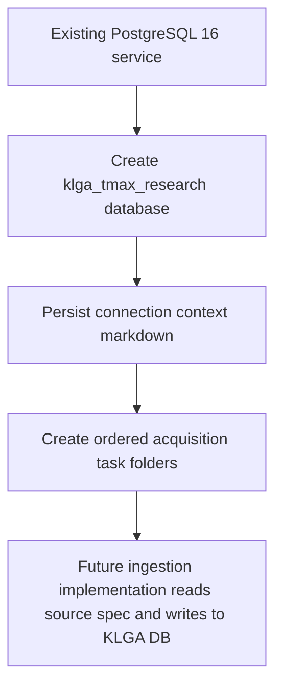

# KLGA Tmax Postgres Persistence Context

## Executive Summary

This document records the local PostgreSQL database created for the KLGA Tmax Polymarket strategy data acquisition and task-00 foundation work. The database is `klga_tmax_research` on the existing local PostgreSQL 16 service at `127.0.0.1:5432`.

The canonical implementation environment variable is now `KLGA_DB_URL`, matching `supplemental_doc_1.md`. The earlier local note name `KLGA_TMAX_DATABASE_URL` is superseded and should not be used by new implementation code.

## Reader Orientation and Document Map

Use this file when a Codex implementation or data-fetching session needs to know where KLGA acquisition data should be persisted.

This document contains:

1. The exact local database connection details.
2. The verification command that proved the database exists and is reachable.
3. The scope boundary for what was and was not created.
4. The ordered acquisition-task folder map created for execution planning.
5. Operational notes for future ingestion runs.

## Scope Boundaries

Included in this preparation step:

- Created PostgreSQL database `klga_tmax_research`.
- Verified a login to the new database using the existing local PostgreSQL admin user.
- Created ordered task folders under the KLGA data-acquisition spec directory.
- Moved each authoritative acquisition source-spec markdown file into its matching ordered task folder.

Excluded from this preparation step:

- No schema DDL was applied.
- No tables were created.
- No source data was fetched.
- No provider API credentials were written here.
- No new PostgreSQL role was created.
- No production deployment target was configured.

## Source-of-Truth Inputs

Primary local inputs:

- `weather_data_extraction/bootstrap/klga_tmax/strategy_spec/data_aquisition/00_foundation_universal_ingestion_contract_and_availability_ledger/00_universal_ingestion_contract_and_availability_ledger.md`
- `weather_data_extraction/bootstrap/klga_tmax/strategy_spec/data_aquisition/01_station_universe_and_coordinates/10_station_universe_and_coordinates.md`
- `weather_data_extraction/bootstrap/klga_tmax/strategy_spec/data_aquisition/02_wunderground_settlement_actuals/01_wunderground_settlement_actuals.md`
- `weather_data_extraction/bootstrap/klga_tmax/strategy_spec/data_aquisition/03_iem_mos_station_guidance/02_iem_mos_station_guidance.md`
- `weather_data_extraction/bootstrap/klga_tmax/strategy_spec/data_aquisition/04_asos_metar_hf_and_minute_observations/04_asos_metar_hf_and_minute_observations.md`
- `weather_data_extraction/bootstrap/klga_tmax/strategy_spec/data_aquisition/05_open_meteo_auxiliary_forecast_runs/06_open_meteo_auxiliary_forecast_runs.md`
- `weather_data_extraction/bootstrap/klga_tmax/strategy_spec/data_aquisition/06_polymarket_market_data/08_polymarket_market_data.md`
- `weather_data_extraction/bootstrap/klga_tmax/strategy_spec/data_aquisition/07_ncep_availability_cutoff_audit/09_ncep_availability_cutoff_audit.md`
- `weather_data_extraction/bootstrap/klga_tmax/strategy_spec/data_aquisition/08_gribstream_nwp_forecast_runs/03_gribstream_nwp_forecast_runs.md`
- `weather_data_extraction/bootstrap/klga_tmax/strategy_spec/data_aquisition/09_rtma_urma_analysis_fields/05_rtma_urma_analysis_fields.md`
- `weather_data_extraction/bootstrap/klga_tmax/strategy_spec/data_aquisition/10_noaa_raw_archives_optional_bulk_fallback/07_noaa_raw_archives_optional_bulk_fallback.md`
- Existing local PostgreSQL runbook evidence in the HKG workspace showing the local admin credential pattern: `postgres` with password `root` on `127.0.0.1:5432`.

## Connection Details

Local PostgreSQL server:

```text
host: 127.0.0.1
port: 5432
engine: PostgreSQL
server_version_verified: 16.3
database: klga_tmax_research
admin_user: postgres
admin_password: root
```

Full local DSN:

```text
postgresql://<user>:<password>@127.0.0.1:5432/klga_tmax_research
```

SQLAlchemy application DSN used by `klga-tmax`:

```text
postgresql+psycopg://<user>:<password>@127.0.0.1:5432/klga_tmax_research
```

Canonical PowerShell environment variable for KLGA implementation and ingestion sessions:

```powershell
$env:KLGA_DB_URL = "postgresql+psycopg://<user>:<password>@127.0.0.1:5432/klga_tmax_research"
```

Recommended direct `psql` smoke command:

```powershell
$env:PGPASSWORD = "root"
& "C:\Program Files\PostgreSQL\16\bin\psql.exe" -h 127.0.0.1 -p 5432 -U postgres -d klga_tmax_research -Atc "SELECT current_database(), current_user, inet_server_addr(), inet_server_port(), current_setting('server_version');"
```

Expected verified output shape:

```text
klga_tmax_research|postgres|127.0.0.1|5432|16.3
```

## Requirements-to-Implementation Traceability

| Requirement | Implementation location | Behavior delivered | Verification evidence | Caveat |
|---|---|---|---|---|
| Create a new PostgreSQL database for KLGA persistence. | Local PostgreSQL 16 service. | Created database `klga_tmax_research`. | `psql` verification returned `current_database() = klga_tmax_research`. | Empty database only; no schemas/tables. |
| Persist connection access details in the KLGA context directory. | This file. | Records host, port, database, user, password, DSN, and smoke command. | File exists under `strategy_spec/context`. | Contains local password by explicit user request; do not publish outside the private workspace. |
| Prepare task folders for acquisition execution. | `strategy_spec/data_aquisition/*/README.md` and each folder-local source spec. | Added ordered numbered task folders and placed each authoritative source spec in its respective folder. | Directory listing verifies all 11 task containers contain a source spec `.md` and a `README.md`. | None for folder placement. |

## Ordered Acquisition Task Folders

The execution folders were created in this order:

1. `00_foundation_universal_ingestion_contract_and_availability_ledger`
2. `01_station_universe_and_coordinates`
3. `02_wunderground_settlement_actuals`
4. `03_iem_mos_station_guidance`
5. `04_asos_metar_hf_and_minute_observations`
6. `05_open_meteo_auxiliary_forecast_runs`
7. `06_polymarket_market_data`
8. `07_ncep_availability_cutoff_audit`
9. `08_gribstream_nwp_forecast_runs`
10. `09_rtma_urma_analysis_fields`
11. `10_noaa_raw_archives_optional_bulk_fallback`

This order intentionally starts with foundation metadata and lower-friction public or credential-light sources before the large GribStream-dependent pulls. GribStream NWP and RTMA/URMA are later because the user noted that a temporary larger-request allowance is still needed before large GribStream requests should be attempted.

## Change Inventory

| File path | Change type | Why it changed | Main object changed | Effect | Verification coverage |
|---|---|---|---|---|---|
| `bootstrap/klga_tmax/strategy_spec/context/KLGA_TMAX_POSTGRES_PERSISTENCE_CONTEXT.md` | Added documentation | Persist the KLGA PostgreSQL access details and preparation evidence. | Connection details, verification output, task-folder map. | Future KLGA ingestion sessions have a single local DB context file. | File read by quality gate and manual inspection. |
| `bootstrap/klga_tmax/strategy_spec/data_aquisition/00_foundation_universal_ingestion_contract_and_availability_ledger/00_universal_ingestion_contract_and_availability_ledger.md` | Moved docs | Put the universal ingestion contract inside its execution folder. | Source spec location. | The task folder now contains the authoritative spec. | Folder inventory confirms file exists. |
| `bootstrap/klga_tmax/strategy_spec/data_aquisition/00_foundation_universal_ingestion_contract_and_availability_ledger/README.md` | Added docs | Make the universal ingestion contract a numbered execution folder. | Folder README. | Establishes this as the first pre-provider task. | Directory listing confirms file exists. |
| `bootstrap/klga_tmax/strategy_spec/data_aquisition/01_station_universe_and_coordinates/10_station_universe_and_coordinates.md` | Moved docs | Put station universe spec inside its execution folder. | Source spec location. | Station registry instructions live beside the task README. | Folder inventory confirms file exists. |
| `bootstrap/klga_tmax/strategy_spec/data_aquisition/01_station_universe_and_coordinates/README.md` | Added docs | Make station registry preparation the first data-shape task. | Folder README. | Signals that station ids and pseudo-points must exist before provider fetches. | Directory listing confirms file exists. |
| `bootstrap/klga_tmax/strategy_spec/data_aquisition/02_wunderground_settlement_actuals/01_wunderground_settlement_actuals.md` | Moved docs | Put Wunderground actuals spec inside its execution folder. | Source spec location. | Settlement actuals instructions live beside the task README. | Folder inventory confirms file exists. |
| `bootstrap/klga_tmax/strategy_spec/data_aquisition/02_wunderground_settlement_actuals/README.md` | Added docs | Create the settlement actuals task container. | Folder README. | Points Wunderground ingestion at the new KLGA database. | Directory listing confirms file exists. |
| `bootstrap/klga_tmax/strategy_spec/data_aquisition/03_iem_mos_station_guidance/02_iem_mos_station_guidance.md` | Moved docs | Put IEM MOS spec inside its execution folder. | Source spec location. | MOS parsing and product rules live beside the task README. | Folder inventory confirms file exists. |
| `bootstrap/klga_tmax/strategy_spec/data_aquisition/03_iem_mos_station_guidance/README.md` | Added docs | Create the IEM MOS task container. | Folder README. | States that MOS products are separate and must not be collapsed. | Directory listing confirms file exists. |
| `bootstrap/klga_tmax/strategy_spec/data_aquisition/04_asos_metar_hf_and_minute_observations/04_asos_metar_hf_and_minute_observations.md` | Moved docs | Put ASOS/METAR spec inside its execution folder. | Source spec location. | Observation-feed rules live beside the task README. | Folder inventory confirms file exists. |
| `bootstrap/klga_tmax/strategy_spec/data_aquisition/04_asos_metar_hf_and_minute_observations/README.md` | Added docs | Create the ASOS/METAR observation task container. | Folder README. | Separates regular METAR history from minute and low-latency feeds. | Directory listing confirms file exists. |
| `bootstrap/klga_tmax/strategy_spec/data_aquisition/05_open_meteo_auxiliary_forecast_runs/06_open_meteo_auxiliary_forecast_runs.md` | Moved docs | Put Open-Meteo spec inside its execution folder. | Source spec location. | Auxiliary forecast rules live beside the task README. | Folder inventory confirms file exists. |
| `bootstrap/klga_tmax/strategy_spec/data_aquisition/05_open_meteo_auxiliary_forecast_runs/README.md` | Added docs | Create the Open-Meteo auxiliary forecast task container. | Folder README. | Places Open-Meteo before bulk GribStream work. | Directory listing confirms file exists. |
| `bootstrap/klga_tmax/strategy_spec/data_aquisition/06_polymarket_market_data/08_polymarket_market_data.md` | Moved docs | Put Polymarket spec inside its execution folder. | Source spec location. | Market-data rules live beside the task README. | Folder inventory confirms file exists. |
| `bootstrap/klga_tmax/strategy_spec/data_aquisition/06_polymarket_market_data/README.md` | Added docs | Create the market-data task container. | Folder README. | Gives Polymarket metadata and price feeds an explicit persistence target. | Directory listing confirms file exists. |
| `bootstrap/klga_tmax/strategy_spec/data_aquisition/07_ncep_availability_cutoff_audit/09_ncep_availability_cutoff_audit.md` | Moved docs | Put NCEP availability audit spec inside its execution folder. | Source spec location. | Cutoff audit rules live beside the task README. | Folder inventory confirms file exists. |
| `bootstrap/klga_tmax/strategy_spec/data_aquisition/07_ncep_availability_cutoff_audit/README.md` | Added docs | Create the NCEP availability audit task container. | Folder README. | Keeps cutoff audit evidence distinct from predictors. | Directory listing confirms file exists. |
| `bootstrap/klga_tmax/strategy_spec/data_aquisition/08_gribstream_nwp_forecast_runs/03_gribstream_nwp_forecast_runs.md` | Moved docs | Put GribStream NWP spec inside its execution folder. | Source spec location. | GribStream forecast rules live beside the task README. | Folder inventory confirms file exists. |
| `bootstrap/klga_tmax/strategy_spec/data_aquisition/08_gribstream_nwp_forecast_runs/README.md` | Added docs | Create the GribStream NWP task container. | Folder README. | Marks large GribStream pulls as pending larger-request allowance. | Directory listing confirms file exists. |
| `bootstrap/klga_tmax/strategy_spec/data_aquisition/09_rtma_urma_analysis_fields/05_rtma_urma_analysis_fields.md` | Moved docs | Put RTMA/URMA spec inside its execution folder. | Source spec location. | Analysis-field rules live beside the task README. | Folder inventory confirms file exists. |
| `bootstrap/klga_tmax/strategy_spec/data_aquisition/09_rtma_urma_analysis_fields/README.md` | Added docs | Create the RTMA/URMA analysis task container. | Folder README. | Separates live RTMA usage from retrospective URMA usage. | Directory listing confirms file exists. |
| `bootstrap/klga_tmax/strategy_spec/data_aquisition/10_noaa_raw_archives_optional_bulk_fallback/07_noaa_raw_archives_optional_bulk_fallback.md` | Moved docs | Put NOAA raw archive fallback spec inside its execution folder. | Source spec location. | Optional fallback rules live beside the task README. | Folder inventory confirms file exists. |
| `bootstrap/klga_tmax/strategy_spec/data_aquisition/10_noaa_raw_archives_optional_bulk_fallback/README.md` | Added docs | Create the optional raw-archive fallback task container. | Folder README. | Keeps fallback raw archives last in the execution order. | Directory listing confirms file exists. |

## Architecture and Control Flow

The preparation flow is intentionally small:



The database is a persistence target, not an ingestion engine. Future acquisition code should read the authoritative provider spec, connect to `klga_tmax_research`, create the provider-specific schema objects, persist raw responses first, and then normalize into silver/gold structures according to the active KLGA strategy documents.

Failure paths:

- If PostgreSQL is not running, connection attempts to `127.0.0.1:5432` fail before any ingestion starts.
- If the password changes, the DSN in this file must be updated before future sessions can use it.
- If a task README and its folder-local source spec disagree, the source spec wins. The README only establishes execution order and local DB target.
- If GribStream larger-request allowance is not approved, GribStream and RTMA/URMA bulk tasks should remain queued while smaller providers continue.

## File-by-File Deep Dive

### `bootstrap/klga_tmax/strategy_spec/context/KLGA_TMAX_POSTGRES_PERSISTENCE_CONTEXT.md`

Responsibility: records the new local database, its verified access details, operational smoke commands, security caveat, rollback command, and ordered acquisition task map.

Inputs: user request, local PostgreSQL service state, the verified `psql` output, and the existing data-acquisition spec filenames.

Outputs and side effects: creates no runtime object by itself; it is a handoff document for future implementation and ingestion sessions.

Maintenance note: keep the DSN current if the database name, password, host, or port changes. Do not add provider API keys here.

### `bootstrap/klga_tmax/strategy_spec/data_aquisition/00_foundation_universal_ingestion_contract_and_availability_ledger/README.md`

Responsibility: marks the universal ingestion contract as the first execution task. It points to `00_universal_ingestion_contract_and_availability_ledger.md` in the same folder and states that shared availability, lineage, checksum, raw-response, and source-gap conventions must exist before provider data lands.

Maintenance note: this folder should stay first unless a future spec replaces the universal ingestion contract with a more explicit preflight.

### `bootstrap/klga_tmax/strategy_spec/data_aquisition/01_station_universe_and_coordinates/README.md`

Responsibility: marks canonical station and pseudo-point setup as the first data-shape task. It points to `10_station_universe_and_coordinates.md` in the same folder.

Maintenance note: keep this task before any provider that uses station ids, MOS suffixes, coordinates, or pseudo-points.

### `bootstrap/klga_tmax/strategy_spec/data_aquisition/02_wunderground_settlement_actuals/README.md`

Responsibility: identifies Wunderground settlement actuals as the first external source to fetch because target labels and settlement verification depend on it.

Maintenance note: preserve the revision-aware actuals boundary from the supplemental patch when schema work starts.

### `bootstrap/klga_tmax/strategy_spec/data_aquisition/03_iem_mos_station_guidance/README.md`

Responsibility: identifies IEM MOS station guidance as an early fetch source and explicitly keeps `MAV`, `MET`, `MEX`, `LAV`, `NBS`, and `NBE` separate.

Maintenance note: do not collapse `MAV`, `MEX`, and `LAV` into a single GFS feature family; they are correlated but distinct products.

### `bootstrap/klga_tmax/strategy_spec/data_aquisition/04_asos_metar_hf_and_minute_observations/README.md`

Responsibility: identifies ASOS/METAR and high-frequency observation work as the next observation-data task after MOS.

Maintenance note: preserve the distinction between regular IEM ASOS/METAR archive, one-minute delayed archive, and optional low-latency feeds.

### `bootstrap/klga_tmax/strategy_spec/data_aquisition/05_open_meteo_auxiliary_forecast_runs/README.md`

Responsibility: places Open-Meteo auxiliary runs before bulk GribStream work because it can be fetched without the same large-request allowance dependency.

Maintenance note: keep exact-run, historical forecast, and previous-run source families separated.

### `bootstrap/klga_tmax/strategy_spec/data_aquisition/06_polymarket_market_data/README.md`

Responsibility: creates the execution container for market metadata, books, prices, spreads, and activity.

Maintenance note: weather data and market data should share the same database target but remain normalized into distinct schemas or table families when implementation begins.

### `bootstrap/klga_tmax/strategy_spec/data_aquisition/07_ncep_availability_cutoff_audit/README.md`

Responsibility: creates the execution container for NCEP/NCO production-status polling and cutoff audit evidence.

Maintenance note: keep this source out of predictors unless a later binding spec explicitly promotes a derived feature.

### `bootstrap/klga_tmax/strategy_spec/data_aquisition/08_gribstream_nwp_forecast_runs/README.md`

Responsibility: creates the execution container for deterministic, ensemble, quantile, and audition GribStream NWP pulls.

Maintenance note: use live GribStream catalog/API discovery for exact selectors. Do not invent dataset selectors from local notes.

### `bootstrap/klga_tmax/strategy_spec/data_aquisition/09_rtma_urma_analysis_fields/README.md`

Responsibility: creates the execution container for RTMA current-state analysis and URMA retrospective analysis fields.

Maintenance note: enforce the as-of availability contract before any analysis-derived value enters cutoff-sensitive features.

### `bootstrap/klga_tmax/strategy_spec/data_aquisition/10_noaa_raw_archives_optional_bulk_fallback/README.md`

Responsibility: creates the execution container for optional NOAA raw archive fallback data.

Maintenance note: use this only when the primary provider path cannot satisfy history, coverage, or auditability. Preserve raw archive provenance separately.

## Public Interfaces and Contracts

New local persistence contract:

```text
KLGA_DB_URL=postgresql+psycopg://<user>:<password>@127.0.0.1:5432/klga_tmax_research
```

PostgreSQL database contract:

```text
database_name: klga_tmax_research
database_owner_used_for_creation: postgres
initial_schema_state: empty
expected_use: KLGA Tmax data acquisition, normalization, feature generation, backtesting, and trading research persistence
```

Filesystem contract:

```text
weather_data_extraction/bootstrap/klga_tmax/strategy_spec/context/KLGA_TMAX_POSTGRES_PERSISTENCE_CONTEXT.md
weather_data_extraction/bootstrap/klga_tmax/strategy_spec/data_aquisition/00_foundation_universal_ingestion_contract_and_availability_ledger/00_universal_ingestion_contract_and_availability_ledger.md
weather_data_extraction/bootstrap/klga_tmax/strategy_spec/data_aquisition/00_foundation_universal_ingestion_contract_and_availability_ledger/README.md
weather_data_extraction/bootstrap/klga_tmax/strategy_spec/data_aquisition/01_station_universe_and_coordinates/10_station_universe_and_coordinates.md
weather_data_extraction/bootstrap/klga_tmax/strategy_spec/data_aquisition/01_station_universe_and_coordinates/README.md
weather_data_extraction/bootstrap/klga_tmax/strategy_spec/data_aquisition/02_wunderground_settlement_actuals/01_wunderground_settlement_actuals.md
weather_data_extraction/bootstrap/klga_tmax/strategy_spec/data_aquisition/02_wunderground_settlement_actuals/README.md
weather_data_extraction/bootstrap/klga_tmax/strategy_spec/data_aquisition/03_iem_mos_station_guidance/02_iem_mos_station_guidance.md
weather_data_extraction/bootstrap/klga_tmax/strategy_spec/data_aquisition/03_iem_mos_station_guidance/README.md
weather_data_extraction/bootstrap/klga_tmax/strategy_spec/data_aquisition/04_asos_metar_hf_and_minute_observations/04_asos_metar_hf_and_minute_observations.md
weather_data_extraction/bootstrap/klga_tmax/strategy_spec/data_aquisition/04_asos_metar_hf_and_minute_observations/README.md
weather_data_extraction/bootstrap/klga_tmax/strategy_spec/data_aquisition/05_open_meteo_auxiliary_forecast_runs/06_open_meteo_auxiliary_forecast_runs.md
weather_data_extraction/bootstrap/klga_tmax/strategy_spec/data_aquisition/05_open_meteo_auxiliary_forecast_runs/README.md
weather_data_extraction/bootstrap/klga_tmax/strategy_spec/data_aquisition/06_polymarket_market_data/08_polymarket_market_data.md
weather_data_extraction/bootstrap/klga_tmax/strategy_spec/data_aquisition/06_polymarket_market_data/README.md
weather_data_extraction/bootstrap/klga_tmax/strategy_spec/data_aquisition/07_ncep_availability_cutoff_audit/09_ncep_availability_cutoff_audit.md
weather_data_extraction/bootstrap/klga_tmax/strategy_spec/data_aquisition/07_ncep_availability_cutoff_audit/README.md
weather_data_extraction/bootstrap/klga_tmax/strategy_spec/data_aquisition/08_gribstream_nwp_forecast_runs/03_gribstream_nwp_forecast_runs.md
weather_data_extraction/bootstrap/klga_tmax/strategy_spec/data_aquisition/08_gribstream_nwp_forecast_runs/README.md
weather_data_extraction/bootstrap/klga_tmax/strategy_spec/data_aquisition/09_rtma_urma_analysis_fields/05_rtma_urma_analysis_fields.md
weather_data_extraction/bootstrap/klga_tmax/strategy_spec/data_aquisition/09_rtma_urma_analysis_fields/README.md
weather_data_extraction/bootstrap/klga_tmax/strategy_spec/data_aquisition/10_noaa_raw_archives_optional_bulk_fallback/07_noaa_raw_archives_optional_bulk_fallback.md
weather_data_extraction/bootstrap/klga_tmax/strategy_spec/data_aquisition/10_noaa_raw_archives_optional_bulk_fallback/README.md
```

## Data Model, Persistence, and Migration Notes

The database currently has no KLGA tables. Future schema work must follow the active strategy specification chain:

1. `KLGA_TMAX_TRADING_STRATEGY_SPEC.md`
2. `supplemental_doc_1.md`
3. `supplemental_doc_1_patch_1.md`
4. The provider-specific files in `data_aquisition`

Future migrations should create provider-specific bronze/silver/gold/reporting schemas only after the relevant acquisition task is implemented. This keeps the database boundary clean: database creation is complete, data model implementation is not yet started.

## Security, Privacy, and Safety Review

The password `root` is recorded because the user explicitly requested persisted connection access details and the same local credential already appears in existing local HKG runbooks. This file should be treated as local private workspace context, not a public documentation artifact.

Do not place third-party provider keys in this file. GribStream, Wunderground, Synoptic, Polymarket, or other provider credentials should live in the project secrets mechanism chosen during implementation.

## Testing and Verification Evidence

Database creation and verification command run from:

```text
C:\Users\ahmad\Desktop\generalFiles\git\weather_markets
```

Command summary:

```powershell
$env:PGPASSWORD = "root"
createdb -h 127.0.0.1 -p 5432 -U postgres -E UTF8 -T template0 klga_tmax_research
psql -h 127.0.0.1 -p 5432 -U postgres -d klga_tmax_research -Atc "SELECT current_database(), current_user, inet_server_addr(), inet_server_port(), current_setting('server_version');"
```

Observed verification output:

```text
klga_tmax_research|postgres|127.0.0.1|5432|16.3
database_status=created
```

This proves:

- The database exists.
- The local admin user can connect.
- The connection path uses the intended host and port.
- PostgreSQL server version is 16.3.

This does not prove:

- Any provider ingestion code works.
- Any schema contract has been applied.
- Any dataset has been fetched or normalized.

## Operational Runbook

Open an interactive `psql` session:

```powershell
$env:PGPASSWORD = "root"
& "C:\Program Files\PostgreSQL\16\bin\psql.exe" -h 127.0.0.1 -p 5432 -U postgres -d klga_tmax_research
```

Set the application DSN for future KLGA ingestion code:

```powershell
$env:KLGA_DB_URL = "postgresql+psycopg://<user>:<password>@127.0.0.1:5432/klga_tmax_research"
```

Inspect currently created user tables:

```powershell
$env:PGPASSWORD = "root"
& "C:\Program Files\PostgreSQL\16\bin\psql.exe" -h 127.0.0.1 -p 5432 -U postgres -d klga_tmax_research -c "\dt *.*"
```

Expected state after Task 00 foundation migration: KLGA foundation schemas, registry seeds, audit tables, and target-instance scaffolding exist; provider acquisition tables remain empty until source-specific tasks run.

## Compatibility, Rollback, and Upgrade Notes

The new database is isolated from the existing HKG database. Dropping `klga_tmax_research` would remove only KLGA work created in this new database.

Rollback command before any data has been loaded:

```powershell
$env:PGPASSWORD = "root"
& "C:\Program Files\PostgreSQL\16\bin\dropdb.exe" -h 127.0.0.1 -p 5432 -U postgres klga_tmax_research
```

Do not run rollback after acquisition starts unless a backup has been created or the user explicitly approves deleting the KLGA persistence target.

## Known Limitations and Follow-Up Work

- Provider acquisition data is still empty by design. Task 00 creates the shared foundation contract; the next implementation steps should populate source-specific bronze/silver rows through the acquisition tasks.
- The local admin user is used for now. A dedicated least-privilege role can be added when ingestion code and schema ownership boundaries are implemented.
- The GribStream-heavy tasks should wait for the larger-request allowance before bulk pulls.

## Reviewer Checklist

- [x] Database name is recorded.
- [x] Host and port are recorded.
- [x] User and password are recorded.
- [x] Full DSN is recorded.
- [x] Creation and verification output is recorded.
- [x] Scope boundary states that no tables or datasets were created.
- [x] Ordered task folders are listed.
- [x] Security caveat is explicit.
