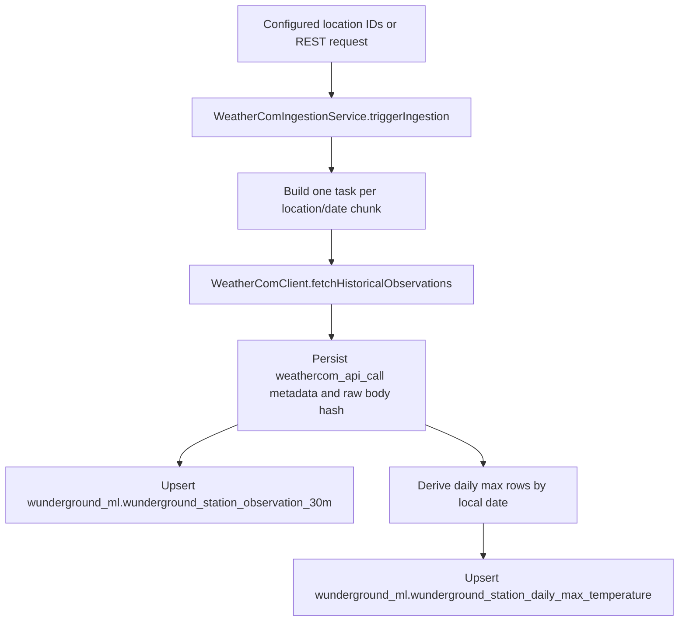

# KLGA Tmax Wunderground Existing Scraper Deep Dive

Date: 2026-06-28

Audience: next Codex conversation implementing KLGA task `02_wunderground_settlement_actuals`.

## Executive Summary

The existing code under `weather_data_extraction` is a Weather.com historical-observations ingestion module that is used as the Wunderground data path in the older extraction project. It is not an HTML scraper and it is not a direct "daily settlement high" API client.

The reusable parts for KLGA are:

- The proven Weather.com historical endpoint shape.
- The DTO mapping for historical observation rows.
- The retry, gzip, response-hash, raw-body, and request-audit patterns.
- The daily max derivation rule used by the old module.
- The fixture-backed unit tests that verify request construction and JSON parsing.
- The standalone Python CSV downloader that preserves raw response evidence and manifests without DB writes.

The non-reusable parts are:

- The old MySQL/H2 persistence schema.
- The old Spring application context and unrelated Kalshi backfill wiring.
- The old daily-max table as a final KLGA label table, because KLGA requires Postgres bronze/silver/gold writes, an availability ledger, revision history, and strict target-date leakage rules.
- The old location-id contract, because it uses Weather.com request IDs like `KNYC:9:US`, while the KLGA station registry currently stores Wunderground station IDs like `KLGA`.

The key KLGA implementation decision that must be resolved before fetching is the exact mapping from canonical station IDs (`KLGA`, `KJFK`, `KEWR`, ...) to Weather.com request `locationId` values if this private Weather.com/Wunderground API path is used. Passing bare `KLGA` into the existing Spring ingestion service would not satisfy its configured-location validation, which expects at least three colon-delimited segments.

## Reader Orientation

Read this document as an implementation handoff, not as a request to modify the old scraper. The existing Weather.com/Wunderground code lives in the old Java/Spring extraction project. The KLGA codebase lives under `bootstrap/klga_tmax/implementation` and uses a Postgres-first foundation.

The old module answers one narrow question well: how the current repository has been fetching Weather.com historical observations that downstream code treats as Wunderground observations. It does not answer the full KLGA task-02 question because KLGA adds station registry lookup, bronze raw persistence, silver daily/intraday tables, revision history, and leakage-safe availability ledgers.

## Scope Boundaries

In scope for this pass:

- Locate the existing Wunderground/Weather.com scraping and ingestion code under `weather_data_extraction`.
- Identify the actual API path, parameters, retry behavior, DTO fields, persistence tables, and entry points.
- Run quick local smoke tests that do not require live provider credentials.
- Record exactly which checks passed and which checks are blocked.
- Create this KLGA context document.

Out of scope for this pass:

- Live Weather.com/Wunderground API calls.
- New KLGA Wunderground source code.
- DB migrations for task 02.
- Postgres writes into `klga_tmax_research`.
- Fixing unrelated old Spring/Kalshi test-context wiring.

## Source-of-Truth Inputs

Evidence sources used:

- Local code under `weather_data_extraction/ingestion-service/src/main/java/com/predictionmarkets/weather/weathercom`.
- Local repository classes under `weather_data_extraction/ingestion-service/src/main/java/com/predictionmarkets/weather/repository`.
- Local model and Flyway migration files under `weather_data_extraction/models`.
- Weather.com fixture tests under `weather_data_extraction/ingestion-service/src/test/java/com/predictionmarkets/weather/weathercom`.
- KLGA task spec file `bootstrap/klga_tmax/strategy_spec/data_aquisition/02_wunderground_settlement_actuals/01_wunderground_settlement_actuals.md`.
- KLGA station registry implementation under `bootstrap/klga_tmax/implementation/src/klga_tmax/registry/station_universe.py`.
- Smoke commands listed in `Testing and Verification Evidence`.

## Requirements-to-Implementation Traceability

| Requirement from user | Evidence or output |
| --- | --- |
| Find existing Wunderground scraping code | `File-by-File Deep Dive` maps the Java module, Python downloader, migrations, models, and tests. |
| Aggregate all information about actual scraping | `Public Interfaces and Contracts`, `Configuration Contract`, `Architecture and Control Flow`, and `Daily-Max Derivation In The Old Module` document request shape, config, persistence, and parsing. |
| Run quick smoke tests | `Testing and Verification Evidence` records Python compile/smoke, Weather.com unit tests, package compile, and the blocked Spring-context DB tests. |
| Document for KLGA | This file was added under `bootstrap/klga_tmax/strategy_spec/context`. |
| Be clear about what does not work | `Known Limitations and Follow-Up Work` and the verification section call out missing live API validation and unrelated Spring/Kalshi test-context failure. |

## Change Inventory

Changed file:

```text
bootstrap/klga_tmax/strategy_spec/context/KLGA_TMAX_WUNDERGROUND_EXISTING_SCRAPER_DEEP_DIVE.md
```

No scraper source file, test file, migration, project config, or KLGA implementation code was modified.

## File-by-File Deep Dive

### Core Java Weather.com/Wunderground Module

| File | Role |
| --- | --- |
| `ingestion-service/src/main/java/com/predictionmarkets/weather/weathercom/client/WeatherComClient.java` | Builds and executes historical-observation API requests, applies retry rules, parses JSON into DTOs, handles gzip. |
| `ingestion-service/src/main/java/com/predictionmarkets/weather/weathercom/client/WeatherComClientResult.java` | Return envelope for API result, raw body, error type, fetch time, and attempt count. |
| `ingestion-service/src/main/java/com/predictionmarkets/weather/weathercom/client/WeatherComRateLimiter.java` | Simple spacing limiter based on configured permits per second. |
| `ingestion-service/src/main/java/com/predictionmarkets/weather/weathercom/client/dto/WeatherComHistoricalResponse.java` | Top-level JSON DTO with `metadata` and `observations`. |
| `ingestion-service/src/main/java/com/predictionmarkets/weather/weathercom/client/dto/WeatherComObservationPayload.java` | Observation row DTO for weather fields, timestamps, max/min fields, phrases, wind, precipitation, and marine fields. |
| `ingestion-service/src/main/java/com/predictionmarkets/weather/weathercom/client/dto/WeatherComResponseMetadata.java` | Metadata DTO for response location, units, language, transaction ID, API version, and expiry. |
| `ingestion-service/src/main/java/com/predictionmarkets/weather/weathercom/config/WeatherComProperties.java` | Main config contract under prefix `weathercom`. |
| `ingestion-service/src/main/java/com/predictionmarkets/weather/weathercom/config/WeatherComStartupValidator.java` | Fails startup if ingestion is enabled without an API key. |
| `ingestion-service/src/main/java/com/predictionmarkets/weather/weathercom/config/WeatherComExecutorConfig.java` | Weather.com task executor, queue, and run executor. |
| `ingestion-service/src/main/java/com/predictionmarkets/weather/weathercom/config/WeatherComBackfillRunnerProperties.java` | Command-line backfill property contract under `weathercom.backfill-runner`. |
| `ingestion-service/src/main/java/com/predictionmarkets/weather/weathercom/service/WeatherComBackfillCommandLineRunner.java` | Optional startup runner that launches and polls a backfill run. |
| `ingestion-service/src/main/java/com/predictionmarkets/weather/weathercom/service/WeatherComIngestionService.java` | Main orchestrator: chunks date ranges, calls the client, writes request metadata, writes observation rows, derives daily max rows. |
| `ingestion-service/src/main/java/com/predictionmarkets/weather/weathercom/service/WeatherComLocationService.java` | CRUD service for configured Weather.com locations. |
| `ingestion-service/src/main/java/com/predictionmarkets/weather/weathercom/service/WeatherComObservationService.java` | Paged observation search wrapper. |
| `ingestion-service/src/main/java/com/predictionmarkets/weather/weathercom/service/WeatherComValidation.java` | Location-id validation for configured ingestion locations. |
| `ingestion-service/src/main/java/com/predictionmarkets/weather/weathercom/web/WeatherComController.java` | REST endpoints under `/api/weathercom`. |

### Persistence Files

| File | Role |
| --- | --- |
| `models/src/main/resources/db/migration/V13__weathercom_historical_observations.sql` | Creates original Weather.com location, run, API call, and observation tables. |
| `models/src/main/resources/db/migration/V14__wunderground_ml_tables.sql` | Creates `wunderground_ml` tables, copies old observation rows into `wunderground_station_observation_30m`, creates daily max table, drops old observation table. |
| `ingestion-service/src/main/java/com/predictionmarkets/weather/repository/WeatherComObservationUpsertRepository.java` | MySQL-style upsert into `wunderground_ml.wunderground_station_observation_30m`. |
| `ingestion-service/src/main/java/com/predictionmarkets/weather/repository/WundergroundDailyMaxTemperatureUpsertRepository.java` | MySQL-style upsert into `wunderground_ml.wunderground_station_daily_max_temperature`. |
| `ingestion-service/src/main/java/com/predictionmarkets/weather/repository/WeatherComObservationRepository.java` | JPA search/count access to normalized observation rows. |
| `models/src/main/java/com/predictionmarkets/weather/models/WeatherComApiCall.java` | JPA model for request/response metadata and raw-body hash. |
| `models/src/main/java/com/predictionmarkets/weather/models/WeatherComLocation.java` | JPA model for active Weather.com locations. |
| `models/src/main/java/com/predictionmarkets/weather/models/WeatherComObservation.java` | JPA model for `wunderground_ml.wunderground_station_observation_30m`. |
| `models/src/main/java/com/predictionmarkets/weather/models/WundergroundDailyMaxTemperature.java` | JPA model for derived daily max rows. |

### Standalone Python Utility

| File | Role |
| --- | --- |
| `ingestion-service/scripts/weathercom_download_to_csv.py` | Direct downloader that fetches Weather.com historical windows, stores raw JSON evidence, manifests, per-window normalized CSVs, and final merged CSV. It performs no DB writes. |

### Tests and Fixtures

| File | Role |
| --- | --- |
| `ingestion-service/src/test/java/com/predictionmarkets/weather/weathercom/WeatherComClientTest.java` | MockWebServer tests for URL path, query params, gzip header, retry-on-429/500, and no retry on 401/403/404. |
| `ingestion-service/src/test/java/com/predictionmarkets/weather/weathercom/WeatherComDtoMappingTest.java` | Fixture parsing and timestamp conversion tests. |
| `ingestion-service/src/test/java/com/predictionmarkets/weather/weathercom/WeatherComObservationUpsertRepositoryTest.java` | Intended DB upsert/dedup test. Currently blocked by unrelated Spring context wiring. |
| `ingestion-service/src/test/java/com/predictionmarkets/weather/weathercom/WeatherComIngestionConcurrencyTest.java` | Intended background ingestion/concurrency test. Currently blocked by unrelated Spring context wiring. |
| `ingestion-service/src/test/resources/weathercom/historical_observations_fixture.json` | Representative historical observation payload with `metadata` and two KLGA observations. |
| `ingestion-service/src/test/resources/application-test.yml` | H2 MySQL-mode test datasource config. |

### KLGA Spec Files Cross-Checked

| File | Relevant contract |
| --- | --- |
| `bootstrap/klga_tmax/strategy_spec/data_aquisition/02_wunderground_settlement_actuals/01_wunderground_settlement_actuals.md` | KLGA Wunderground requirements: canonical label, stations, raw fields, daily/intraday tables, availability rules, revision handling, and acceptance tests. |
| `bootstrap/klga_tmax/implementation/src/klga_tmax/registry/station_universe.py` | KLGA station registry currently maps `KLGA` to Wunderground station ID `KLGA`. |

## Public Interfaces and Contracts

`WeatherComClient.fetchHistoricalObservations(locationId, units, startDate, endDate)` builds this request:

```text
GET {weathercom.api.base-url}/v1/location/{locationId}/observations/historical.json
```

Query parameters:

| Parameter | Source | Example from tests |
| --- | --- | --- |
| `apiKey` | `weathercom.api.api-key` or `WEATHERCOM_API_KEY` through Spring config | `test-weathercom-key` |
| `units` | Method argument, normalized to `e`, `m`, `h`, or `s` | `e` |
| `startDate` | `LocalDate` formatted as `yyyyMMdd` | `20260217` |
| `endDate` | `LocalDate` formatted as `yyyyMMdd` | `20260217` |

Headers:

| Header | Behavior |
| --- | --- |
| `Accept` | Always `application/json`. |
| `Accept-Encoding` | Always `gzip`. |
| `User-Agent` | Set only when `weathercom.api.user-agent` is non-blank. Default is `weather-forecasting-predictionmarkets/1.0`. |

Retry behavior:

| Status/error | Existing behavior |
| --- | --- |
| `429`, `500`, `502`, `503`, `504` | Retry while attempts remain. `Retry-After` is honored for `429` when present. |
| `401`, `403`, `404` | No retry. Result is returned as failed with `HTTP_{status}`. |
| JSON parse error | Failed result with `JSON_PARSE_ERROR`. Raw body is retained in result. |
| IO exception | Retry while attempts remain, then failed result with `IO_EXCEPTION`. |
| Missing API key | No HTTP call. Failed result with `MISSING_API_KEY`. |

The endpoint shape was verified by `WeatherComClientTest.sendsExpectedQueryParamsAndGzipHeader`, which asserted path segments:

```text
v1 / location / KNYC:9:US / observations / historical.json
```

and query parameters `apiKey`, `units=e`, `startDate=20260217`, `endDate=20260217`.

## Configuration Contract

### Spring Service Config

Current defaults live in `ingestion-service/src/main/resources/application.yml`.

| Property | Default | Meaning |
| --- | --- | --- |
| `weathercom.api.base-url` | `https://api.weather.com` | API root. |
| `weathercom.api.api-key` | `${WEATHERCOM_API_KEY:}` | Weather.com API key. |
| `weathercom.api.connect-timeout-ms` | `5000` | HTTP connect timeout. |
| `weathercom.api.read-timeout-ms` | `20000` | Read, write, and call timeout. |
| `weathercom.api.user-agent` | `weather-forecasting-predictionmarkets/1.0` | Optional request user agent. |
| `weathercom.ingestion.enabled` | `false` | Must be `true` for service-triggered ingestion. |
| `weathercom.ingestion.thread-pool-size` | `15` in YAML, `4` class default | Number of concurrent ingestion tasks. |
| `weathercom.ingestion.queue-capacity` | `200` | Bounded executor queue size. |
| `weathercom.ingestion.chunk-days` | `1` | Days per API task in the Spring ingestion service. |
| `weathercom.ingestion.max-retries` | `4` | Retries after the initial request. |
| `weathercom.ingestion.retry-backoff-ms` | `500` | Base retry backoff. |
| `weathercom.ingestion.max-backoff-ms` | `10000` | Retry backoff cap. |
| `weathercom.ingestion.retry-jitter-ms` | `250` | Jitter cap added to retry backoff. |
| `weathercom.ingestion.upsert-batch-size` | `500` | Observation upsert batch size. |
| `weathercom.ingestion.store-response-body` | `true` | Whether to store truncated raw response body in `weathercom_api_call`. |
| `weathercom.ingestion.max-response-body-chars` | `50000` | Max stored response body chars. |
| `weathercom.ingestion.rate-limit.permits-per-second` | `2.0` | Client-side request spacing. |

`WeatherComStartupValidator` rejects startup when `weathercom.ingestion.enabled=true` and the API key is blank.

### Command-Line Backfill Runner Config

`WeatherComBackfillCommandLineRunner` is activated by:

```text
weathercom.backfill-runner.enabled=true
```

Required for that runner:

| Property | Meaning |
| --- | --- |
| `weathercom.backfill-runner.location-ids` | Request location IDs to fetch. |
| `weathercom.backfill-runner.start-date` | Start date. |
| `weathercom.backfill-runner.end-date` | End date. |
| `weathercom.backfill-runner.units` | Defaults to `e`. |
| `weathercom.backfill-runner.requested-by` | Defaults to `system`. |
| `weathercom.backfill-runner.poll-interval-seconds` | Defaults to `15`. |
| `weathercom.backfill-runner.fail-on-non-succeeded` | Defaults to `false`. |

### Standalone Python Downloader Config

`ingestion-service/scripts/weathercom_download_to_csv.py` accepts:

| Argument | Default |
| --- | --- |
| `--location-id` | `KNYC:9:US` |
| `--start-date` | `1973-01-01` |
| `--end-date` | `2026-12-31` |
| `--units` | `e` |
| `--base-url` | `https://api.weather.com` |
| `--api-key` | `WEATHERCOM_API_KEY` env var |
| `--chunk-days` | `31` |
| `--max-workers` | `8` |
| `--max-retries` | `6` |
| `--timeout-seconds` | `60` |
| `--out-root` | `D:\Ahmed\data\kalshi\weathercom_knyc` |
| `--final-csv` | `D:\Ahmed\data\kalshi\KNYC_observations_30m_wunderground_1973_2026.csv` |
| `--skip-existing` | Enabled by default |

For KLGA use, the Python defaults are too KNYC-specific and too aggressive by default for a respectful production fetch. Override `--location-id`, output paths, and worker count.

## Architecture and Control Flow



The flow is asynchronous. `triggerIngestion` saves a `weathercom_ingestion_run`, submits execution to a single run executor, and each chunk runs on `weatherComTaskExecutor`. A run ends as:

| Final status | Rule |
| --- | --- |
| `SUCCEEDED` | `failed_tasks == 0` |
| `PARTIAL_SUCCESS` | `failed_tasks > 0` and `succeeded_tasks > 0` |
| `FAILED` | No succeeded tasks |

## Daily-Max Derivation In The Old Module

`WeatherComIngestionService.toDailyMaxRows` computes daily max rows after a successful payload is parsed.

Key behavior:

- The local date is derived from `valid_time_gmt` using a resolved `ZoneId`.
- `KLGA`, `KJFK`, `KEWR`, `KTEB`, `KHPN`, `KISP`, `KBDR`, and `KMMU` force fallback zone `America/New_York`.
- Other stations try `StationRegistryRepository.findById(stationId).getZoneId()`.
- If no station or zone is found, the fallback zone is `UTC`.
- Candidate temperature is `max_temp` when present.
- If `max_temp` is absent, candidate temperature is `temp`.
- Source type is `REPORTED_MAX_TEMP` when `max_temp` was used.
- Source type is `OBSERVED_TEMP_MAX` when the max was computed from observed `temp` values.
- The persisted key is `(request_location_id, obs_id, target_date_local)`.
- The chosen row stores `source_valid_time_gmt`, `source_api_call_id`, `source_type`, and `observation_count`.

This is useful for KLGA but not sufficient as the final settlement-label contract. The KLGA spec prefers a Wunderground daily summary high when the provider exposes it, and only computes from intraday rows when no daily summary exists. The existing code does not store a `label_method` matching `wunderground_daily_summary` or `computed_from_wunderground_intraday_rows`.

## Existing Database Shape

The existing module is not Postgres-native. It uses Flyway migrations with MySQL/H2-compatible constructs such as `AUTO_INCREMENT`, `LONGTEXT`, and `ON DUPLICATE KEY UPDATE`.

### `weathercom_location`

Purpose: active request-location registry for the old service.

Important columns:

```text
id
location_id
display_name
active
created_at_utc
updated_at_utc
```

Unique key:

```text
UNIQUE (location_id)
```

### `weathercom_ingestion_run`

Purpose: one row per ingestion run.

Important columns:

```text
id
status
started_at_utc
finished_at_utc
requested_by
request_payload_json
total_tasks
succeeded_tasks
failed_tasks
created_at_utc
updated_at_utc
```

Allowed statuses:

```text
RUNNING
SUCCEEDED
PARTIAL_SUCCESS
FAILED
```

### `weathercom_api_call`

Purpose: one row per API request chunk.

Important columns:

```text
id
ingestion_run_id
request_location_id
units
start_date
end_date
response_location_id
response_units
response_language
transaction_id
api_version
expire_time_gmt
http_status
fetched_at_utc
duration_ms
error_type
error_message
response_body_json
response_body_hash
created_at_utc
updated_at_utc
```

KLGA should reuse this idea through the existing foundation tables `bronze.source_requests` and `bronze.source_records`, not copy this table as-is.

### `wunderground_ml.wunderground_station_observation_30m`

Purpose: normalized historical observation rows.

Dedup key:

```text
UNIQUE (request_location_id, obs_id, valid_time_gmt)
```

Important weather columns:

```text
valid_time_gmt
valid_time_utc
day_ind
temp
dew_pt
heat_index
rh
pressure
pressure_tend
pressure_desc
vis
wc
wdir
wdir_cardinal
gust
wspd
wx_phrase
wx_icon
icon_extd
precip_total
precip_hrly
snow_hrly
max_temp
min_temp
uv_desc
uv_index
feels_like
clds
qualifier
qualifier_svrty
blunt_phrase
terse_phrase
observation_class
water_temp
primary_wave_period
primary_wave_height
primary_swell_period
primary_swell_height
primary_swell_direction
secondary_swell_period
secondary_swell_height
secondary_swell_direction
```

### `wunderground_ml.wunderground_station_daily_max_temperature`

Purpose: derived daily max rows.

Dedup key:

```text
UNIQUE (request_location_id, obs_id, target_date_local)
```

Important columns:

```text
request_location_id
obs_id
station_zoneid
target_date_local
max_temp_f
source_valid_time_gmt
source_api_call_id
source_type
observation_count
created_at_utc
updated_at_utc
```

KLGA should map this concept into the task-02 silver table contract:

```text
wu_daily_actuals
wu_intraday_observations
wu_daily_actual_revisions
silver.availability_ledger
gold.target_instances settlement fields
```

## REST API Entry Points

`WeatherComController` exposes:

| Method | Path | Purpose |
| --- | --- | --- |
| `POST` | `/api/weathercom/locations` | Create a Weather.com location row. |
| `GET` | `/api/weathercom/locations` | List locations. |
| `GET` | `/api/weathercom/locations/{id}` | Fetch one location. |
| `PUT` | `/api/weathercom/locations/{id}` | Update a location. |
| `DELETE` | `/api/weathercom/locations/{id}` | Delete a location. |
| `GET` | `/api/weathercom/observations` | Search persisted observation rows. |
| `POST` | `/api/weathercom/ingestions` | Trigger async ingestion. |
| `GET` | `/api/weathercom/ingestions/{runId}` | Read ingestion run status. |
| `GET` | `/api/weathercom/ingestions/{runId}/api-calls` | Read API call audit rows for a run. |

The REST trigger parses `startDate` and `endDate` as `BASIC_ISO_DATE`, for example `20260217`.

## Standalone CSV Downloader Behavior

`weathercom_download_to_csv.py` is useful as a one-off evidence collector or exploratory downloader. It does not depend on Spring or the database.

It writes:

| Output | Meaning |
| --- | --- |
| `raw/{location}/{window}/response.json` | Raw provider response body. |
| `raw/{location}/{window}/request_url.txt` | Redacted request URL. |
| `raw/{location}/{window}/headers.json` | Response headers. |
| `raw/{location}/{window}/retrieved_at_utc.txt` | Retrieval timestamp. |
| `raw/{location}/{window}/sha256.txt` | Raw body hash. |
| `raw/{location}/{window}/http_status.txt` | HTTP status. |
| `window_csv/{location}_{window}.csv` | Per-window normalized 30-minute rows. |
| `manifest/manifest_{run_id}.csv` | Window-level manifest. |
| `summary.json` | Run summary. |
| final CSV path | Merged normalized CSV deduped by request location and 30-minute timestamp. |

Important limitation: the CSV normalizer does not emit `obs_id` in its final normalized rows. It keeps `request_location_id` and 30-minute UTC timestamps, then dedupes by `request_location_id` and `valid_time_utc`. For KLGA settlement work, this is not enough by itself because the KLGA task needs station-level labels, intraday rows, bronze source IDs, revision handling, and provider availability timestamps.

## KLGA Task 02 Gap Analysis

### What Can Be Reused Directly

| Existing asset | Reuse path |
| --- | --- |
| Weather.com endpoint shape | Use as a provider adapter implementation if the user's Wunderground access is this Weather.com API. |
| DTO field list | Reuse for parsing `metadata` and `observations` into KLGA bronze/silver rows. |
| Retry status set | Reuse `429`, `500`, `502`, `503`, `504` retry behavior and `Retry-After` handling. |
| Raw-body hash | Reuse the hash concept for `bronze.source_records.payload_sha256`. |
| Daily max derivation | Reuse only as fallback when daily summary high is absent. |
| MockWebServer fixture tests | Port into Python or keep as reference test behavior for URL construction and parsing. |
| Python raw evidence writer | Reuse its manifest/raw-evidence pattern, but not its final CSV as the canonical KLGA table. |

### What Must Be Implemented New For KLGA

| KLGA requirement | Reason old module is insufficient |
| --- | --- |
| Postgres schema integration | Old code uses MySQL/H2 syntax and old table names. |
| `WundergroundHistoricalClient.fetch_station_day` and `fetch_station_range` adapter | KLGA spec requires this adapter contract; old Java client exposes `fetchHistoricalObservations(locationId, units, startDate, endDate)`. |
| Canonical station resolution | KLGA station registry stores `wunderground_station_id=KLGA`; old service expects request IDs like `KNYC:9:US`. |
| Bronze raw request and response persistence | Old `weathercom_api_call` is close but not the KLGA `bronze.source_requests` and `bronze.source_records` contract. |
| `wu_daily_actuals` | Old daily max table lacks daily summary fields, `label_method`, `provider_available_at_utc`, `quality_flag`, and `source_request_id`. |
| `wu_intraday_observations` | Old observation table has many useful columns but not the exact KLGA primary key, raw JSON, availability fields, or source request ID. |
| `wu_daily_actual_revisions` | Old upsert overwrites current rows and does not store revision history. |
| Availability ledger | Old module does not compute KLGA cutoff eligibility or label availability. |
| Target-date leakage guard | Old module derives max rows without enforcing "target date T label is never eligible for target T forecast cutoffs." |
| Quality controls | Old module does not enforce KLGA range checks or Wunderground-vs-IEM reconciliation flags. |

## Location-ID Issue For KLGA

This is the most important implementation caveat.

The KLGA station registry currently says:

```text
station_id = KLGA
wunderground_station_id = KLGA
```

The old Weather.com ingestion service validates configured locations with:

```text
^[^:]+(:[^:]+){2,}$
```

That means the old service expects a value with at least three colon-delimited segments, such as:

```text
KNYC:9:US
```

The fixture response for `KNYC:9:US` contains observation rows with:

```text
obs_id = KLGA
key = KLGA
obs_name = LaGuardia Airport
```

Therefore, the next implementation must not assume that `station_id == request_location_id`. It needs a provider-location map with at least:

```text
station_id
wunderground_station_id
weathercom_request_location_id
expected_obs_id
timezone_name
```

If the user's private Wunderground API can fetch directly by `KLGA`, then the KLGA adapter can ignore the old Weather.com location validation and use `station_id`/`wunderground_station_id` directly. If the private API is actually Weather.com historical observations, we need the exact Weather.com `locationId` for each required station before a complete backfill can be run.

## Leakage And Availability Implications

The old code can fetch and derive daily max rows, but it does not know whether a value was available before a KLGA trading cutoff.

KLGA task 02 must add:

- `provider_available_at_utc` for daily and intraday rows.
- `our_ingested_at_utc`.
- `source_request_id`.
- Availability-ledger rows for every parsed fact.
- Default daily label availability of `local_day_end_utc + 24 hours` unless actual captured publication times exist.
- Strict rule that KLGA target-date label `T` cannot be used for any forecast cutoff for `T`.
- T-1 daily-high history features normally use labels only through `T-2`.

The existing old module's local-day grouping is still useful. It uses `America/New_York` for KLGA and nearby New York area fallback stations, which is correct for the KLGA market calendar.

## Testing and Verification Evidence

### Verification: `python -m compileall -q smoke_tests ingestion-service\scripts`

- Directory: `C:\Users\ahmad\Desktop\generalFiles\git\weather_markets\weather_data_extraction`
- Result: Passed.
- Relevant output: no output.
- Proves: Python smoke harness and `weathercom_download_to_csv.py` compile.
- Does not prove: live Weather.com API connectivity or pandas/request runtime behavior against a real response.

### Verification: `python smoke_tests\smoke_extractors.py`

- Directory: `C:\Users\ahmad\Desktop\generalFiles\git\weather_markets\weather_data_extraction`
- Result: Passed.
- Relevant output: `smoke_extractors: ok`.
- Proves: existing extraction smoke harness still runs.
- Does not prove: Weather.com live fetching, DB persistence, or KLGA Postgres integration.

### Verification: `mvn -q -pl ingestion-service -am "-Dtest=WeatherComClientTest,WeatherComDtoMappingTest" "-Dsurefire.failIfNoSpecifiedTests=false" test`

- Directory: `C:\Users\ahmad\Desktop\generalFiles\git\weather_markets\weather_data_extraction`
- Result: Passed.
- Relevant output from Surefire:
  - `WeatherComClientTest`: `Tests run: 6, Failures: 0, Errors: 0, Skipped: 0`.
  - `WeatherComDtoMappingTest`: `Tests run: 2, Failures: 0, Errors: 0, Skipped: 0`.
- Proves: URL construction, query parameters, gzip header, retry behavior, non-retry auth/not-found behavior, DTO fixture parsing, and `valid_time_gmt` to UTC conversion.
- Does not prove: Spring DB context, real API credentials, live station coverage, or KLGA Postgres writes.

### Verification: `mvn -q -pl ingestion-service -am "-Dtest=WeatherComObservationUpsertRepositoryTest,WeatherComIngestionConcurrencyTest" "-Dsurefire.failIfNoSpecifiedTests=false" test`

- Directory: `C:\Users\ahmad\Desktop\generalFiles\git\weather_markets\weather_data_extraction`
- Result: Failed before testing Weather.com persistence behavior.
- Relevant output:
  - `No qualifying bean of type 'com.predictionmarkets.weather.repository.KalshiSeriesRepository' available`.
  - Failure originates through `backfillCommandLineRunner` -> `backfillOrchestrator` -> `kalshiSeriesResolver`.
- Proves: current old Spring test context is not isolated enough to run Weather.com DB tests independently in this checkout.
- Does not prove: upsert failure in `WeatherComObservationUpsertRepository` or `WundergroundDailyMaxTemperatureUpsertRepository`; the failure is unrelated application wiring.
- Recommended follow-up if old Java tests must be revived: add a Weather.com test slice, mock/disable the unrelated Kalshi backfill beans for the `test` profile, or move Weather.com DB tests to a focused Spring configuration.

### Verification: `mvn -q -DskipTests package`

- Directory: `C:\Users\ahmad\Desktop\generalFiles\git\weather_markets\weather_data_extraction`
- Result: Passed.
- Relevant output: no output under Maven quiet mode.
- Proves: the current Java multi-module project compiles and packages when tests are skipped.
- Does not prove: Spring application startup, Weather.com live ingestion, or database migrations against MySQL/Postgres.

## Recommended KLGA Implementation Shape

Use the old module as a reference, but implement KLGA task 02 inside:

```text
bootstrap/klga_tmax/implementation
```

Recommended module split:

| New KLGA module | Responsibility |
| --- | --- |
| `klga_tmax.providers.wunderground.client` | `WundergroundHistoricalClient` interface plus HTTP/private-connector implementation. |
| `klga_tmax.providers.wunderground.weathercom_adapter` | Optional adapter for the Weather.com endpoint shape documented here. |
| `klga_tmax.providers.wunderground.models` | Raw response and parsed daily/intraday dataclasses. |
| `klga_tmax.providers.wunderground.parser` | Convert raw provider payloads into `wu_daily_actuals` and `wu_intraday_observations` candidate rows. |
| `klga_tmax.providers.wunderground.persistence` | Write bronze source request/records, silver rows, revisions, and availability ledger entries. |
| `klga_tmax.providers.wunderground.availability` | Conservative daily label availability and intraday observation eligibility rules. |
| `klga_tmax.providers.wunderground.cli` | Backfill and validation commands under the existing `klga-tmax` CLI. |
| `tests/test_wunderground_*` | Unit tests for request shape, parsing, daily high extraction, revision handling, and leakage/availability. |

Recommended CLI commands:

```text
klga-tmax wunderground inspect-config
klga-tmax wunderground fetch-day --station-id KLGA --local-date YYYY-MM-DD
klga-tmax wunderground backfill --start-date YYYY-MM-DD --end-date YYYY-MM-DD --stations KLGA,KJFK,...
klga-tmax wunderground validate-coverage
```

Recommended first smoke sequence:

```text
klga-tmax wunderground inspect-config
klga-tmax wunderground fetch-day --station-id KLGA --local-date 2026-06-27 --dry-run
klga-tmax wunderground fetch-day --station-id KLGA --local-date 2026-06-27 --persist
klga-tmax validate foundation
klga-tmax validate station-universe
klga-tmax wunderground validate-coverage --station-id KLGA --start-date 2026-06-27 --end-date 2026-06-27
```

The first real implementation should fetch KLGA only before expanding to all 19 required station IDs.

## Required KLGA Data Checks After First Real Fetch

For the first successful KLGA fetch, verify:

- One bronze source request exists with provider/source metadata and exact request parameters.
- One bronze source record exists with raw payload, raw payload hash, and ingestion timestamp.
- `wu_daily_actuals` has one KLGA row for the local date.
- `wu_intraday_observations` has all available observation rows for that local date.
- `daily_high_f` or `settlement_high_f_whole` equals the provider's displayed daily high when a daily summary field exists.
- `label_method` is `wunderground_daily_summary` when a daily summary field exists.
- Fallback `computed_from_wunderground_intraday_rows` is used only when no daily summary high exists.
- `provider_available_at_utc` is populated.
- The availability ledger marks the target-day label unavailable for every target-date cutoff on the same `T`.
- Re-fetching the same date with identical payload does not create a false revision.
- Re-fetching the same date with changed daily high creates a `wu_daily_actual_revisions` row.

## Known Limitations and Follow-Up Work

| Item | Why it matters | Required resolution |
| --- | --- | --- |
| Exact provider endpoint | KLGA spec intentionally avoids guessing the private Wunderground API shape. | Confirm whether the user's access is Weather.com historical observations or another private/local Wunderground connector. |
| Station-to-request-ID map | Existing Weather.com code uses request IDs like `KNYC:9:US`; KLGA registry stores `KLGA`. | Add `weathercom_request_location_id` or equivalent provider metadata for all 19 required stations if Weather.com is the fetch path. |
| Daily summary availability | Existing code derives daily max from observation rows. | Confirm whether the provider response exposes official daily summary high. Prefer that field for settlement labels. |
| Publication timing | KLGA leakage rules depend on availability, not only observation timestamp. | Use conservative `local_day_end_utc + 24 hours` until actual publication capture exists. |
| Revision policy cutoff | KLGA spec says revisions need history and current-row rules. | Implement `wu_daily_actual_revisions` and define no-revision cutoff if the market has one. |
| Rate limit | Old Python default `--max-workers=8`; old Java YAML `thread-pool-size=15` with `2.0` permits/sec. | Use a conservative one-worker or low-worker backfill until the provider-specific limit is known. |

## Bottom Line For The Next Codex Task

Do not copy the old Wunderground/Weather.com implementation wholesale into KLGA.

Use it as a tested reference for:

- API path and query shape.
- DTO field coverage.
- retry and response-audit behavior.
- fallback daily max derivation.
- fixture-based tests.
- raw evidence and manifest writing.

Implement new KLGA-native persistence and leakage handling around it. The first blocker to remove is the provider-location mapping: exact `station_id` -> provider request ID -> expected `obs_id` for all required KLGA station rows.

## File Added By This Documentation Task

```text
bootstrap/klga_tmax/strategy_spec/context/KLGA_TMAX_WUNDERGROUND_EXISTING_SCRAPER_DEEP_DIVE.md
```

No existing scraper source files were modified during this documentation pass.

## Reviewer Checklist

- Confirm the documented Weather.com endpoint matches the private Wunderground access path the user intends to use.
- Confirm exact provider request IDs for all 19 KLGA task-02 stations before implementing the backfill.
- Confirm whether provider responses expose a daily summary high; if yes, make that the preferred settlement label source.
- Keep KLGA persistence in Postgres task-02 tables instead of copying the old MySQL/H2 schema.
- Keep daily labels availability-gated through `silver.availability_ledger`.
- Re-run the failed Spring-context Weather.com DB tests only if the old Java module itself needs maintenance; they are not required to start the new KLGA-native implementation.
